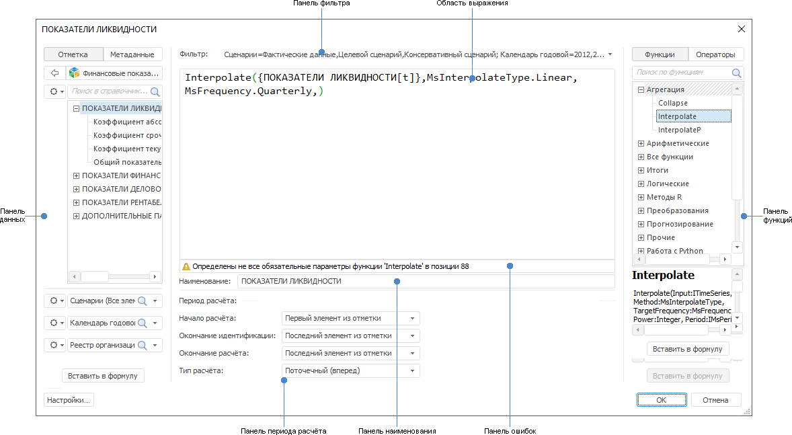

# Создание формул и выражений

Создание формул и выражений
-

# Создание формул и выражений

Универсальный редактор выражения доступен из различных инструментов
 продукта «Форсайт. Аналитическая платформа»
 и предназначен для составления выражений, формул, условий.

[Область применения
 редактора выражения](javascript:TextPopup(this))

	Редактор выражения применяется для настройки:

		- [вычисляемого
		 элемента измерения](UiAnalyticalArea.chm::/Work_with_dimensions/Edited_elements.htm);

		- [фильтрации
		 данных](UiAnalyticalArea.chm::/Working_with_table_data/Filtering.htm);

		- [сортировки
		 данных с учётом иерархии](UiAnalyticalArea.chm::/Working_with_table_data/Sorting_table_data.htm);

		- [расчёта
		 фактора модели](uimodelling.chm::/2_Container_of_Modeling/2_3_Work_object/2_3_2_Model/Specification/8_Linear_regression/uimodelling_model_specification_linaer_reg.htm#formula);

		- [расчёта
		 модели](uimodelling.chm::/2_Container_of_Modeling/2_3_Work_object/2_3_2_Model/Specification/4_Deterministic_equation/uimodelling_model_specification_deter.htm);

		- [расчёта
		 вычисляемого временного ряда](uidw.chm::/Workbook/CalculatedSeries/UiDw_cs_Calculator.htm);

		- [расчёта
		 MDX-выражения для измерения кубов ADOMD](UiNavObj.chm::/ADOMD/Connect_to_SAP_NetWeaver_BW.htm#using);

		- [валидации
		 данных](UiValidation.chm::/Validation_types/Custom_analysis.htm);

		- [дополнительного
		 условия проверки доступа в менеджере безопасности](Admin.chm::/04_SecurityPolicy/Creating_conditions.htm);

		- [вычисляемых
		 полей в мастере импорта](UiNavObj.chm::/Data_import_wizard/Adjust_Data.htm#calculated_fields);

		- [вычисляемых
		 полей преобразователей данных в задаче ETL](UiETL.chm::/Desktop/03_ETLObjects/04_Transformers/UiEtl_Trfs.htm);

		- [вычисляемых
		 фактов в информационных панелях](uidashboard.chm::/InformationPanel/Building/calculated_facts.htm) и так далее.

Пример редактора выражения в настольном приложении:

В заголовке окна редактора выражения выводится наименование того элемента,
 для которого настраивается выражение.

Для настройки выражения:

	- Сформируйте выражение. Выражение формируется в области выражения.
	 В выражении допускается использование операндов, функций, операторов,
	 цифр и круглых скобок. Для получения
	 подробной информации обратитесь к разделам «[Вставка операндов](UFE/Operands.htm)»
	 и «[Вставка
	 функций и операторов](UFE/Operators.htm)».

	- [Выберите данные, по которым будет
	 рассчитано выражение](UFE/Filtering.htm). Если выражение должно быть рассчитано по
	 всем данным источника, пропустите этот шаг.

	- [Настройте период расчёта выражения](UFE/Period.htm).

	- Если создаётся или редактируется вычисляемый элемент, то измените
	 его наименование на панели наименования.

В результате будет настроено выражение.

Проверка корректности выражения выполняется автоматически в процессе
 его настройки. Текст ошибки выводится на панель ошибок с указанием позиции,
 в которой допущена ошибка. Для установки курсора в место возникновения
 ошибки нажмите на панель ошибок.

Также можно настроить внешний вид выражения. Для этого нажмите кнопку
 «Настройки».
 Будет открыт одноимённый диалог. Для получения подробной информации обратитесь
 к разделу «[Настройка
 внешнего вида выражения](UFE/Format.htm)».

В веб-приложении вид редактора выражения отличается в зависимости от
 настраиваемого объекта:

	- в мастере справочника НСИ: для задания постоянного значения
	 привязки в окне «[Параметры
	 привязки](uinavobj.chm::/reference_book/Master_RDS_reference_book/Link_Property.htm#add)»;

	- в мастере стандартного куба: на страницах «[Вычисляемые факты](uinavobj.chm::/Cube/CreateCube/Master_Standart/UiMd_Cube_CreateCube_Master_Standart_5.htm#formula)»,
	 «[Управление параметрами](uinavobj.chm::/Cube/CreateCube/Master_Standart/UiMd_Cube_CreateCube_Master_Standart_manage_param.htm#formula)»,
	 «[Управляющие измерения](uinavobj.chm::/Cube/CreateCube/Master_Standart/UiMd_Cube_CreateCube_Master_Standart_managed_dim.htm#formula)»;

	- в мастере представления-куба: на страницах «[Управление параметрами](uinavobj.chm::/Cube/CreateCube/Master_Conception/UiMd_Cube_CreateCube_Master_Conception_manage_dim.htm#formula)»,
	 «[Управляющие измерения](uinavobj.chm::/Cube/CreateCube/Master_Conception/UiMd_Cube_CreateCube_Master_Conception_managed_dim.htm#formula)»;

	- в мастере виртуального куба: на страницах «[Управление параметрами](uinavobj.chm::/Cube/CreateCube/Master_Virtual_Cube/UiMd_Cube_CreateCube_Master_Virtual_managed_param.htm#formula)»,
	 «[Управляющие измерения](uinavobj.chm::/Cube/CreateCube/Master_Virtual_Cube/UiMd_Cube_CreateCube_Master_Virtual_manage_dim.htm#formula)»;

	- в мастере вычисляемого куба: на страницах «[Управление параметрами](uinavobj.chm::/Cube/CreateCube/Master_Calculation/UiMd_Cube_CreateCube_Master_Calculation_manage_param.htm#formula)»,
	 «[Управляющие измерения](uinavobj.chm::/Cube/CreateCube/Master_Calculation/UiMd_Cube_CreateCube_Master_Calculation_managed_dim.htm#formula)»;

	- в инструменте «Информационные панели»: для [настройки
	 вычисляемых фактов](uidashboard.chm::/InformationPanel/Building/calculated_facts.htm).

См. также:

[Параметры
 редактора значений](ValueEditorParameters.htm) | [Редактирование
 измерения](UiSelection.chm::/Selection/Dimension_edit.htm)

		Справочная
		 система на версию 10.9
		 от 18/08/2025,
		 © ООО «ФОРСАЙТ»,
