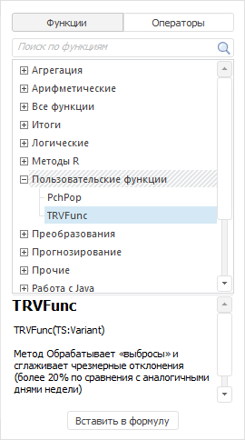
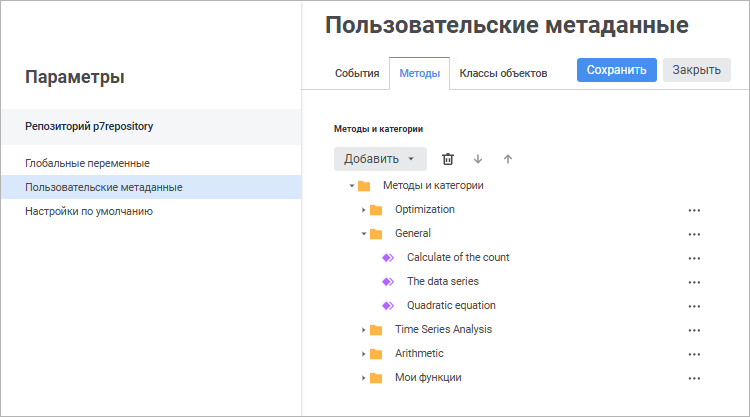
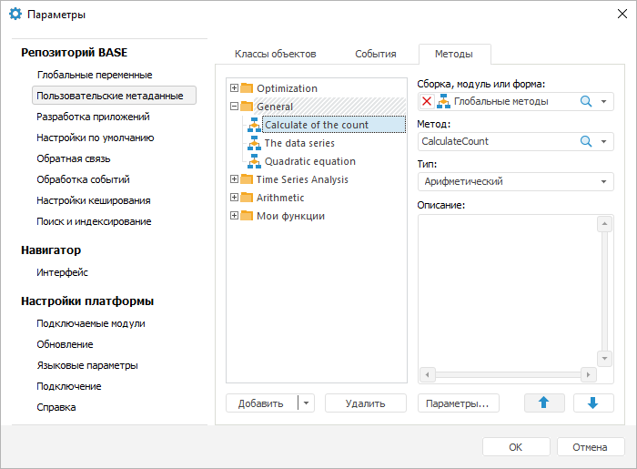
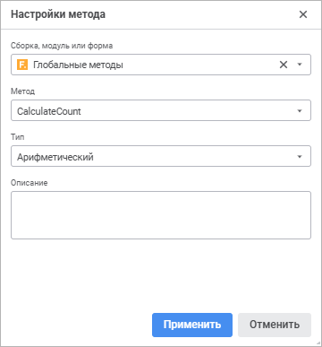
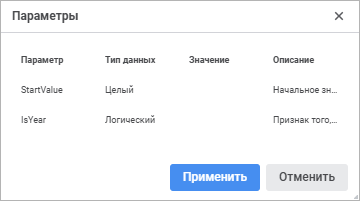
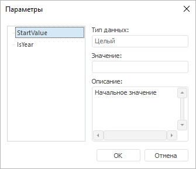

# Подключение пользовательских функций

Подключение пользовательских функций
-

# Подключение пользовательских функций

Пользовательские функции и методы позволяют расширить возможности выражения
 за счёт использования пользовательских методик расчёта. Пользовательские
 функции доступны для использования:

	- в [редакторе выражения](ExpressionEditor.htm);

	- в [мастере
	 функций](UIReport.chm::/Desktop/organizational_management/UiReport_Organizational_master_function.htm) в инструменте «[Отчёты](UIReport.chm::/UiReport_purpose.htm)»;

	- в [редакторе
	 формул](CalculationAlgorithm.chm::/Desktop/Calculation_block/Formula.htm) в инструменте «[Алгоритмы
	 расчёта](CalculationAlgorithm.chm::/Purpose.htm)»;

	- в [методах
	 расчёта вычисляемых рядов](UiDw.chm::/Workbook/CalculatedSeries/UiDw_cs_UserMethods.htm) в инструменте «[Анализ
	 временных рядов](UiDw.chm::/UiDw_Title.htm)»;

	- в [методах
	 расчёта моделей](UiModelling.chm::/2_Container_of_Modeling/2_3_Work_object/2_3_2_Model/Specification/UiModelling_SpecificationUserMethod.htm) в инструменте «[Моделирование
	 и прогнозирование](UiModelling.chm::/UiModelling_TitlePage.htm)».

По умолчанию пользовательские функции не подключены к инструментам.
 Для использования пользовательских функций надо вводить их в выражение
 вручную каждый раз. Продукт «Форсайт. Аналитическая платформа»
 позволяет подключить пользовательские функции к системным функциям одновременно
 во всех вышеперечисленных инструментах.

Примечание.
 Подключение пользовательских функций доступно пользователям, состоящим
 в группе «[Администраторы](admin.chm::/03_Admin/Groups/Admin_Groups.htm)».

Например, в редакторе выражения пользовательские функции отображаются
 на панели функций в категории «Пользовательские
 функции»:

Для подключения пользовательских функций используйте вкладку «Методы» в разделе «Пользовательские
 метаданные» окна «Параметры».
 Все методы, добавленные на данной вкладке, будут подключены в раздел пользовательских
 функций в инструментах продукта «Форсайт. Аналитическая платформа».

[Для открытия
 окна](javascript:TextPopup(this))

		- в веб-приложении выполните команду  «Параметры» на боковой панели
		 [навигатора
		 объектов](GetStarted.chm::/Interface/Interface_Navigator.htm);

		- в настольном приложении выполните команду «Сервис >
		 Параметры» в главном меню навигатора объектов.

	 Веб-приложение

	 Настольное
	 приложение

		

		

На вкладке «Методы» содержатся
 пользовательские функции, разделённые по папкам. Папки - это категории,
 предназначенные для упорядочения и группировки функций.

Требования, предъявляемые к пользовательским функциям:

	- функции должны быть написаны на языке [Fore](Fore.chm::/Fore_Title.htm), иметь модификатор
	 Public и сохранены в текущем репозитории в виде формы, модуля или
	 сборки Fore;

	- если в расчёте используются ряды данных или переменные моделирования,
	 то они должны быть типа [ITimeSeries](KeMs.chm::/Interface/ITimeSeries/ITimeSeries.htm).
	 Для возврата значений, рассчитанных функцией, также должны использоваться
	 данные типа [ITimeSeries](KeMs.chm::/Interface/ITimeSeries/ITimeSeries.htm).

Примечание.
 Пользовательская функция должна иметь уникальное имя. Если при выборе
 модуля/сборки в нём имеется функция, имя которой совпадает с какой-либо
 ранее добавленной функцией или системным методом/функцией, то генерируется
 исключительная ситуация. Использование такого модуля/сборки будет недоступно.

[Добавление категории](javascript:TextPopup(this))

	Для добавления категории:

		- в веб-приложении выполните команду «Категория»
		 в раскрывающемся меню кнопки «Добавить»;

		- в настольном приложении:

			- выполните команду «Категория»
			 в раскрывающемся меню кнопки «Добавить»;

			- выполните команду «Добавить
			 категорию» в контекстном меню списка методов.

	Категория будет добавлена на вкладку «Методы».
	 При необходимости измените [название категории](#name).

	Обратите внимание, что категория не может быть добавлена в другую
	 категорию.

[Добавление
 метода](javascript:TextPopup(this))

	Для добавления метода:

		- Выберите категорию, в которую будет добавлен метод. Если
		 не выбрана ни одна из категорий, то метод будет добавлен без категории.

		- Добавьте метод:

			- в веб-приложении выполните команду «Метод»
			 в раскрывающемся меню кнопки «Добавить»;

			- в настольном приложении:

				- нажмите кнопку «Добавить»;

				- выполните команду «Метод»
				 в раскрывающемся меню кнопки «Добавить»;

				- выполните команду «Добавить
				 метод» в контекстном меню списка методов.

	Метод будет добавлен в выбранную категорию на вкладке «Методы».
	 [Настройте метод](#settings) и при необходимости измените
	 [название метода](#name).

	Примечание.
	 Для подключения пользовательской функции с помощью языка Fore используйте
	 метод [IForeMethods.Add](KeFore.chm::/Interface/IForeMethods/IForeMethods.Add.htm).

[Настройка
 метода](javascript:TextPopup(this))

	Для настройки метода:

		- в веб-приложении нажмите кнопку  «Действия» напротив метода и
		 выполните команду «Настройки».
		 Будет открыто окно «Настройки
		 метода»:

	

		- в настольном приложении задайте настройки метода в соответствующих
		 полях.

	Задайте параметры:

		- Сборка, модуль или форма.
		 Выберите форму, модуль или сборку Fore в раскрывающемся списке;

		- Метод.
		 Выберите процедуру или функцию, реализующую метод, в раскрывающемся
		 списке. В списке содержатся все доступные процедуры и функции
		 из объекта, выбранного в списке «Сборка,
		 модуль или форма»;

		- Тип. Выберите тип
		 метода в раскрывающемся списке:

			- Арифметический.
			 Используется по умолчанию. Применяется для вычисления одиночных
			 значений;

			- Поточечный.
			 Расчёт производится индивидуально в каждой точке ряда данных;

			- Векторный. Расчёт
			 производится для ряда данных целиком.

	Обратите внимание, что тип метода используется
	 для его классификации, а не для определения режима расчёта метода.
	 Режим расчёта определён заранее и зависит от используемого инструмента;

	Примечание.
	 В инструменте «Моделирование и прогнозирование»
	 доступны только векторные методы.

		- Описание.
		 Дайте краткое описание метода, которое будет видеть пользователь.
		 Описание отображается в [редакторе
		 выражения](ExpressionEditor.htm), [мастере
		 функций](UIReport.chm::/desktop/organizational_management/UiReport_Organizational_master_function.htm) в инструменте «[Отчёты](UIReport.chm::/UiReport_purpose.htm)»
		 и [редакторе
		 формул](CalculationAlgorithm.chm::/desktop/Calculation_block/Formula.htm) в инструменте «[Алгоритмы
		 расчёта](CalculationAlgorithm.chm::/Purpose.htm)».

	Если метод параметрический, то доступна [настройка
	 параметров метода](#params).

[Настройка
 параметров метода](javascript:TextPopup(this))

	Для настройки параметров метода:

		- в веб-приложении нажмите кнопку  «Действия» напротив метода и
		 выполните команду «Параметры».
		 Будет открыто окно «Параметры»:

	

		- в настольном приложении:

			- нажмите кнопку «Параметры»
			 ;

			- выполните команду «Параметры
			 метода» в контекстном меню метода.

	Будет открыто окно «Параметры»:

	

	В окне содержится список всех параметров
	 метода:

		- Тип данных. В поле
		 отображён тип данных параметра, указанный в методе. Изменить тип
		 данных параметра нельзя;

		- Значение. Задайте
		 значение параметра по умолчанию. Тип данных указанного значения
		 должен совпадать с типом данных параметра. Если при создании метода
		 для параметра было задано значение по умолчанию, то оно будет
		 отображено в поле «Значение».
		 Это значение может быть изменено;

		- Описание. Дайте
		 краткое описание параметра, которое будет видеть пользователь.
		 Описание отображается в [редакторе
		 выражения](ExpressionEditor.htm), [мастере
		 функций](UIReport.chm::/desktop/organizational_management/UiReport_Organizational_master_function.htm) в инструменте «[Отчёты](UIReport.chm::/UiReport_purpose.htm)»
		 и [редакторе
		 формул](CalculationAlgorithm.chm::/desktop/Calculation_block/Formula.htm) в инструменте «[Алгоритмы
		 расчёта](CalculationAlgorithm.chm::/Purpose.htm)».

[Переименование
 метода или категории](javascript:TextPopup(this))

	Для переименования выделенного метода или категории:

		- в веб-приложении:

			- нажмите кнопку  «Действия»
			 напротив метода и выполните команду «Переименовать»;

			- дважды щёлкните по наименованию метода или категории;

		- в настольном приложении:

			- нажмите клавишу F2;

			- выполните команду «Переименовать»
			 в контекстном меню;

			- щёлкните по методу или категории.

	Название будет переведено в режим редактирования. Введите новое
	 название метода или категории и нажмите клавишу ENTER.

[Настройка порядка
 следования метода или категории](javascript:TextPopup(this))

	Для настройки порядка следования выделенного метода или категории:

		- используйте кнопки «Вверх»
		 и «Вниз»;

		- перетащите метод или категорию выше или ниже по списку.
		 Используйте данный способ для изменения категории метода.

	Обратите внимание, что категория не может быть перемещена в другую
	 категорию.

[Удаление метода
 или категории](javascript:TextPopup(this))

	Для удаления выделенного метода или категории:

		- в веб-приложении:

			- нажмите кнопку 
			 «Удалить»;

			- нажмите кнопку  «Действия»
			 напротив метода или категории и выполните команду «Удалить»;

		- в настольном приложении:

			- нажмите кнопку «Удалить»;

			- выполните команду «Удалить»
			 в контекстном меню метода или категории;

			- нажмите сочетание клавиш CTRL+DELETE.

	Будет отображен запрос подтверждения выполняемого действия. При
	 положительном ответе метод или категория будут удалены. Если внутри
	 категории содержались методы, то они будут оставлены и перемещены
	 в список методов без категории.

## Пример синтаксиса пользовательской функции

В качестве пользовательской функции можно использовать и функции, и
 методы.

Синтаксис пользовательского метода:

	Sub MyFunc(Factor1, Factor2: ITimeSeries; Var Output: ITimeSeries; Coef1: Double; Coef2: Double);

	Begin

	    ...

	End Sub MyFunc;

Параметры метода:

	- Factor1, Factor2.
	 Данные;

	- Output. Данные, которые
	 будут изменены и возвращены по результатам расчёта;

	- Coef1, Coef2.
	 Параметры, имеющие вещественное значение.

Синтаксис пользовательской функции:

	Function MyFunc(Input, Input1: ITimeSeries; Coef: Double): ITimeSeries;

	Var

	    Output: ITimeSeries;

	Begin

	    ...

	    Return Output;

	End Function MyFunc;

Параметры функции:

	- Input, Input1.
	 Данные;

	- Coef. Параметр, имеющий
	 вещественное значение;

	- Output. Переменная,
	 возвращающая результат расчёта функции.

См. также:

[Создание
 формул и выражений](ExpressionEditor.htm)

		Справочная
		 система на версию 10.9
		 от 18/08/2025,
		 © ООО «ФОРСАЙТ»,
