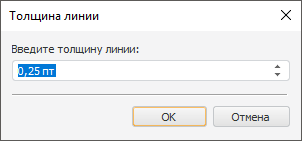

# Настройка единиц измерения для размеров объектов

Настройка единиц измерения для размеров объектов
-

# Настройка единиц измерения для размеров объектов

В настольном приложении в диалогах, отвечающих за настройку размеров
 различных объектов платформы, размеры могут быть заданы как в метрической,
 так и в английской системах мер.

При настройке размеров объектов используются следующие единицы измерения:

		 Наименование
		 Обозначение в русском языке
		 Обозначение в английском языке

		 Миллиметр
		 мм
		 mm

		 Дюйм
		 "
		 in

		 Point
		 пт
		 pt

Сокращения отображаются в зависимости от текущих настроек языка продукта
 «Форсайт. Аналитическая платформа».
 Выбор единицы измерения обусловлен региональными настройками операционной
 системы. Если настроена американская система измерений, значения величин
 отображаются в дюймах, если метрическая - в миллиметрах.

При вводе величины в единицах измерения, не соответствующих текущим
 настройкам, значение переводится в единицы установленной системы измерения.

## Пример

Настроена американская система измерений (в дюймах):

Вводим значение в единицах метрической системы измерений - в миллиметрах:

При установке курсора за пределами данного редактора значение переводится
 в дюймы из расчета 1 дюйм = 25,4 мм:

Если значение введено некорректно, то возвращается последнее корректное
 значение.

## Настройка толщины линии

Для настройки толщины линий используется единица измерения point, равная
 1/72 дюйма. Редактор настройки толщины линий выглядит следующим образом:

При нажатии на кнопку вызова раскрывающегося списка отобразится список,
 состоящий из значений толщины линии и соответствующих им изображений линии.
 Для настройки толщины линии можно воспользоваться представленными в данном
 списке значениями или установить свое. Для установки пользовательского
 значения толщины линии выберите пункт списка «Пользовательская».
 На экране появится следующий диалог:

В строке ввода можно установить значение толщины линий в дюймах или
 в миллиметрах. Независимо от того, какая система измерений установлена
 в региональных настройках, значения в миллиметрах и дюймах переведутся
 в единицы point при нажатии кнопки «ОК».

См. также:

[Принципы
 работы с объектами](../../02_Navigator/General_Principles_of_Work.htm)

		Справочная
		 система на версию 10.9
		 от 18/08/2025,
		 © ООО «ФОРСАЙТ»,
