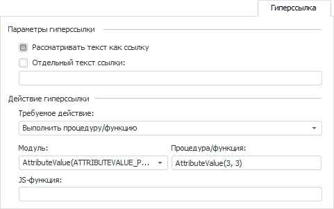
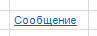
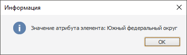

# Пример создания гиперссылки

Пример создания гиперссылки
-

# Пример создания гиперссылки

Для выполнения примера предполагается наличие регламентного отчёта,
 в который добавлен источник, создана [области
 данных](uireport.chm::/desktop/AreaData/UiReport_AreaData.htm#areadata_create) или [табличного визуализатора](uireport.chm::/desktop/AreaData/DataTable.htm) с идентификатором EaxObject.

Если предполагается использовать Fore-метод, то перейдите к этапу 1.
 Если предполагается работа в веб-приложение и использование JavaScript,
 то перейдите к этапу 2.

## Этап 1. Создание процедуры

Для создания макроса в окне «Навигатор
 объектов» выполните команду контекстного меню «Создать > Среда
 разработки > Модуль». Будет открыто окно среды разработки.

Добавьте ссылки на системные сборки: Dimensions, Express, Matrix, Pivot,
 Report, Tab, Ui. Для этого выполните команду «Сборка > Редактировать
 ссылки». В открывшемся окне «Ссылки сборки» на вкладке «Системные сборки» установите флажки
 напротив наименований необходимых сборок.

В окне среды разработки введите код:

	Sub AttributeValue(FocusedRow: Integer; FocusedColumn: Integer);

	Var

	    Report: IPrxReport;

	    Tab: ITabSheet;

	    DataArea: IEaxDataAreaViews;

	    Grid: IEaxGrid;

	    Result_eax: IEaxDrillResult;

	    Result_prx: IPrxDrillCellResult;

	    Slice_eax: IEaxDataAreaPivotSlice;

	    Slice_prx: IPrxSlice;

	    Dim: IDimInstance;

	    DimSelection: IDimSelection;

	    Dim_prx: IPrxSliceDimension;

	    DimAttr: IDimAttributeInstance;

	    DimElements: IDimElements;

	    DataBinding: IPrxTableDataBinding;

	    DimInd, Ind: Integer;

	    AttrValue: Variant;

	Begin

	    Report := PrxReport.ActiveReport;

	    Tab := (Report.ActiveSheet As IPrxTable).TabSheet;

	    // === Табличный визуализатор ===

	    DataArea := Report.DataArea.Views;

	    Grid := DataArea.FindById("EaxObject") As IEaxGrid;

	    Result_eax := Grid.DrillCellResult(FocusedRow, FocusedColumn);

	    If Result_eax <> Null Then

	        Slice_eax := Grid.Slice As IEaxDataAreaPivotSlice;

	        Dim := Slice_eax.Pivot.LeftHeader.Dim(0);

	        DimSelection := Result_eax.Selection.FindByKey(Dim.Key);

	        WinApplication.InformationBox("Отметка по измерению " + Dim.Ident + " после детализации: " + DimSelection.ToString);

	    End If;

	    // === Область данных ===

	    DataBinding := (Report.ActiveSheet As IPrxTable).DataBinding;

	    Result_prx := DataBinding.DrillCell(FocusedRow, FocusedColumn);

	    If Result_prx <> Null Then

	        Slice_prx := Report.DataSources.Item(0).Slices.Item(0);

	        Dim_prx := Slice_prx.LeftHeader.Item(0);

	        DimInd := Slice_prx.Selection.IndexOfKey(Dim_prx.Key);

	        Ind := Result_prx.Coord.Item(DimInd);

	        DimAttr := Dim_prx.Dimension.Attributes.Item(0);

	        DimSelection := Result_prx.Selection.Item(DimInd);

	        DimElements := DimSelection.Dimension.Elements;

	        AttrValue := DimElements.AttributeValueO(Ind, DimAttr);

	        WinApplication.InformationBox("Значение атрибута " + DimAttr.Attribute.Id + ": " + AttrValue);

	    End If;

	End Sub AttributeValue;

После написания и сохранения модуля [подключите
 его к отчёту](uireport.chm::/desktop/Reports/Event/UiReport_Reports_Event.htm).

## Этап 2. Создание пользовательской js-функции

Если необходимо, чтобы ссылка работала в веб-приложении, то создайте
 пользовательскую js-функцию, аналогичную процедуре Fore, и подключите
 её к отчёту. Для получения подробной
 информации о сигнатуре и подключении js-функции к регламентному отчёту
 обратитесь к разделу «[Подключение пользовательской
 js-функции](dhtmlFAQ.chm::/FAQ/js_to_link.htm)».

## Этап 3. Создание гиперссылки

Для ячейки в регламентном отчете откройте окно «Формат
 ячейки», перейдите на вкладку «Гиперссылка».
 Если был создан и подключен модуль, то выберите его в поле «Модуль»
 и укажите вызов процедуры в поле «Процедура/функция».
 Если создавалась JavaScript-функция, то укажите её вызов в поле JS-функция.

Примечание.
 В рассматриваемом примере в качестве параметров процедуры указываются
 номера строки и столбца области данных: AttributeValue(3,
 3).

#### Результат

Ячейка, содержащая гиперссылку, имеет вид:

Нажмите на ячейку с гиперссылкой.

В результате выполнения примера будут получены атрибуты элемента области
 данных по введённым координатам ячейки области данных. Например:

См. также:

[Гиперссылка](UiReport_Table_Attribute_Hyperlink.htm)

		Справочная
		 система на версию 10.9
		 от 18/08/2025,
		 © ООО «ФОРСАЙТ»,
