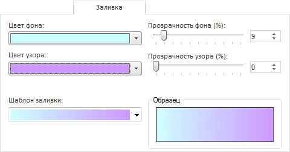

# Заливка и тень

Заливка и тень
-

# Заливка и тень

Вкладки «Заливка» и «Тень»
 содержат одинаковый набор параметров, предназначенный для изменения параметров
 фона объекта и фона тени объекта:

Задайте параметры:

	- Цвет фона/Цвет узора.
	 Укажите цвета фона и фонового узора, выбрав их из соответствующих
	 раскрывающихся палитр. Можно указать собственный цвет, нажав в палитре
	 кнопку «Другой»;

	- Прозрачность фона/Прозрачность
	 узора. Укажите степень прозрачности фона и фонового узора (в
	 процентах): 100% - фон/узор невидимы, 0% - фон/узор полностью
	 непрозрачны;

	- Шаблон заливки. Из раскрывающегося
	 списка выберите один из типов фонового узора;

	- Образец. В данной области
	 отображается фон, оформленный по текущим параметрам.

См. также:

[Работа с
 диалогом форматирования](../Format.htm)

		Справочная
		 система на версию 10.9
		 от 18/08/2025,
		 © ООО «ФОРСАЙТ»,
