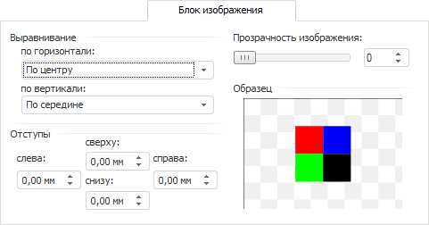

# Блок изображения

Блок изображения
-

# Блок изображения

Вкладка предназначена для изменения параметров изображения в объектах:

Задайте параметры:

	- Выравнивание. В соответствующих
	 раскрывающихся списках укажите горизонтальное и вертикальное выравнивание
	 изображения относительно границ объекта;

	- Отступы. Задайте размер
	 отступов изображения от границ объекта;

	- Прозрачность изображения.
	 Укажите степень прозрачности изображения (в процентах): 100% -
	 изображение невидимое, 0% - изображение полностью непрозрачное;

	- Образец. В данной области расположено
	 изображение, оформленное по текущим параметрам.

См. также:

[Работа с
 диалогом форматирования](../Format.htm)

		Справочная
		 система на версию 10.9
		 от 18/08/2025,
		 © ООО «ФОРСАЙТ»,
