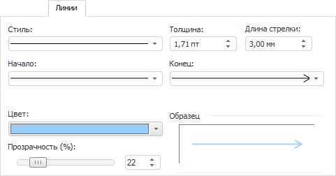

# Линии

Линии
-

# Линии

Вкладка предназначена для настройки внешнего вида линий, используемых
 для отображения границ объекта:

Задайте параметры:

	- Стиль. Укажите стиль
	 начертания линий. По умолчанию используются сплошные линии;

	- Толщина. Укажите толщину
	 линий. Если толщина равна нулю, то линия не отображается;

Примечание.
 Значение толщины линии [может задаваться
 в разных единицах измерения](Different_units.htm), но в поле ввода редактора будет храниться
 значение в единицах point (1/72 дюйма).

	- Длина стрелки. Укажите
	 длину стрелки. Параметр применяется, если линия начинается/оканчивается
	 стрелкой;

	- Начало. Конец.
	 Укажите стиль начертания начала/окончания линии;

	- Цвет. Выберите один
	 из цветов, содержащихся в раскрывающейся палитре, либо укажите собственный
	 цвет, нажав в палитре кнопку «Другой»;

	- Прозрачность. Укажите
	 степень прозрачности линий (в процентах): 100% - линии невидимы,
	 0% - линии полностью непрозрачны;

	- Образец. В данной области
	 отображается линия, оформленная по текущим параметрам.

См. также:

[Работа с
 диалогом форматирования](../Format.htm)

		Справочная
		 система на версию 10.9
		 от 18/08/2025,
		 © ООО «ФОРСАЙТ»,
