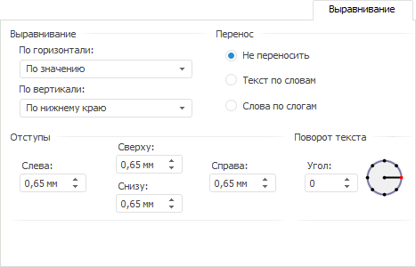
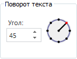

# Выравнивание

Выравнивание
-

# Выравнивание

На вкладке «Выравнивание» задаются
 способы расположения значения внутри ячейки. Значение может быть выровнено
 по горизонтали и по вертикали с учётом заданных отступов от границ ячейки
 и угла поворота. Для строковых значений дополнительно может быть задан
 способ переноса.

Задайте параметры:

[Выравнивание](javascript:TextPopup(this))

	В группе «Выравнивание»
	 задайте способ выравнивания значений:

		- По горизонтали.
		 Возможны варианты:

		-

			- По значению.
			 Выравнивание зависит от содержимого ячейки (ячеек). Если ячейка
			 содержит только цифры (включая разделители разрядов, знак
			 отделения дробной части и знак процента), то выравнивание
			 будет производиться по правому краю, в противном случае -
			 по левому. Значение по умолчанию;

			- По левому краю.
			 Значение прижимается к левой границе вывода;

			- По центру. Значение
			 размещается на равном расстоянии от левой и правой границ
			 ячейки с учётом заданных отступов;

			- По правому краю.
			 Значение прижимается к правой границе вывода;

			- По ширине. Значение
			 размещается по ширине ячейки;

		- По вертикали. Возможны
		 варианты:

		-

			- По верхнему краю.
			 Значение прижимается к верхней границе вывода;

			- По центру. Значение
			 размещается на равном расстоянии от верхней и нижней границ
			 вывода с учётом заданных отступов;

			- По нижнему краю.
			 Значение прижимается к нижней границе вывода. Значение по
			 умолчанию.

[Перенос](javascript:TextPopup(this))

	В группе элементов «Перенос»
	 задаётся способ переноса текста в ячейке:

		- Не переносить. Перенос
		 производиться не будет. Весь текст располагается в одну строку;

		- Текст по словам.
		 Текст ячейки будет переноситься по словам. Расположение переноса
		 определяется шириной ячейки;

		- Слова по слогам.
		 Слова в тексте ячейки будут переноситься по слогам. Расположение
		 переноса определяется шириной ячейки.

	При задании способа переноса текста в ячейке учитывайте особенности:

		- если у ячеек вручную не изменялась высота, то после установки
		 переноса «Текст по словам»
		 или «Слова по слогам»
		 для ячеек будет выполнен автоматический подбор высоты;

		- если для ячеек регламентного отчета, открытого на редактирование
		 в настольном приложении, был установлен перенос «Текст
		 по словам» или «Слова
		 по слогам», то в веб-приложении в данных ячейках текст
		 будет переноситься по словам;

		- для китайского языка перенос текста осуществляется по иероглифам.

[Отступы](javascript:TextPopup(this))

	В группе «Отступы» задайте
	 отступы элемента от границ ячейки: в каждом поле задайте размер отступа
	 от соответствующей границы ячейки. Доступен [ввод
	 значений в разных единицах измерения](Different_units.htm), но в поле ввода сохраняется
	 значение в системе измерений, заданной в региональных настройках операционной
	 системы.

[Поворот текста](javascript:TextPopup(this))

	В группе «Поворот текста»
	 задайте настройки положения текста в ячейке.

	В поле «Угол» задается угол
	 поворота текста в градусах. Величина угла определяется в диапазоне
	 от «-180°» до «180°». Поворот текста происходит всегда от традиционного
	 расположения текста в ячейке (угол поворота - «0°»), независимо
	 от фактического его расположения в момент преобразования. Если значение
	 угла положительное, то текст будет повернут против часовой стрелки
	 (на изображении слева), если отрицательное - по часовой стрелке (на
	 изображении справа):

	

	Справа от поля «Угол» располагается
	 элемент, отображающий указанный угол поворота.

	

	Для задания значения угла поворота с помощью данного элемента выполните
	 одно из действий:

		- наведите курсор на элемент и, удерживая кнопку мыши, переместите
		 курсор. Изменение угла будет отображаться в поле «Угол»;

		- щёлкните по краю окружности в нужном месте.

	При экспорте отчёта угол поворота текста экспортируется только в
	 определённые форматы:

		- XLS. Формат XLS
		 не поддерживает значения угла поворота больше «90°» и меньше «-90°».
		 При экспорте значение угла будет изменено:

		-

			- если значение угла поворота больше «90°», оно будет
			 заменено на «90°»;

			- если значение угла меньше «-90°», то оно будет заменено
			 на «-90°»;

		- RTF. Формат RTF
		 поддерживает три значения угла поворота: «-90°», «0°» и «90°».
		 При экспорте значение угла будет изменено:

		-

			- если значение угла находится в диапазоне от «-180°»
			 до «-46°», то значение будет заменено на «-90°»;

			- если значение угла находится в диапазоне от «-45°» до
			 «45°», то значение будет заменено на «0°»;

			- если значение угла находится в диапазоне от «46°» до
			 «180°», то значение будет заменено на «90°».

См. также:

[Работа с
 диалогом форматирования](../Format.htm)

		Справочная
		 система на версию 10.9
		 от 18/08/2025,
		 © ООО «ФОРСАЙТ»,
