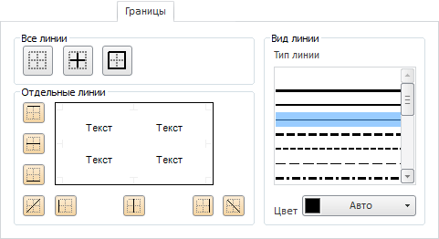
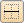
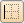
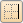

# Границы

Границы
-

# Границы

Вкладка «Границы» имеет вид:

Оформление ячеек применяется в соответствии с [порядком
 оформления](../applystyle.htm) и может быть перекрыто другим оформлением.
 Особенности применения специальных границ перечислены в разделе «[Порядок применения специальных
 границ](../applystyle.htm#special_borders)».

Границы каждой ячейки состоят из прямоугольника, ограничивающего ячейку,
 и диагоналей этого прямоугольника.

Границы прямоугольного диапазона ячеек состоят из границ ячеек, входящих
 в диапазон, и делятся на:

	- Внешние. Вертикальные
	 и горизонтальные границы ячеек диапазона, составляющие прямоугольник,
	 ограничивающий диапазон;

	- Внутренние. Вертикальные
	 и горизонтальные границы ячеек, не входящие во внешние границы;

	- Диагонали. Диагонали
	 ячеек диапазона.

Границы комбинированного диапазона ячеек состоят из границ прямоугольных
 диапазонов, входящих в него, и делятся на такие же группы, как и границы
 прямоугольного диапазона.

Группы элементов «Все линии»
 и «Отдельные линии» предназначены
 для установки и снятия границ. Вид устанавливаемых границ зависит от параметров,
 заданных в группе элементов «Вид линии»:

	- Все линии. Задаёт одинаковое
	 оформление для внутренних и внешних границ диапазона:

	-

		-  «Без
		 границ». И внутренние, и внешние границы снимаются;

		-  «Внутренние
		 границы». Все внутренние границы отображаются;

		-  «Внешние
		 границы». Все внешние границы отображаются.

	- Отдельные линии. Кнопки
	 этой группы управляют наличием и оформлением каждой границы по отдельности.
	 При переключении кнопки в активное состояние соответствующая ей граница
	 отображается так, как установлено в группе «Вид
	 линии». При переключении кнопки в неактивное состояние соответствующая
	 ей граница снимается. Доступные кнопки:

	-

		-  «Верхняя
		 граница»;

		-  «Внутренняя
		 горизонтальная граница»;

		-  «Нижняя
		 граница»;

		-  «Диагональ
		 из левого нижнего угла в правый верхний угол»;

		-  «Левая
		 граница»;

		-  «Внутренняя
		 вертикальная граница»;

		-  «Правая
		 граница»;

		-  «Диагональ
		 из левого верхнего угла в правый нижний угол»;

	- Вид линии. В данной
	 области группировки расположены элементы управления, содержащие:

	-

		- Тип линии. Выбирается
		 толщина и тип линии границы;

		- Цвет. Устанавливается
		 цвет границы путем выбора из стандартной или расширенной палитры
		 цветов. Стандартная палитра открывается щелчком по полю «Цвет», а расширенная -
		 нажатием на кнопку «Другой»
		 внизу стандартной палитры.

См. также:

[Работа с
 диалогом форматирования](../Format.htm)

		Справочная
		 система на версию 10.9
		 от 18/08/2025,
		 © ООО «ФОРСАЙТ»,
