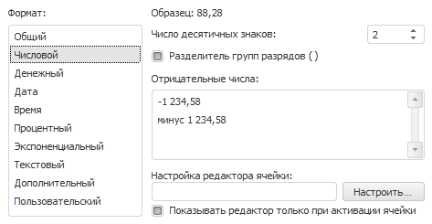
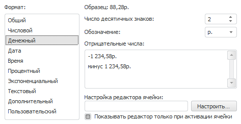
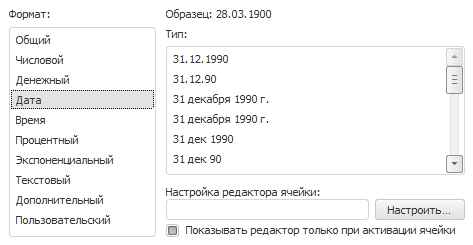
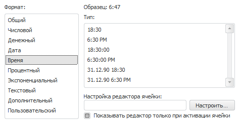
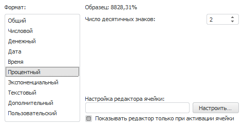
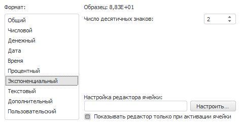
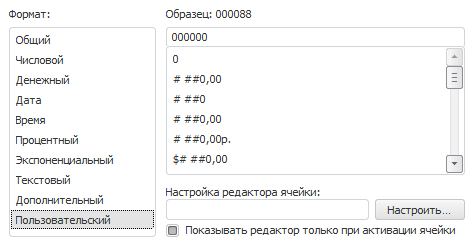

# Формат числа

Формат числа
-

# Формат числа

Вкладка «Формат числа» имеет
 вид:

Вкладка содержит список предустановленных форматов отображения содержимого
 ячеек листа. Выберите формат данных и настройте его параметры. Вид вкладки
 и набор настроек зависит от используемого инструмента.

## Настройка параметров формата данных

Набор настраиваемых параметров зависит от выбранного формата данных:

[Общий](javascript:TextPopup(this))

	Равносильно отмене форматирования. Установлен по умолчанию.

[Числовой](javascript:TextPopup(this))

	При выборе числового формата вкладка принимает вид:

	

	Задайте параметры:

		- Число десятичных знаков.
		 Задаёт число отображаемых знаков после запятой;

		- Разделитель групп разрядов.
		 При установке флажка числа выводятся с разделителем групп разрядов,
		 заданным в текущих региональных настройках операционной системы;

		- Отрицательные числа.
		 Выбор одного из элементов данного списка устанавливает, в какой
		 нотации будут выводиться отрицательные значения: со знаком «-»
		 или со словом «минус».

[Денежный](javascript:TextPopup(this))

	При выборе денежного формата вкладка принимает вид:

	

	Задайте параметры:

		- Число десятичных знаков.
		 Задаёт число отображаемых знаков после запятой;

		- Обозначение. Задаёт
		 обозначение валюты;

		- Отрицательные числа.
		 Выберите вид отображения отрицательных чисел.

	Формат вывода зависит от текущих региональных настроек операционной
	 системы.

[Дата](javascript:TextPopup(this))

	При выборе формата «Дата» вкладка принимает вид:

	

	Определите тип вывода даты и времени:

			 Формат
			 Комментарий

			 09.10.2004
			 Число (01-31), месяц (01-12), полный формат года

			 09.10.04
			 Число (01-31), месяц (01-12), краткий формат года

			 9 октября 2004 г.
			 Число (1-31), полное название месяца, полный формат года

			 09 октября 2004 г.
			 Число (01-31), полное название месяца, полный формат года

			 9 окт 2004 г.
			 Число (1-31), краткое название месяца, полный формат года

			 9 окт 04 г.
			 Число (1-31), краткое название месяца, краткий формат года

			 09 окт 04 г.
			 Число (01-31), краткое название месяца, краткий формат
			 года

			 9.10.04
			 Число (1-31), месяц (01-12), краткий формат года

			 9.10.2004
			 Число (1-31), месяц (01-12), полный формат года

			 09.10
			 Число (01-31), месяц (01-12)

			 09. окт
			 Число (01-31), краткое название месяца

			 2004, Октябрь
			 Полный формат года, полное название месяца

			 Октябрь 2004
			 Полное название месяца, полный формат года

			 Октябрь
			 Полное название месяца

			 2004, 09 октября
			 Полный формат года, Число (01-31), полное название месяца

			 9-окт-2004
			 Число (1-31), краткое название месяца, полный формат года

			 09.10.04 18:30
			 Число (01-31), месяц (01-12), краткий формат года, час
			 (0-24), минуты

			 09.10.04 6:30 PM
			 Число (01-31), месяц (01-12), краткий формат года, час
			 (0-12), минуты

[Время](javascript:TextPopup(this))

	При выборе формата «Время» вкладка принимает вид:

	

	Определите тип вывода времени:

			 Формат
			 Комментарий

			 18:30
			 Часы (0-24), минуты

			 6:30 РМ
			 Часы (0-12), минуты

			 18:30:00 РМ
			 Часы (0-24), минуты, секунды

			 6:30:00 РМ
			 Часы (0-12), минуты, секунды

			 09.10.04 18:30
			 Число (01-31), месяц (01-12), краткий формат года, час
			 (0-24), минуты

			 09.10.04 6:30 РМ
			 Число (01-31), месяц (01-12), краткий формат года, час
			 (0-12), минуты

[Процентный](javascript:TextPopup(this))

	При выборе процентного формата вкладка принимает вид:

	

	Задайте число отображаемых знаков после запятой.

	При использовании процентного формата значение чисел умножается
	 на 100 и добавляется знак «% ». Ввод чисел в ячейку при данном формате
	 будет по-разному обрабатываться в зависимости от использования знака
	 «%». Например, при вводе «40%» в ячейке будет отражено «40%», при
	 этом значение в ячейке «0,4». Если вводится «40», то в ячейке отображается
	 «4000%», при этом значение в ячейке будет «40».

[Экспоненциальный](javascript:TextPopup(this))

	При выборе экспоненциального формата вкладка принимает вид:

	

	Данный формат используется для представления числа в экспоненциальном
	 виде.

	Определите число отображаемых знаков после запятой.

[Текстовый](javascript:TextPopup(this))

	Равносильно отмене форматирования. Текстовый формат устанавливается
	 по умолчанию для ячеек, содержащих нечисловые значения.

[Дополнительный](javascript:TextPopup(this))

	При выборе дополнительного формата вкладка принимает вид:

	

	Для автоматического преобразования значения выберите предустановленный
	 вариант:

		- Почтовый индекс;

		- Номер телефона;

		- Табельный номер.

[Пользовательский](javascript:TextPopup(this))

	При выборе пользовательского формата вкладка принимает вид:

	

	Список всех возможных форматов содержит наборы различных базовых
	 форматов, составленных с использованием специальных зарезервированных
	 символов (кодов форматов). Если ни один из форматов не подходит, то
	 можно добавить собственный.

		- Отображение чисел и текста.
		 Для отображения текста и числа в одной ячейке, текстовые знаки
		 указывайте в двойных кавычках (" "). Для отображения
		 числа в собственном формате используйте символ @.

			 Формат

			 Отображаемое значение

			 $0,00" приход"

			$-0,00" расход"

			 $1,00 приход

			$-10,00 расход

			 "Списать "@" штук"

			 Списать 100 штук

		- Разрядность
		 и числа с десятичной запятой.
		 Для формирования целой и/или дробной части включите в раздел следующие
		 шаблоны:

			- #. Выводятся
			 только значащие числа, незначащие нули не отображаются;

			- 0. Незначащие
			 нули отображаются, если количество разрядов числа меньше количества
			 нулей в формате;

			- " "
			 (<пробел>).
			 При наличии знака пробела между # и/или 0 будет включен режим
			 групп разрядов. Число будет разделено пробелами по 3 цифры.
			 При вставке пробелов после шаблона целой части числа - каждый
			 пробел будет понижать разрядность отображаемого числа на 3,
			 что соответствует отображению в тысячах при одном пробеле.
			 Например, шаблон "0 " будет отображать число "10
			 000" как "10".

		- Задание шаблона дробной части производится после знака запятой
		 ",".

		- Если дробная часть числа содержит цифр больше, чем формат
		 содержит шаблонов, число округляется так, чтобы количество разрядов
		 соответствовало количеству шаблонов. Если же целая часть числа
		 содержит цифр больше, чем формат содержит шаблонов, отображаются
		 все значащие разряды.

		- Примеры использования шаблонов числа:

			 Формат

			 Исходное значение

			 Отображаемое значение

			 #
			 5
			 5

			 00
			 5
			 05

			 # #
			 10

			1000
			 10

			1 000

			 #,0#
			 12

			12,557
			 12,0

			12,56

			 # #,000
			 150
			 150,000

			 #<пробел>
			 10000
			 10

			 #<пробел>,00
			 100
			 0,10

			 #,0E+00
			 1000
			 1,0E+003

		- Отрицательные и нулевые
		 числа. Для формирования отдельного шаблона для отрицательных
		 и/или нулевых чисел используется разделение знаком ";".
		 После первого знака идет формат для отрицательных чисел, после
		 второго - для нулевых.

			 Формат

			 Исходное значение

			 Отображаемое значение

			 # #;-#,00;000
			 2

			-2

			0
			 2

			-2,00

			000

			 #;#,0
			 2

			-2
			 2

			2,0

		- Дата и время. Для
		 формирования значений даты и времени используйте коды форматов:

			 Формат даты

			 Отображаемое значение

			 Русский

			 Английский

			 М

			 M

			 Месяц в виде числа от 1 до 12

			 ММ

			 MM

			 Месяц в виде числа от 01 до 12

			 МММ

			 MMM

			 Месяц в виде янв-дек

			 ММММ

			 MMMM

			 Месяц в виде Январь-Декабрь

			 Д

			 D

			 День в виде числа от 1 до 31

			 ДД

			 DD

			 День в виде числа от 01 до 31

			 ДДД

			 DDD

			 День в виде Пн-Вс

			 ДДДД

			 DDDD

			 День в виде понедельник-воскресенье

			 ГГ

			 YY

			 Год в виде 01-99

			 ГГГГ

			 YYYY

			 Год в виде 1900-9999

			 Формат времени

			 Отображаемое значение

			 Русский

			 Английский

			 Ч

			 H

			 Часы в виде 0-23

			 ЧЧ

			 HH

			 Часы в виде 00-23

			 М

			 M

			 Минуты в виде 0-59

			 ММ

			 MM

			 Минуты в виде 00-59

			 С

			 S

			 Секунды в виде 0-59

			 СС

			 SS

			 Секунды в виде 00-59

			 AM/PM

			 AM/PM

			 Применяется 12-часовая система. AM - время суток от
			 полуночи до полудня, PM - время суток от полудня до полуночи

	Коды М-ММММ должны стоять непосредственно после кодов Ч-ЧЧ, либо
	 перед кодами С-СС, иначе данные коды будут отображаться как месяцы,
	 а не минуты.

	Коды форматов могут задаваться как заглавными, так и прописными
	 буквами.

	Язык, в котором задаются коды форматов, зависит от языка региональных
	 настроек операционной системы (ОС). В ОС с русскими региональными
	 настройками форматы указываются на русском языке. В ОС с другими региональными
	 настройками форматы указываются на английском языке. При изменении
	 языка региональных настроек происходит автоматическое преобразование
	 языка обозначения форматов: русский/английский.

## Настройка редактора ячейки

Текущие настройки редактора ячейки отображаются и настраиваются в поле
 «Настройка редактора ячейки».
 В этом поле определяется тип редактора ячейки для удобного ввода/выбора
 значений. Параметры отображения задаются в виде специально сформированной
 строки, в которой указывается вид редактора, значение по умолчанию и т.д.
 Строка может быть отредактирована как непосредственно в поле ввода, так
 и при помощи специального диалога «[Параметры
 редактора значений](../ValueEditorParameters.htm)». Для открытия диалога нажмите кнопку «Настроить».
 По умолчанию параметр отображения устанавливается в соответствии с выбранным
 типом параметра. Для отображения всегда активного редактора ячейки снимите
 флажок «Показывать редактор только при
 активации ячейки».

Значение ячейки, для которой задан редактор, перед установкой проверяется
 на соответствие типу данных редактора. Значение, которое не соответствует
 типу данных редактора, не устанавливается.

Если в ячейке установлен редактор типа «[Раскрывающийся список
 справочника](../ValueEditorParameters.htm#dimension)» и для него выбран способ отметки «SingleSelect»
 или «SingleSelectNullable» и не
 заданы параметры «Пользовательское наименование
 всех уровней» и «Отображаемый
 атрибут», то при установке значения ячейки будет выполняться проверка
 на его наличие в справочнике. Если значение присутствует в справочнике,
 то установка произойдёт успешно, при этом в раскрывающемся списке справочника
 будет автоматически выбран соответствующий элемент. Если выбраны другие
 способы отметки и/или задан один или оба из указанных параметров, то значение
 ячейки будет установлено даже в тех случаях, когда оно отсутствует в справочнике,
 при этом никакие элементы раскрывающегося списка выделены не будут.

Синтаксис строки:

UI="Control" PARAMETER="VALUE"

где:

	- Control. Тип элемента
	 управления;

	- PARAMETER. Параметр
	 элемента управления;

	- VALUE. Значение параметра.

Примечание.
 Для каждого элемента управления можно определить свой набор пар «параметр-значение»,
 которые должны разделяться между собой символом пробела.
 Типы элементов управления и их параметры смотрите в описании метода: [IBindingManager.CreateByUi](ForeSys.chm::/Interface/IBindingManager/IBindingManager.CreateByUi.htm).

См. также:

[Работа с
 диалогом форматирования](../Format.htm)

		Справочная
		 система на версию 10.9
		 от 18/08/2025,
		 © ООО «ФОРСАЙТ»,
