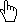

# Гиперссылка

Гиперссылка
-

# Гиперссылка

Текст и изображение, помещенные в ячейку, могут являться гиперссылкой.
 При щелчке по содержимому такой ячейки будет выполняться заданное действие.

Примечание.
 Гиперссылка доступна только в инструменте «[Отчёты](UiReport.chm::/UiReport_purpose.htm)»
 и настраивается для всей ячейки, т.е. отсутствует возможность отдельной
 настройки гиперссылки только для изображения в ячейке или части текста.

Курсор при движении над гиперссылкой принимает вид указателя: .

Для настройки параметров гиперссылки перейдите на вкладку «Гиперссылка»
 [диалога форматирования](../Format.htm):

Настройте гиперссылку:

	- для задания параметров текста гиперссылки используйте группу
	 «Параметры гиперссылки»:

		- Рассматривать текст как
		 ссылку. Установите флажок для преобразования текста ячейки
		 в гиперссылку. По умолчанию флажок снят и текст в ячейке не является
		 гиперссылкой;

Совет.
 По умолчанию для всех гиперссылок в отчете используется подчеркнутый текст
 синего цвета. Для настройки единого пользовательского оформления гиперссылок
 используйте вкладку «[Настройки](uireport.chm::/desktop/Reports/UiReport_Reports_Param3.htm)» в
 диалоге «[Параметры](uireport.chm::/desktop/Reports/UiReport_Reports_Param.htm)».

		- Отдельный текст ссылки.
		 По умолчанию флажок снят и текст гиперссылки совпадает с текстом
		 в ячейке. Для задания отдельного текста для гиперссылки установите
		 данный флажок и введите текст в соответствующем поле. В этом случае
		 текст в ячейке будет перекрываться данным текстом. Если гиперссылка
		 с отдельным текстом задается для ячейки с изображением, текст
		 располагается поверх изображения;

	- для выполнения определенного действия при щелчке по гиперссылке
	 выберите его в раскрывающемся списке «Требуемое
	 действие».

## Действие гиперссылки

При переходе по гиперссылке доступны действия:

[Не определено](javascript:TextPopup(this))

	Гиперссылка не вызывает действие при срабатывании.

[Открыть файл](javascript:TextPopup(this))

	При выборе данного действия появляется поле «Имя
	 файла», в котором необходимо указать файл, который будет открываться
	 при активации гиперссылки. Для указания файла нажмите кнопку  «Обзор», расположенную в этом поле.
	 Будет открыто стандартное окно выбора файла.

[Открыть ссылку](javascript:TextPopup(this))

	При выборе данного действия появляется поле «Ссылка».
	 Введите в нём требуемый адрес ссылки, по которой будет осуществлен
	 переход при нажатии на гиперссылку.

[Открыть лист
 отчета](javascript:TextPopup(this))

	При выборе данного действия появляется раскрывающийся список «Листы отчета» Выберите в нём лист,
	 на который будет осуществлен переход при нажатии на гиперссылку.

[Показать диапазон
 ячеек](javascript:TextPopup(this))

	При выборе данного действия появится поле «Описание
	 диапазона». Введите в нём диапазон ячеек, который будет выделяться
	 при нажатии на ссылку. Доступные варианты ввода диапазона:

		- для описания прямоугольной области укажите через двоеточие
		 сначала адрес верхней левой ячейки, с которой начинается диапазон,
		 а затем адрес нижней правой ячейки, на которой заканчивается диапазон;

		- если необходимо позиционирование на одной ячейки, то укажите
		 только её адрес;

		- для описания комбинированной области через точку с запятой
		 («;») укажите адреса прямоугольных областей и отдельных ячеек,
		 из которых состоит данная область.

[Показать объект
 в центре экрана](javascript:TextPopup(this))

	При выборе данного действия появляется раскрывающийся список «Объекты отчета». Выберите в нём
	 объект, на который будет осуществлён переход при нажатии на ссылку.
	 Объектами являются диаграммы, карты, рисунки и т.д.

[Открытие объекта
 репозитория](javascript:TextPopup(this))

	При выборе данного действия появляется раскрывающийся список «Объекты репозитория». Выберите в
	 нём объект репозитория, который будет открываться при нажатии на гиперссылку.

[Выполнить
 процедуру/функцию](javascript:TextPopup(this))

	При выборе данного действия появляются дополнительные поля:

		- Модуль. Выберите
		 модуль среды разработки, подключенный к регламентному отчёту;

		- Процедура/функция.
		 Укажите имя процедуры/функции, которую необходимо запустить в
		 настольном приложении при нажатии на гиперссылку;

		- JS-функция. Укажите
		 имя js-функции, которую необходимо запустить в веб-приложении
		 при нажатии на гиперссылку. Это может быть как системная, так
		 и пользовательская js-функция. Для получения подробной информации
		 о сигнатуре и подключении js-функции к регламентному отчёту обратитесь
		 к разделу «[Подключение
		 пользовательской js-функции](dhtmlFAQ.chm::/FAQ/js_to_link.htm)»

	Примечание.
	 Допускается указание только имени процедуры/функции или только имени
	 js-функции.

	Подключённый к регламентному отчёту модуль позволяет:

		- обрабатывать ввод данных «на лету»;

		- выводить диалог подтверждения выполняемого действия;

		- выполнять дополнительные действия перед и/или после возникновения
		 какого-либо события;

		- выводить информационные сообщения, содержащие определенную
		 информацию (например, идентификатор измененного элемента управления,
		 [тип
		 гиперссылки](TabSheet.chm::/Interface/ITabHyperlinkClickEventArgs/ITabHyperlinkClickEventArgs.Type.htm) и т.д.) и др.

	В зависимости от того, где находится реализация процедуры/функции,
	 различается способ указания пути к ней. Процедура/функция реализована
	 в:

		- модуле/форме репозитория:
		 <наименование процедуры/функции>;

		- одном из объектов сборки
		 репозитория: <наименование процедуры/функции>.

	Примечание.
	 Сигнатура процедуры/функции может содержать параметры.

	Выполняемые методы/функции могут иметь параметры. Значения параметров
	 указываются в круглых скобках через запятую.

	Для получения представления
	 о создании гиперссылки обратитесь к разделу «[Пример создания гиперссылки](Hyperlink_example.htm)».

См. также:

[Работа с
 диалогом форматирования](../Format.htm)

		Справочная
		 система на версию 10.9
		 от 18/08/2025,
		 © ООО «ФОРСАЙТ»,
