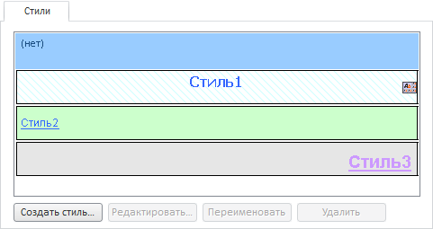

# Стили

Стили
-

# Стили

Вкладка «Стили» предназначена
 для выбора стиля, который будет применён к оформляемым ячейкам:

На вкладке отображается список стилей, содержащихся во внутренней (локальной)
 и внешней (подключаемой) таблицах стилей. Стили подключаемой таблицы помечены
 пиктограммой  и недоступны
 для редактирования.

Для управления стилями доступны кнопки:

	- Создать стиль. При нажатии
	 кнопки открывается диалог «Создание
	 стиля», в котором задаётся название создаваемого стиля;

	- Редактировать. При нажатии
	 кнопки открывается диалог «Форматирование»,
	 содержащий вкладки:

	-

		- [Формат числа](UiReport_Table_Attribute_Format.htm);

		- [Шрифт](UiReport_Table_Attribute_Type.htm);

		- [Заливка](UiReport_Table_Attribute_View.htm);

		- [Выравнивание](UiReport_Table_Attribute_Arrange.htm);

		- [Границы](UiReport_Table_Attribute_Border.htm);

		- [Прочее](UiReport_Table_Attribute_Others.htm);

	- Переименовать. При нажатии
	 кнопки открывается диалог «Переименование
	 стиля», в котором можно сменить текущее наименование стиля;

	- Удалить. Удаляет выделенный
	 стиль из списка. Команда недоступна для внешних стилей.

См. также:

[Работа с
 диалогом форматирования](../Format.htm)

		Справочная
		 система на версию 10.9
		 от 18/08/2025,
		 © ООО «ФОРСАЙТ»,
