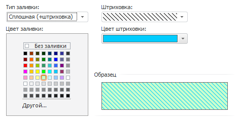
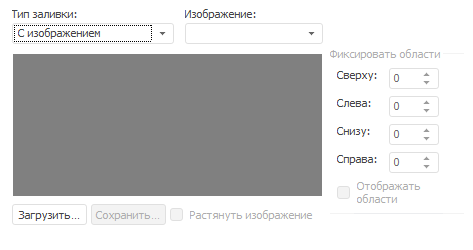
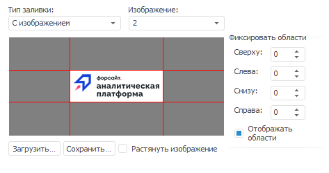
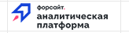

# Заливка

Заливка
-

# Заливка

Вкладка «Заливка» имеет вид:

Выберите тип заливки и задайте параметры:

	- Нет. Без заливки;

	- Сплошная (+штриховка).
	 При выборе данного типа заливки появятся дополнительные параметры:

Фон ячеек представляет собой двухцветный
 узор. Вид узора называется штриховкой, фоновый цвет узора - заливкой,
 а цвет узора - цветом штриховки. Если штриховка не выбрана или цвет заливки
 и цвет штриховки совпадают, то фон ячейки однородный.

		- Цвет
		 заливки. Цвет заливки можно выбрать из стандартной палитры
		 цветов, расположенной в области «Цвет
		 заливки», либо в расширенной палитре, вызываемой кнопкой
		 «Другой» в этой области.
		 При выборе элемента «Без заливки»
		 будет установлен стандартный цвет фона;

		- Штриховка.
		 В раскрывающемся списке содержатся образцы всех возможных текстур
		 в черно-белом изображении: черным цветом обозначается цвет текстуры,
		 а белым цвет заливки;

		- Цвет
		 штриховки. Цвет штриховки выбирается из стандартной или
		 расширенной палитры цветов. Стандартная палитра открывается щелчком
		 по полю «Цвет штриховки»,
		 а расширенная - нажатием на кнопку «Другой»
		 внизу стандартной палитры;

		- Образец.
		 В данной области отображается внешний вид ячейки, который она
		 примет после применения установленных параметров;

	- С изображением. При
	 выборе данного типа заливки вкладка меняет свое отображение:

В качестве заливки ячейки будет использовано
 изображение. Для выбранного изображения можно применить девятизонное разбиение,
 которое используется для фиксирования областей:

		- Изображение. В раскрывающемся
		 списке содержатся индексы всех загруженных изображений. Для загрузки
		 нового изображения используйте кнопку «Загрузить»;

		- Загрузить. Позволяет
		 загрузить новое изображение в коллекцию изображений отчета. После
		 добавления изображения оно будет добавлено в конец списка «Изображение» и выбрано в качестве
		 значения;

		- Сохранить. Позволяет
		 сохранить текущее изображение в файл;

		- Растянуть изображение.
		 При установке флажка загруженное изображение будет растянуто на
		 всю область окна редактирования. Имитирует изменение размера изображения;

		- Фиксировать области.
		 В группе задаются размеры фиксированных областей в пикселях:

Фиксированные области отображаются в том
 виде, в каком они содержатся в исходном файле. Вся остальная область изображения
 масштабируется в соответствии с размерами ячейки.

Пример ячейки, для которой установлены приведенные
 выше параметры фонового изображения:

См. также:

[Работа с
 диалогом форматирования](../Format.htm)

		Справочная
		 система на версию 10.9
		 от 18/08/2025,
		 © ООО «ФОРСАЙТ»,
