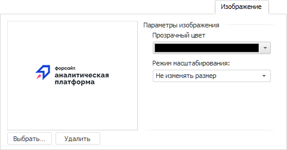

# Изображение

Изображение
-

# Изображение

Вкладка «Изображение» предназначена
 для управления изображением, которое будет использоваться в качестве заливки
 для объекта:

Для загрузки изображения нажмите кнопку «Выбрать».
 Будет открыт стандартный диалог выбора файла. Допускается использовать
 файлы форматов JPG, GIF, BMP и TIF.

Для удаления изображения нажмите кнопку «Удалить»;

Задайте параметры загружённого изображения:

	- Прозрачный цвет. Определите
	 цвет, который будет прозрачным на изображении. Пример изображения
	 без использования прозрачного цвета (слева) и с использованием красного
	 цвета в качестве прозрачного (справа):

	- Режим масштабирования.
	 Выберите из раскрывающегося списка поведение изображения при изменении
	 размера объекта:

	-

		- Не изменять размер.
		 Размер изображения остаётся всегда исходным независимо от измерений
		 размеров объекта;

		- Сохранять пропорции.
		 При изменении размера объекта размер изображения будет изменён
		 с соблюдением пропорций;

		- Растягивать. По
		 умолчанию. Размер изображения всегда совпадает с размером объекта.

См. также:

[Работа с
 диалогом форматирования](../Format.htm)

		Справочная
		 система на версию 10.9
		 от 18/08/2025,
		 © ООО «ФОРСАЙТ»,
