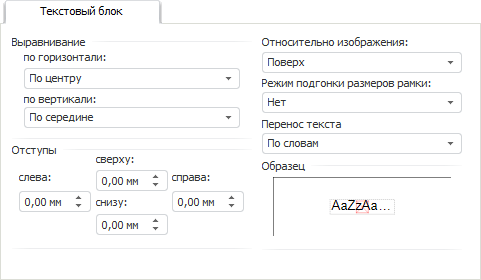

# Текстовый блок

Текстовый блок
-

# Текстовый блок

Вкладка предназначена для изменения параметров положения надписей в
 объектах:

Задайте параметры:

	- Выравнивание. Выберите
	 из раскрывающихся списков вариант выравнивания текста по горизонтали
	 и вертикали относительно границ объекта;

	- Отступы. Задайте с помощью
	 редакторов чисел размеры отступов надписи от границ объекта;

	- Относительно изображения.
	 Выберите из раскрывающегося списка положение надписей относительно
	 изображения в объекте;

	- Режим подгонки размеров рамки.
	 Выберите из раскрывающегося списка способ подгонки размеров рамки
	 под размер надписи:

		- Нет. Размер рамки
		 не будет изменяться;

		- По высоте. Размер
		 рамки будет подобран под высоту надписи и изображения в объекте;

		- По ширине. Размер
		 рамки будет подобран под ширину надписи и изображения в объекте;

	- Перенос текста. Выберите
	 из раскрывающегося списка способ переноса текста: по словам или не
	 переносить текст на следующую строку.

Примечание.
 Для китайского языка перенос текста осуществляется по иероглифам.

Образец текста надписи, оформленного по заданным параметрам, отображается
 в области «Образец».

См. также:

[Работа с
 диалогом форматирования](../Format.htm)

		Справочная
		 система на версию 10.9
		 от 18/08/2025,
		 © ООО «ФОРСАЙТ»,
