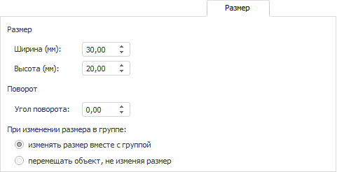

# Размер

Размер
-

# Размер

На вкладке задаются размеры и угол поворота объекта:

Размеры и угол поворота объекта задаются вручную или с помощью соответствующих
 редакторов чисел.

Поведение объекта при изменении размера группы, в которую он включён,
 определяется переключателем:

	- изменять
	 размер вместе с группой. Переключатель установлен по умолчанию.
	 При изменении размера группы размер объекта будет масштабироваться;

	- перемещать
	 объект, не изменяя размер. При изменении размера группы объект
	 будет изменять свое положение, размер объекта останется неизменным.

См. также:

[Работа с
 диалогом форматирования](../Format.htm)

		Справочная
		 система на версию 10.9
		 от 18/08/2025,
		 © ООО «ФОРСАЙТ»,
