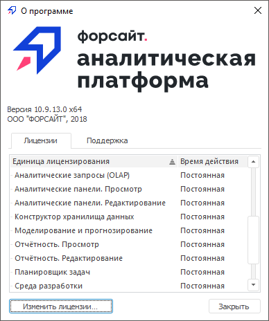
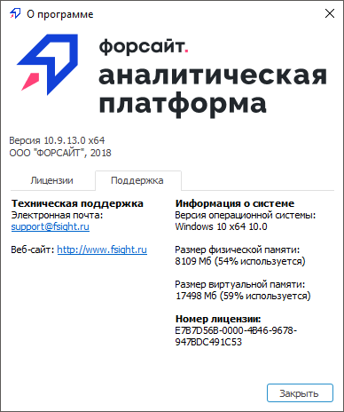

# Получение информации о программе

Получение информации о программе
-

# Получение информации о программе

Для получения информации о программе:

	- в веб-приложении выполните команду  «О программе» на боковой панели [навигатора
	 объектов](GetStarted.chm::/Interface/Interface_Navigator.htm);

	- в настольном приложении выполните команду «Справка >
	 О программе» в главном меню [навигатора
	 объектов](GetStarted.chm::/Interface/Interface_Navigator.htm).

После выполнения действия будет открыто окно «О
 программе».

	Веб-
	 приложение Настольное приложение

		

		В окне содержится:

			- версия сервиса;

			- версия веб-приложения;

			- контактная информация службы технической поддержки ООО
			 «ФОРСАЙТ».

		
		 

		В окне содержится:

			- версия настольного приложения;

			- на вкладке «Лицензии»:

				- доступные [лицензии](Setup.chm::/08_Licensing/Admin_Licensing.htm)
				 пользователя и их статус. Для изменения набора лицензий
				 нажмите кнопку «Изменить
				 лицензии». После чего будет открыт [менеджер
				 лицензий](Setup.chm::/08_Licensing/RMS/Intro_LicMngr.htm);

			- на вкладке «Поддержка»:

				- контактная информация службы технической поддержки
				 ООО «ФОРСАЙТ»;

				- информация о системе;

				- уникальный номер лицензии, который включается в
				 выданную [лицензию](setup.chm::/08_Licensing/Admin_Licensing.htm)
				 при необходимости. Номер лицензии может запрашиваться
				 службой технической поддержки при обращении пользователя.

Стабильный релиз продукта «Форсайт. Аналитическая платформа»
 с долгосрочной поддержкой (англ. Long
 Term Support, LTS) выпускается
 один раз в год. Данный тип релиза указывается рядом с версией сервиса,
 веб-приложения, настольного приложения. Релизы с коротким сроком поддержки
 (англ. Short Term Support, STS) выпускаются два раза в год.
 Данный тип релиза не указывается в интерфейсе. Сроки поддержки релизов
 с момента выпуска: LTS - 2 года и 4 месяца, STS - 4 месяца.

LTS-релиз отличается высокой стабильностью и предназначен для критически
 важных систем и проектов на этапе промышленной эксплуатации. STS-релизы
 представляют собой промежуточные выпуски, включающие новую функциональность,
 и рекомендуются проектам, приоритетом которых является оперативное получение
 обновлений продукта. Новая функциональность, реализованная в рамках STS-релизов,
 включается в очередной LTS-релиз.

Параметры отображения информации в окне «О
 программе» можно изменить с помощью [Tuner.exe](setup.chm::/Update/Tuner.htm) или
 DHTML-компонента [AboutBox](dhtmlApp.chm::/Components/AboutBox/AboutBox.htm).

См. также:

[Дополнительные справочные материалы](General_principles.htm)

		Справочная
		 система на версию 10.9
		 от 18/08/2025,
		 © ООО «ФОРСАЙТ»,
