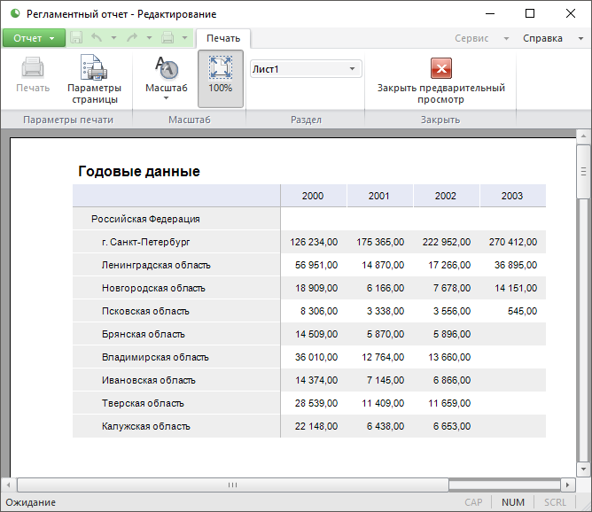

# Предварительный просмотр и печать объекта

Предварительный просмотр и печать объекта
-

# Предварительный просмотр и печать
 объекта

Режим предварительного просмотра предназначен для проверки объекта непосредственно
 перед печатью. В этом режиме объект отображается на экране точно так же,
 как будет выглядеть на бумаге.

Для выполнения предварительного просмотра:

	- в веб-приложении выполните команду «Файл >
	 Печать» в главном меню. Будет отображен диалог для настройки
	 параметров печати. Порядок работы с диалогом зависит от используемого
	 браузера;

	- в настольном приложении выполните команду «Печать >
	 Предварительный просмотр» в главном меню. Будет открыто окно
	 предварительного просмотра, описанное ниже.

Пример окна предварительного просмотра в настольном приложении:

Окно предварительного просмотра включает:

	- Главное меню. Содержит
	 команды для выполнения различных операций с объектом в режиме предварительного
	 просмотра;

	- Лента инструментов.
	 Содержит кнопки для настройки параметров печати и управления областью
	 предварительного просмотра;

	- Область предварительного просмотра.
	 Отображает объект в соответствии с заданными настройками печати.

Примечание.
 При предварительном просмотре и печати объекта может быть отображен штамп
 № 1 в соответствии с Инструкцией № 0126-87, если в качестве
 политики безопасности используется [мандатный
 доступ](admin.chm::/04_securitypolicy/admin_mandataccess.htm) и для уровня безопасности данного объекта включена
 маркировка при экспорте и печати.

Основные операции в режиме предварительного просмотра:

[Печать объекта](javascript:TextPopup(this))

	Нажмите кнопку «Печать»
	 на ленте инструментов или выполните одноименную команду в главном
	 меню.

	Будет открыт диалог «[Печать](Print_setup.htm)»
	 для настройки параметров печати и выбора используемого принтера.

[Настройка параметров
 страницы](javascript:TextPopup(this))

	Нажмите кнопку «Параметры страницы»
	 на ленте инструментов. Будет открыт диалог «Параметры
	 страницы» для настройки параметров печатных страниц объекта.

	Вид диалога «Параметры страницы»
	 отличается в зависимости от инструмента продукта «Форсайт. Аналитическая платформа»,
	 в котором выполняется предварительный просмотр. Более подробное описание
	 данного диалога вы можете найти в описании соответствующего инструмента.

[Изменение масштаба
 объекта](javascript:TextPopup(this))

	Для выбора масштаба текущего печатного листа объекта нажмите кнопку
	 «Масштаб» на ленте инструментов.
	 В отобразившемся меню укажите требуемый масштаб. Допустимые значения:

		- 200%. 150%.
		 100%. 75%.
		 50%. 25%.
		 Фиксированные значения масштаба;

		- По ширине страницы.
		 Масштаб, при котором печатный лист по ширине полностью отображается
		 в окне предварительного просмотра;

		- Масштаб, при котором определенное количество страниц печатного
		 листа полностью отображаются в окне предварительного просмотра:

			- Страница целиком;

			- Две страницы;

			- Четыре страницы;

			- Шесть страниц;

		- Произвольный. Произвольный
		 масштаб, заданный пользователем. Для ввода значения масштаба будет
		 отображен диалог «Укажите масштаб».

	Для установки масштаба в 100% нажмите кнопку «100%»
	 на ленте инструментов.

	Для изменения масштаба можно использовать кнопки мыши: наведите
	 курсор на область просмотра и щёлкните по ней для увеличения масштаба или дополнительной - для уменьшения.

[Смена просматриваемого
 печатного листа](javascript:TextPopup(this))

	Выберите требуемый лист в списке «Раздел»
	 на ленте инструментов. Выбранный лист будет отображён в области предварительного
	 просмотра.

[Выход из режима
 предварительного просмотра](javascript:TextPopup(this))

	Нажмите кнопку «Закрыть предварительный
	 просмотр» на ленте инструментов. Окно предварительного просмотра
	 будет закрыто.

См. также:

[Настройка параметров печати](Print_setup.htm)

		Справочная
		 система на версию 10.9
		 от 18/08/2025,
		 © ООО «ФОРСАЙТ»,
