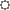

# Настройка для операнда агрегации по измерению

Настройка для операнда агрегации по измерению
-

# Настройка для операнда агрегации
 по измерению

Агрегация позволяет использовать в выражении несколько значений элементов
 из измерения операнда, агрегированных выбранным способом. Агрегация может
 быть настроена по любому измерению операнда, кроме календарного.

Примечание.
 Возможность доступна только в настольном приложении.

Для настройки агрегации по измерению:

	- На панели данных установите переключатель «Отметка».
	 Будут отображены все измерения источника данных. Например:

	- Нажмите кнопку  «Действия»,
	 расположенную слева от названия измерения. Будет отображено меню измерения.

	- В группе «Агрегация»
	 выберите один из доступных методов агрегации.

	- Для расчета агрегации с учётом иерархии элементов измерения
	 установите переключатель «По иерархии».
	 По умолчанию флажок снят и расчёт агрегации выполняется без учёта
	 иерархии.

	- Для расчёта агрегации только по тем значениям измерения, атрибуты
	 которых соответствуют определенным условиям, выполните команду «Расширенная фильтрация». Будет отображен
	 диалог «[Расширенный
	 фильтр](UFE/AttributeFiltering.htm)», в котором задайте требуемые условия.

	- После закрытия меню измерения выберите агрегируемые значения
	 в списке значений измерения на панели данных. Доступна множественная
	 отметка. Если ни одно значение не выбрано, то агрегация рассчитывается
	 по всем значениям.

В результате будет настроена агрегация значений измерения операнда.
 Для сброса агрегации выберите значение «Нет»
 в группе «Агрегация» в меню измерения.

См. также:

[Вставка
 операндов](UFE/Operands.htm)

		Справочная
		 система на версию 10.9
		 от 18/08/2025,
		 © ООО «ФОРСАЙТ»,
