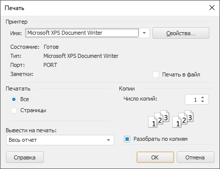

# Настройка параметров печати

Настройка параметров печати
-

# Настройка параметров печати

В настольном приложении настройка параметров печати выполняется с помощью
 диалога «Печать».

[Для отображения
 диалога](javascript:TextPopup(this))

		- выполните команду «Печать»
		 в главном меню объекта;

		- нажмите сочетание клавиш CTRL+P.

Задайте следующие параметры печати:

	- Принтер. Выберите принтер,
	 который будет использоваться для печати объекта. Для настройки параметров
	 принтера нажмите кнопку «Свойства».
	 Будет отображен диалог, вид которого зависит от выбранного принтера.
	 Для получения подробной информации о доступных настройках обратитесь
	 к документации принтера.

	-

		- Печать в файл. Если
		 флажок установлен, то объект будет напечатан в файл. Печать в
		 файл сохраняет информацию о структуре объекта, по которой можно
		 напечатать версию объекта без доступа к нему. Это может использоваться
		 для отложенной печати объекта.

		По умолчанию флажок снят и печать объекта выполняется на принтере;

	- Печатать. Укажите страницы,
	 которые должны быть напечатаны:

	-

		- Все. Будут напечатаны
		 все страницы объекта;

		- Страницы. Укажите
		 страницы, которые будут напечатаны. Водите номера или диапазоны
		 страниц, разделяя их запятыми. Диапазон порядка указывайте через
		 знак «-». Например: 1-3,5,7-9;

Примечание.
 Печать и нумерация страниц выполняются с учетом области печати, указанной
 в параметре «Вывести на печать».

	- Вывести на печать. Выберите
	 область печати объекта. Доступный набор областей зависит от типа печатаемого
	 объекта.

Примечание.
 Если в политике безопасности используется мандатный доступ и для уровня
 безопасности печатаемого объекта включена маркировка при экспорте и печати,
 то каждый напечатанный лист будет содержать штамп № 1 в соответствии с
 Инструкцией № 0126-87.

См. также:

[Предварительный просмотр и печать объекта](Object_preview.htm)

		Справочная
		 система на версию 10.9
		 от 18/08/2025,
		 © ООО «ФОРСАЙТ»,
