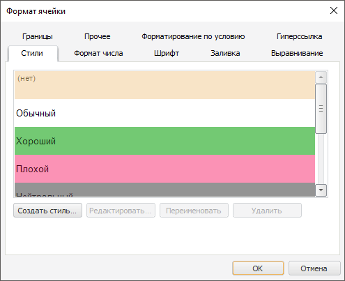
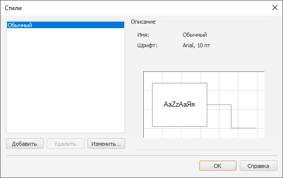

# Настройка оформления объектов в настольном приложении

Настройка оформления объектов в настольном приложении
-

# Настройка оформления объектов в
 настольном приложении

Во многих инструментах продукта «Форсайт. Аналитическая платформа»
 используются объекты, для которых можно настраивать параметры оформления
 в настольном приложении. При настройке оформления объектов необходимо
 учитывать [порядок применения оформления](applystyle.htm) и
 то, что размеры объектов можно задавать в различных [единицах
 измерения](Format/Different_units.htm).

Настройка оформления доступна:

	- с помощью [таблицы
	 стилей](../StylesTable/StylesTablePurpose.htm):

	- с помощью [диалога форматирования](Format.htm):

	- через [настройку стиля](Style_setup.htm) оформления:

	- с помощью [стилей оформления](UiETL_Objects_Styles.htm):

См. также:

[Работа с диалогом
 форматирования](Format.htm)

		Справочная
		 система на версию 10.9
		 от 18/08/2025,
		 © ООО «ФОРСАЙТ»,
