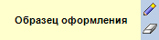
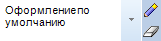

# Настройка стиля

Настройка стиля
-

# Настройка стиля

Во многих инструментах продукта «Форсайт. Аналитическая платформа»
 используются таблицы, диаграммы, фигуры и другие объекты, для которых
 можно задать такие параметры оформления, как заливка отдельных элементов,
 границы, шрифт и т.д. Совокупность этих параметров называется стилем объекта.
 Для редактирования стиля в «Форсайт. Аналитическая платформа»
 предусмотрен специальный элемент «Редактор
 стиля»:

Примечание.
 Редактор стиля доступен только в настольном приложении.

Редактор стиля позволяет выполнять операции:

[Настройка стиля](javascript:TextPopup(this))

	Для настройки стиля выполните одно из следующих действий:

		- дважды щёлкните по области предпросмотра;

		- нажмите кнопку  «Редактировать
		 оформление»;

		- выполните команду контекстного меню «Редактировать
		 оформление».

	Будет открыт диалог «Форматирование».

[Копирование
 стиля в буфер обмена](javascript:TextPopup(this))

	Оформление из редактора стиля может быть помещено в буфер обмена
	 для последующей вставки в другие редакторы стиля.

	Для копирования стиля в буфер обмена выполните команду контекстного
	 меню «Копировать».

[Вставка стиля
 в буфер обмена](javascript:TextPopup(this))

	Для вставки в редактор стиля, предварительно скопированного
	 в буфер обмена, выполните команду контекстного меню «Вставить».
	 Команда доступна, если буфер обмена содержит стиль, скопированный
	 из редактора стиля.

[Перенос стиля
 между двумя редакторами стиля](javascript:TextPopup(this))

	Стиль из редактора стиля можно передать в другой редактор стиля
	 без помещения в буфер обмена. Для этого:

		- Щёлкните по области предпросмотра редактора стиля.

		- Удерживая кнопку, перетащите стиль и отпустите на другом
		 редакторе стиля.

	В результате стиль из одного редактора стиля будет перемещён в другой
	 редактор.

[Выбор стиля
 из набора предустановленных стилей](javascript:TextPopup(this))

	Некоторые инструменты продукта «Форсайт. Аналитическая платформа»,
	 такие как «Отчёты» и «Аналитические запросы (OLAP)»,
	 позволяют подключать набор внешних стилей – специальный объект репозитория,
	 содержащий набор стилей.

	В этом случае редактор стиля при наведении на него указателя будет
	 отображать кнопку раскрытия списка:

	

	Для выбора стиля из подключённого списка:

		- Нажмите кнопку для раскрытия списка.

		- Выберите нужный стиль.

	В результате будет выбран стиль.

См. также:

[Настройка
 условного форматирования](../../UiAnalyticalArea/analysis/conditional_formatting.htm)

		Справочная
		 система на версию 10.9
		 от 18/08/2025,
		 © ООО «ФОРСАЙТ»,
