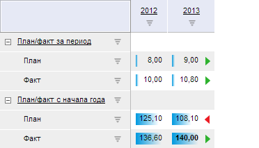

# Работа с интерактивными возможностями таблицы

Работа с интерактивными возможностями таблицы
-

# Работа с интерактивными возможностями
 таблицы

Таблица данных предназначена для отображения табличных данных из различных
 инструментов:

При работе с таблицей данных учитывайте следующие интерактивные возможности
 и особенности:

	- [выделение ячеек](Cells_Select.htm);

	- [автозаполнение
	 ячеек данными](UiExpress_Tabl_Operation_AutoFillData.htm);

	- [ввод и вставка значений в таблицу](Parse_string.htm);

	- [работа с контекстным меню
	 в веб-приложении](ContextMenu_Features.htm).

См. также:

[Настройка
 условного форматирования](../../UiAnalyticalArea/analysis/conditional_formatting.htm)

		Справочная
		 система на версию 10.9
		 от 18/08/2025,
		 © ООО «ФОРСАЙТ»,
