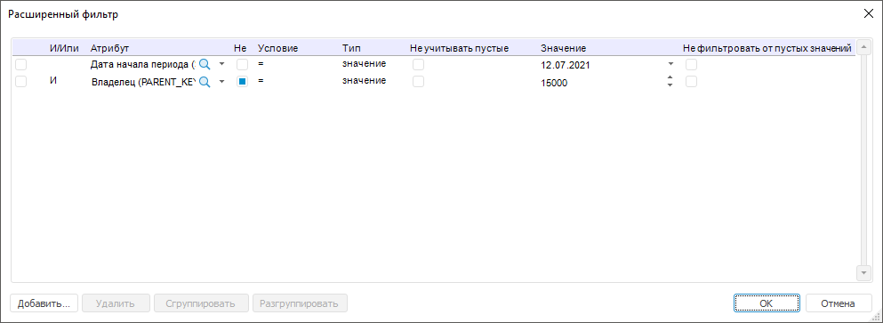
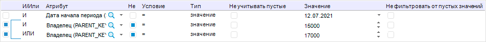
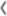
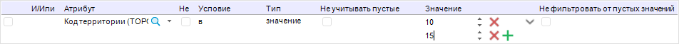
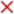
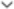

# Настройка фильтрации по значениям атрибутов

Настройка фильтрации по значениям атрибутов
-

# Настройка фильтрации по значениям атрибутов

Фильтрация элементов измерения выполняется за счёт наложения условий
 на значения атрибутов измерения. Настройка выполняется в диалоге «Расширенный фильтр»:

Для добавления условия:

	- Нажмите кнопку «Добавить».
	 В таблицу будет добавлена новая строка для задания условия.

	- В столбце «И/Или» выберите
	 один из логических операторов с помощью раскрывающегося списка:

		- И. По умолчанию.
		 Фильтрация элементов измерения будет выполняться при удовлетворении
		 всех условий фильтрации;

		- ИЛИ. Фильтрация
		 элементов измерения будет выполняться при удовлетворении одного
		 из условий фильтрации. Проверка условий выполняется последовательно.

Для группировки условий фильтрации последовательно
 установите флажки напротив условий в первом столбце и нажмите кнопку «Сгруппировать». После выполнения
 действий выбранные условия фильтрации будут сгруппированы:

Для разгруппировки условий фильтрации установите
 флажки напротив каждого условия в группе и нажмите кнопку «Разгруппировать».

	- В столбце «Атрибут»
	 выберите атрибут, на который требуется наложить условие. Для выбора
	 доступны все атрибуты измерения.

	- Установите флажок в столбце «Не»,
	 если требуется задать обратное условие. Например, значение атрибута
	 не равно пяти.

	- В столбце «Условие»
	 выберите один из типов условия:

		- =. Равно;

		- !=. Не равно;

		- в. Входит в одно
		 из заданных значений;

		- >. Больше;

		- >=. Больше или
		 равно;

		- <. Меньше;

		- <=. Меньше или
		 равно;

		- между. Находится
		 в диапазоне заданных значений. Данный тип условия доступен, если
		 выбран атрибут следующего [типа
		 данных](UiNavObj.chm::/reference_book/Master_Table_reference_book/UiMd_reference_book_Master_Table_page1_AttProps.htm): целочисленный, вещественный, дата и
		 время.

	- В столбце «Тип» выберите
	 тип сравниваемого значения:

		- Значение. Значение
		 атрибута задаётся напрямую конкретным значением;

		- Параметр. Значение
		 атрибута задаётся динамически через параметр или атрибут измерения,
		 содержащийся в параметре. Для выбора доступны только параметры
		 типа «Отметка» и их атрибуты.
		 Данный тип сравниваемого значения недоступен, если выбран тип
		 условия «Между».

	- Установите флажок в столбце «Не
	 учитывать пустые», если требуется не фильтровать элементы измерения,
	 у которых есть пустые значения по атрибуту, указанному в столбце «Атрибут». Например, если флажок
	 установлен в [блоке
	 расчёта](CalculationAlgorithm.chm::/Desktop/Calculation_block/Calculation_unit.htm), то при расчёте [алгоритма](CalculationAlgorithm.chm::/Purpose.htm),
	 содержащего данный блок, не будут исключаться элементы с пустыми значениями
	 из расчёта.

	- В столбце «Значение»
	 укажите сравниваемое значение или выберите в раскрывающемся списке
	 параметр/атрибут измерения, задающий данное значение.

Тип данных значения задается в соответствии
 с атрибутом. Если расширенный фильтр задается для календарного измерения,
 то для атрибута «Тип блока календаря»
 будет доступен выбор уровней календарного измерения в качестве значения.

Примечание.
 Если задано условие на уровень, который исключен из календарного измерения,
 то выбранное значение атрибута будет сброшено.

Если выбрано условие «в»,
 то для ввода второго и последующих значений разверните список с помощью
 кнопки 
 «Развернуть» и нажмите кнопку
 «Добавить», расположенную в конце
 строки. Будет добавлена дополнительная строка для ввода значения:

Для удаления значения нажмите кнопку  «Удалить».

После завершения ввода значений сверните
 список с помощью кнопки  «Свернуть»
 при необходимости. Заданные значения будут отображены в одной строке через
 запятую:

	- Установите флажок в столбце «Не
	 фильтровать от пустых значений», если для сравнения используется
	 значение параметра в столбце «Значение».
	 Результат расчёта при установленном флажке зависит от того, какое
	 значение принимает параметр:

		- если параметр принимает единственное значение, то из расчёта
		 не будут исключаться элементы с пустыми значениями;

		- если параметр принимает множественное значение, то из расчёта
		 будут исключаться элементы с пустыми значениями.

Примечание.
 Доступно только для типа сравниваемого значения «Параметр».

В результате будет добавлено условие фильтрации элементов измерения
 по значениям атрибутов измерения.

Для удаления условий фильтрации:

	- Установите флажки напротив условий в первом столбце.

	- Нажмите кнопку «Удалить».

После выполнения действий будут удалены выбранные условия фильтрации.

См. также:

[Настройка
 для операнда агрегации по измерению](../OperandAggregation.htm)

		Справочная
		 система на версию 10.9
		 от 18/08/2025,
		 © ООО «ФОРСАЙТ»,
