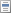

# Редактирование операнда

Редактирование операнда
-

# Редактирование операнда

Редактирование позволяет изменить отметку измерений, сделанную на этапе
 [вставки операнда](Operands.htm), и доступно для всех типов
 операндов, кроме [операндов на основе элементов
 измерения](Operands.htm#elements).

Для редактирования операнда:

	- Выполните команду «Редактировать»
	 в контекстном меню операнда или дважды по нему щёлкните. Операнд будет
	 переведён в режим редактирования. Например:

{-|-|Прочие доходы|-[t]}

В тексте операнда через вертикальную черту
 будут идти элементы, отмеченные в измерениях. Если отметка для измерения
 не задана, то будет стоять прочерк. Если в тексте отмеченного элемента
 присутствуют символы, которые могут быть [операторами](Operators.htm#operators)
 в выражении, то они экранируются с помощью символа «\». Например:

{-|-|Валовая прибыль
 \(убыток\)|-[t]}

Если операнд на основе атрибута измерения,
 то название измерения и идентификатор атрибута будут идти через точку,
 например:

{-|-|Изменение отложенных
 налоговых обязательств|-.ВИДЫ АГРЕГАЦИИ.ORD[t]}

	- Установите курсор на тот элемент операнда, который надо изменить,
	 и нажмите сочетание клавиш CTRL+ПРОБЕЛ. Будет отображён список. Содержимое
	 списка зависит от того, где стоял курсор:

		- на выбранном элементе или
		 прочерке. Список содержит:

			-  элементы измерения;

			-  параметры
			 источника данных.

		- на названии измерения.
		 Список содержит все измерения источника данных, кроме календарного;

		- на идентификаторе атрибута.
		 Список содержит все атрибуты измерения.

	- Выберите элемент из списка.

В результате операнд будет отредактирован.

См. также:

[Вставка операндов](Operands.htm)

		Справочная
		 система на версию 10.9
		 от 18/08/2025,
		 © ООО «ФОРСАЙТ»,
