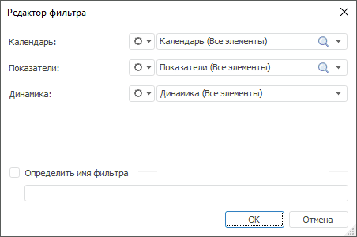

# Выбор рассчитываемых данных

Выбор рассчитываемых данных
-

# Выбор рассчитываемых данных

По умолчанию в [редакторе](../ExpressionEditor.htm) выражение
 рассчитывается по всем элементам измерений источника данных. Для расчёта
 выражения только по выбранным элементам применяется фильтрация.

[Случаи, в которых
 настройка фильтрации не требуется](javascript:TextPopup(this))

		- Объект, для которого составляется выражение, не предполагает
		 расчёта выражения только по выбранным элементам измерения.

		- Если редактируется MDX-выражение для измерения куба ADOMD.

	В данных случаях панель фильтра не отображается.

Текущий фильтр отображается на панели фильтра:

Если фильтр не применяется, то отображается значение «Не
 задан».

Для создания нового фильтра:

	- Щёлкните по названию фильтра и в отобразившемся меню выберите
	 пункт «Добавить новый фильтр».
	 Будет отображён диалог «Редактор
	 фильтра»:

В диалоге содержатся все измерения источника
 данных за исключением измерения, для которого создаётся выражение.

	- В каждом [измерении](UiSelection.chm::/Selection/Dimension.htm)
	 выберите элементы, по которым должен идти расчёт выражения. Если ни
	 один из элементов измерения не выбран, то расчёт будет идти по всем
	 элементам измерения.

	- В раскрывающемся списке «Динамика»
	 выберите календарную динамику, по которой должен идти расчёт выражения.
	 Если ни одна из динамик не выбрана, то расчёт будет идти по всем календарным
	 динамикам источника данных.

	- По умолчанию имя фильтра формируется из названий выбранных элементов
	 измерений. Для изменения имени фильтра установите флажок «Определить
	 имя фильтра» и введите новое название фильтра, позволяющее
	 легко находить его среди других фильтров.

В результате будет создан фильтр, ограничивающий количество элементов,
 по которым будет рассчитано выражение.

[Редактирование
 фильтра](javascript:TextPopup(this))

	Для редактирования текущего фильтра:

		- Щёлкните по названию фильтра.

		- В отобразившемся меню выберите пункт «Редактировать
		 фильтр».

		- Будет отображён диалог «Редактор
		 фильтра», в котором измените параметры фильтра.

	В результате текущий фильтр будет изменён.

[Применение существующего
 фильтра](javascript:TextPopup(this))

	Для применения к выражению уже существующего фильтра:

		- Щёлкните по названию фильтра.

		- В отобразившемся меню в группе «Выбрать
		 другой фильтр» выберите фильтр, который будет применён
		 к выражению.

	В результате выражение будет рассчитано по элементам, отмеченным
	 в выбранном фильтре.

[Расчёт выражения
 без фильтра](javascript:TextPopup(this))

	Для расчёта выражения без фильтра:

		- Щёлкните по названию фильтра.

		- В отобразившемся меню в группе «Выбрать
		 другой фильтр» выберите элемент «Без
		 фильтра».

	В результате выражение будет рассчитано по всем элементам измерения
	 источника данных.

[Удаление фильтра](javascript:TextPopup(this))

	Для удаления текущего фильтра:

		- Щёлкните по названию фильтра.

		- В отобразившемся меню выберите пункт «Удалить
		 фильтр».

	В результате текущий фильтр будет удалён навсегда, выражение будет
	 рассчитано по всем элементам измерения источника данных.

См. также:

[Создание формул и выражений](../ExpressionEditor.htm)

		Справочная
		 система на версию 10.9
		 от 18/08/2025,
		 © ООО «ФОРСАЙТ»,
