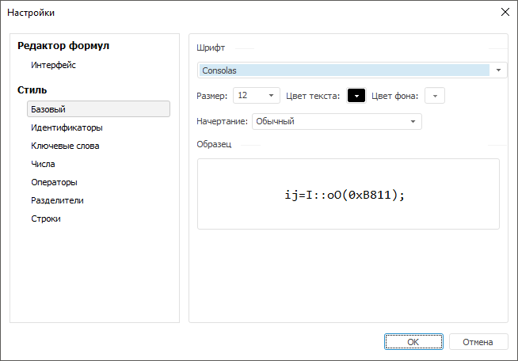

# Настройка внешнего вида выражения

Настройка внешнего вида выражения
-

# Настройка внешнего вида выражения

Настройки внешнего вида выражения влияют только на отображение выражения
 в [редакторе выражения](../ExpressionEditor.htm). Они сохраняются
 для текущего пользователя и применяются ко всем выражениям, которые он
 формирует.

Для настройки внешнего вида выражения используйте диалог «Настройки».
 Для отображения диалога нажмите кнопку «Настройки»
 в [редакторе выражения](../ExpressionEditor.htm).

В диалоге доступна настройка:

	- [стиля выражения](#style);

	- [формата наименований операндов из внешних
	 источников данных](#interface).

## Настройка стиля выражения

Для настройки стиля выражения используйте группу вкладок «Стиль».

	- На вкладке «Базовая»
	 задайте основные параметры для всех частей выражения: шрифт, размер
	 шрифта, цвет текста и цвет фона, а также стиль начертания текста.

	- Если для какой-либо части выражения требуются особые настройки
	 цвета текста или цвета фона, то перейдите на соответствующую вкладку.
	 Доступна настройка для следующих частей выражения:

		- идентификаторы;

		- ключевые слова;

		- числа;

		- операторы;

		- разделители;

		- строки.

Установите флажок «Специальный
 шрифт» и задайте требуемый цвет текста и фона.

В процессе настройки в области «Образец»
 отображается внешний вид настраиваемого элемента выражения, который он
 примет после применения выбранных параметров.

## Настройка формата наименований операндов из
 внешних источников данных

В выражении могут использоваться операнды из текущего источника данных
 и из внешних источников данных.

Для настройки формата наименований операндов из внешних источников используйте
 вкладку «Интерфейс»:

По умолчанию для операндов не отображается источник данных.

Для отображения источника данных перед названием операнда:

	- Установите флажок «Отображать
	 родительские объекты формулы в виде».

	- В раскрывающемся списке выберите: отображать имя или идентификатор
	 источника данных.

В результате, перед названием операнда будет отображаться имя или идентификатор
 источника данных. Операнд от источника данных будет отделён восклицательным
 знаком.

Например, вид по умолчанию операнда из внешнего источника данных:

{ЧИСЛЕННОСТЬ НАСЕЛЕНИЯ[t]}

Вид операнда из внешнего источника данных с указанием имени источника:

{Статистические данные!ЧИСЛЕННОСТЬ НАСЕЛЕНИЯ[t]}

См. также:

[Создание формул и выражений](../ExpressionEditor.htm)

		Справочная
		 система на версию 10.9
		 от 18/08/2025,
		 © ООО «ФОРСАЙТ»,
