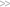
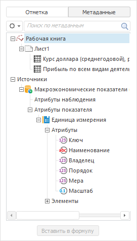
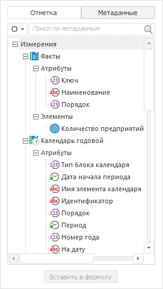

# Вставка операндов

Вставка операндов
-

# Вставка операндов

	Операнд - это элемент данных, над которым выполняются действия
	 при расчёте выражения. В [редакторе
	 выражения](../ExpressionEditor.htm) операнды вставляются с помощью панели данных и отображаются
	 в выражении в фигурных скобках.

	Доступные типы операндов:

		- Операнды на основе отметки
		 измерений. Применяется, если в выражении надо использовать
		 значение данных, полученное по заданной отметке элементов измерений;

		- Операнды на основе временных
		 рядов. Доступен только в инструменте «Анализ
		 временных рядов». Применяется, если в выражении надо использовать
		 временной ряд;

		- Операнды на основе метаданных.
		 Делятся на:

			- Операнды на основе
			 атрибута измерения. Применяется, если в выражении надо
			 использовать значение указанного атрибута, полученное по заданной
			 отметке измерений;

			- Операнды на основе
			 элемента измерения. Применяется, если в выражении надо
			 использовать значение выбранного элемента измерения.

	После вставки для операндов доступно:

		- [настройка календарных параметров
		 операндов](CalendarSetup.htm). Также рекомендуем ознакомиться с [календарными
		 особенностями операндов](CalendarSetup.htm#calendspecial);

		- [редактирование операндов](EditOperand.htm);

		- [просмотр формулы вычисляемого
		 элемента измерения](CalculatedElement.htm);

		- просмотр отметки. Возможность доступна только в настольном
		 приложении. Позволяет на панели данных отобразить отметку, сделанную
		 при вставке операнда. Для этого выполните команду «Показать
		 элемент в списке» в контекстном меню операнда.

	[Отображение
	 и скрытие панели данных](javascript:TextPopup(this))

		Для скрытия панели данных:

			- Наведите курсор на границу панели. Указатель примет
			 вид двунаправленной стрелки.

			- Щёлкните по границе панели и, удерживая кнопку мыши,
			 передвиньте границу до левой границы окна редактора выражения.

		Панель будет скрыта.

		Для отображения панели данных нажмите кнопку  «Отметка/метаданные».

## Вставка операнда на основе отметки измерений

	Результатом расчёта операнда будет значение данных, полученное по
	 заданной отметке элементов измерений.

	Для вставки операнда:

		- На панели данных установите переключатель «Отметка».
		 Будут отображены все измерения источника данных. По умолчанию
		 измерение, для которого формируется выражение, отображается первым.
		 Элементы данного измерения отображаются в виде списка, элементы
		 других измерений - в виде раскрывающихся списков. Например:

	

	Совет.
	 Если вы хотите видеть элементы других измерений в виде списка, а не
	 в виде раскрывающегося списка, то нажмите кнопку  «Действия», расположенную слева от
	 названия измерения. В отобразившемся меню выполните команду «Развернуть».

		- Под переключателем «Отметка»
		 отображается текущий источник данных, по отметке измерений которого
		 будет составлен операнд. Убедитесь, что используете нужный источник.
		 Для смены источника:

			- на ранее использовавшийся источник данных:

				- Щёлкните по названию текущего источника данных.
				 Будет отображён список всех источников данных, использовавшихся
				 ранее.

				- Выберите один из источников в списке;

			- на новый источник данных:

				- Нажмите кнопку  «Источники данных». Будет
				 отображён список всех источников данных, доступных в текущем
				 репозитории.

				- Выберите один из источников в списке или воспользуйтесь
				 поиском для нахождения нужного источника.

	Для отказа от выбора нового источника
	 данных ещё раз нажмите кнопку  «Источники
	 данных».

		- В списке элементов измерения, для которого формируется выражение,
		 выберите элемент. Он будет основным для операнда. Доступна отметка
		 только одного элемента.

	Совет.
	 Для смены отображаемых названий элементов измерения нажмите кнопку
	  «Действия», расположенную слева от
	 названия измерения. В отобразившемся меню выполните команду «Наименование» и выберите атрибуты,
	 которые будут использоваться для формирования наименования элементов.
	 Названия будут изменены на панели данных и в выражении.

		- По умолчанию отметка по остальным измерениям не задана и
		 операнд будет рассчитан по всем элементам данных измерений. Если
		 требуется ограничить число элементов, то задайте отметку по измерениям.
		 Доступна отметка только одного элемента.

	Примечание.
	 В инструментах «Анализ временных
	 рядов» и «Моделирование и
	 прогнозирование» обязательно требуется задать отметку по всем
	 измерениям, кроме календарного.

		- В настольном приложении для любого измерения, кроме календарного,
		 может быть настроена агрегация. Она позволят использовать в выражении
		 не один, а несколько элементов измерения, агрегированных выбранным
		 способом. Для получения подробной
		 информации обратитесь к статье «[Настройка для операнда агрегации
		 по измерению](../OperandAggregation.htm)».

		- Нажмите кнопку «Вставить
		 в формулу» или дважды щёлкните по выбранному элементу,
		 для которого формируется выражение, или перетащите его в область
		 выражения.

	В результате операнд на основе отметки измерений будет вставлен
	 в выражение в место расположения курсора, например:

	{Коммерческие расходы|Ассоциация производителей
	 гидравлического оборудования[t]}

	В тексте операнда через вертикальную черту идут элементы, отмеченные
	 в измерениях. Если отметка для измерения не задана, то оно не фигурирует
	 в тексте операнда.

	[t] в конце операнда означает полную отметку по календарному измерению.
	 Если для календаря отмечено определённое значение, то оно будет отображено
	 в конце операнда в квадратных скобках, например:

	{Коммерческие расходы|Ассоциация производителей
	 гидравлического оборудования[2018]}

	Если была настроена агрегация элементов измерения, то в тексте операнда
	 будет указано название этого измерения с символом ∑, например:

	{Коммерческие расходы|∑Отчетный период[t]}

	Если создаётся или редактируется вычисляемый элемент в календарном
	 измерении, то в качестве операнда на основе элемента измерений можно
	 использовать подстановку X. Данная подстановка при вычислении выражения
	 соответствует элементу измерения, полученному по текущей отметке всех
	 измерений, кроме календарного. Если требуется полная отметка по календарному
	 измерению, то укажите [t] в конце операнда, например:

	{X[t]}

	Если для календарного измерения требуется определённое значение,
	 то укажите его в конце операнда в квадратных скобках, например:

	{X[2018]}

	[Пример с
	 использованием подстановки X](javascript:TextPopup(this))

		В таблице приведены данные по странам. Календарное измерение
		 расположено по столбцам. Элемент в последнем столбце вычисляемый
		 и рассчитывается с помощью подстановки X: значение текущего элемента
		 из столбца 2017, увеличенное на два:

				 2015
				 2016
				 2017
				 {x[2017]}+2

				 Испания
				 14,7
				 12,6
				 13,4
				 15,4

				 Франция
				 15,9
				 17,8
				 19,8
				 21,8

				 Великобритания
				 11,1
				 13,7
				 16,7
				 18,7

	Совет. Для повторной
	 вставки операнда, уже использующегося в выражении, нажмите сочетание
	 клавиш CTRL+ПРОБЕЛ. Будет отображен список доступных операндов и функций.
	 Операнды расположены в начале списка и отмечены пиктограммой . Щёлкните
	 по операнду в списке и он будет вставлен в выражение в место расположения
	 курсора. Возможность доступна только в настольном приложении.

## Вставка операндов на основе временных рядов

	В инструменте «Анализ временных
	 рядов» доступно использование операндов, построенных на временных
	 рядах из текущей рабочей книги. По сути операнд на основе временного
	 ряда - это операнд с отметкой по всем возможным измерениям. Результатом
	 расчёта операнда будет временной ряд.

	Для вставки операнда:

		- Установите переключатель «Метаданные»
		 на панели данных. В верхней части панели перед списком «Источники» будут отображаться
		 все ряды из текущей книги, например:

	

		- Выберите один ряд.

		- Нажмите кнопку «Вставить
		 в формулу» или дважды щёлкните по выбранному ряду, или
		 перетащите его в область выражения.

	В результате операнд на основе временного ряда будет вставлен в
	 выражение в место расположения курсора, например:

	{Курс доллара (среднегодовой), рублей за доллар
	 США|A[t]}

	[t] в конце операнда означает полную отметку по календарному измерению.

## Вставка операндов на основе метаданных

	К операндам на основе метаданных относятся операнды на основе атрибута
	 измерения и операнды на основе элемента измерения. Данные виды операндов
	 чаще всего используются совместно для создания условий в выражениях.

	Примечание.
	 Вставка операндов на основе метаданных доступна для всех выражений
	 кроме MDX-выражения для измерения куба ADOMD и выражений в инструменте
	 «Моделирование и прогнозирование».

	Для отображения метаданных установите переключатель «Метаданные»
	 на панели данных. Будет отображён иерархический список всех измерений
	 источника данных. Для каждого измерения будет отображён список атрибутов
	 и список элементов. Например:

	

	Если выражение составляется в инструменте «Анализ
	 временных рядов», то атрибуты будут разделены на атрибуты наблюдений
	 и атрибуты рядов.

	Совет. Для смены
	 отображаемых названий метаданных нажмите кнопку 
	 и выберите один из вариантов отображения названия. Названия будут
	 изменены только на панели данных.

### Вставка операнда на основе атрибута измерения

	Результатом расчёта операнда будет значение указанного атрибута,
	 полученное по заданной отметке измерений.

	Для вставки операнда:

		- Вставьте операнд на основе отметки измерений. Исходя из
		 данного операнда будет вычисляться значение операнда на основе
		 атрибута измерения.

		- На панели данных установите переключатель «Метаданные».

		- Выберите один атрибут измерения.

		- Нажмите кнопку «Вставить
		 в формулу» или дважды щёлкните по выбранному атрибуту,
		 или перетащите атрибут в область выражения.

	В результате операнд на основе атрибута измерения будет вставлен
	 в выражение в место расположения курсора, например:

	{Коммерческие расходы.ТЕРРИТОРИИ.NAME[t]}

	[t] в конце операнда означает полную отметку по календарному измерению.
	 Если для календаря отмечено определённое значение, то оно будет отображено
	 в конце операнда в квадратных скобках, например:

	{Коммерческие расходы.ТЕРРИТОРИИ.NAME[2018]}

	В тексте операнда через точку указаны название измерения и выбранный
	 атрибут.

### Вставка операнда на основе элемента измерения

	Результатом расчёта операнда будет значение выбранного элемента
	 измерения.

	Для вставки операнда:

		- На панели данных установите переключатель «Метаданные».

		- Выберите один элемент измерения.

		- Нажмите кнопку «Вставить
		 в формулу» или дважды щёлкните по выбранному элементу,
		 или перетащите метаданные в область выражения.

	В результате операнд на основе элемента измерения будет вставлен
	 в выражение в место расположения курсора, например:

	Валовая прибыль (убыток)

	Текст операнда совпадает с названием выбранного элемента и отображается
	 без фигурных скобок. Если значение элемента текстовое, то для корректного
	 использования в выражении возьмите его в кавычки, например:

	"Валовая прибыль (убыток)"

См. также:

[Вставка функций и операторов](Operators.htm) |
 [Создание формул и выражений](../ExpressionEditor.htm)

		Справочная
		 система на версию 10.9
		 от 18/08/2025,
		 © ООО «ФОРСАЙТ»,
