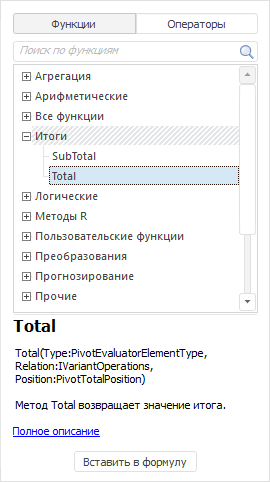
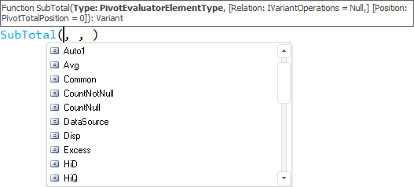
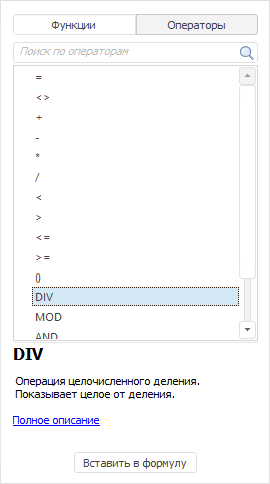

# Вставка функций и операторов

Вставка функций и операторов
-

# Вставка функций и операторов

	Функция - это последовательность действий, выполняемых над
	 операндом при расчёте выражения. Оператор - это отдельное действие,
	 выполняемое над операндом при расчёте выражения. В [редакторе
	 выражения](../ExpressionEditor.htm) функции и операторы могут быть вставлены с помощью панели
	 функций или введены с клавиатуры.

	Для вставки доступны:

		- Системные функции.
		 Доступны в редакторе выражения сразу после установки «Форсайт. Аналитическая платформа»;

		- Пользовательские функции
		 и методы. Позволяют расширить возможности выражения за
		 счёт использования пользовательских методик расчёта. Для их использования
		 они должны быть написаны на языке [Fore](Fore.chm::/Fore_Title.htm), иметь
		 модификатор Public и сохранены в текущем репозитории;

		- Операторы.

	Набор доступных функций и операторов зависит от объекта, для которого
	 составляется выражение.

	Для получения краткого описания функции или оператора выделите его
	 на панели функций. Описание отобразится в нижней части панели. В настольном
	 приложении доступно получение ссылки на полное описание функции или
	 оператора. Для этого нажмите ссылку «Полное
	 описание», расположенную в конце краткого описания.

	Совет. Если
	 вы хотите посмотреть описание функции или оператора, задействованного
	 в выражении, то вызовите контекстное меню и выполните команду «Описание» для отображения краткого
	 описания на панели данных или команду «Справка»
	 для отображения справки по выбранной функции или оператору. Возможность
	 доступна только в настольном приложении.

	[Отображение
	 и скрытие панели функций](javascript:TextPopup(this))

		Для скрытия панели функций:

			- Наведите курсор на границу панели. Указатель примет
			 вид двунаправленной стрелки.

			- Щёлкните по границе панели и, удерживая кнопку мыши,
			 передвиньте границу до правой границы окна редактора
			 выражения.

		Панель будет скрыта.

		Для отображения панели функций нажмите кнопку  «Операторы/функции».

## Вставка системных функций

	Системные функции доступны в редакторе выражения сразу после установки
	 «Форсайт. Аналитическая платформа».

	Примечание.
	 Если в источнике данных отсутствует календарное измерение, то в редакторе
	 выражения недоступны функции, использующие календарное измерение.
	 Если источник данных содержит несколько календарных измерений, будет
	 использоваться измерение, для которого указан [тип](uiselection.chm::/Selection/Dimension_type.htm)
	 «Шкала времени».

	[Доступные
	 системные функции](javascript:TextPopup(this))

		Все системные функции разделены на категории:

			- [агрегация](../Function/Aggregation/Func_Aggregation.htm);

			- [арифметические
			 функции](../Function/Arithmetic/Func_Arithmetic.htm);

			- [итоги](../Function/Totals/Func_Totals.htm);

			- [логические
			 функции](../Function/Logical/Func_Logical.htm);

			- [методы
			 R](../Function/R_methods/Func_R_methods.htm);

			- [преобразования](../Function/Transformations/Func_Transformations.htm);

			- [прогнозирование](../Function/Forecasting/Func_Forecasting.htm);

			- [прочие](../Function/Other/Func_Other.htm);

			- [работа с
			 Java](../Function/Java/Methods_Java.htm). Для использования статических методов, написанных
			 на языке Java, выполните [интеграцию](../../02_Navigator/CommonSettings/Integration.htm#java)
			 «Форсайт. Аналитическая платформа»
			 с Java;

			- [работа
			 с Python](../Function/Python/Func_Python.htm). Для использования функций, написанных на языке
			 Python, выполните [интеграцию](../../02_Navigator/CommonSettings/Integration.htm#python)
			 «Форсайт. Аналитическая платформа»
			 с Python;

			- [регрессия](../Function/Regression/Func_Regression.htm);

			- [сглаживание](../Function/Smoothing/Func_Smoothing.htm);

			- [текстовые функции](../Function/Text/Func_Text.htm).

	Для вставки системной функции:

		- На панели функций установите переключатель «Функции».
		 Будут отображены все доступные функции. Например:

	

		- Выберите функцию из списка или найдите её с помощью поиска.

		- Выполните одно из действий:

			- нажмите кнопку «Вставить
			 в формулу»;

			- дважды щёлкните по функции;

			- перетащите функцию в область выражения.

	Примечание.
	 К системным функциям также относятся временны́е и фиктивные переменные.
	 Они могут быть вставлены только из раскрывающегося списка функций.
	 Для его вызова установите курсор в область выражения и нажмите сочетание
	 клавиш CTRL+ПРОБЕЛ. В отобразившемся списке найдите нужную временну́ю
	 или фиктивную переменную и дважды по ней щёлкните. Она будет вставлена
	 в место расположения курсора.
	 Для получения подробной информации обратитесь к разделу «[Временны́е
	 и фиктивные переменные](uimodelling.chm::/2_Container_of_Modeling/2_3_Work_object/2_3_2_Model/Specification/UiModelling_TempVar.htm)».

		- Функция будет вставлена в область выражения в место расположения
		 курсора. Сразу же будут вставлены скобки для ввода значений параметров
		 функции. Если параметров несколько, то они будут перечислены через
		 запятую. Например, вид функции SubTotal
		 сразу после вставки в область выражения:

	SubTotal(, , )

		- Последовательно введите значения параметров функции.

		В настольном приложении доступно отображение всплывающей подсказки
		 по текущему параметру и подсказки с доступными значениями параметра.
		 Для этого установите курсор на место интересующего параметра и
		 нажмите сочетание клавиш CTRL+ПРОБЕЛ. Будут отображены все возможные
		 подсказки, например:

	

	Подсказка по текущему параметру отображается
	 сверху, по доступным значениям параметра - снизу. В качестве значений
	 параметра могут быть использованы:

			-  значения
			 перечисления;

			-  операнды;

			-  функции;

			-  параметры
			 источника данных.

	В результате функция будет вставлена в выражение, например:

	SubTotal({Добыча угля[t]},null ,PivotTotalPosition.Columns)

	Совет. Если
	 вы знаете название функции, которую хотите использовать, то можете
	 вводить её прямо с клавиатуры. В настольном приложении автоматически
	 будет отображена всплывающая подсказка по параметрам и значениям параметров
	 функции.

## Вставка пользовательских функций и методов

	Пользовательские функции и методы позволяют расширить возможности
	 выражения за счёт использования пользовательских методик расчёта.
	 Для их использования они должны быть написаны на языке [Fore](Fore.chm::/Fore_Title.htm), иметь
	 модификатор Public и сохранены в текущем репозитории.

	Для вставки пользовательской функции:

		- В области выражения вставьте курсор в то место, в котором
		 должна быть расположена пользовательская функция.

		- Введите полный путь к функции:

	<Идентификатор
	 модуля>.<Имя функции>

		- Если прикладная функция содержит параметры, то введите их
		 в круглых скобках сразу после полного пути к функции.

	В результате прикладная функция будет вставлена в выражение, например:

	CALCFUNC.UserCalculation({Количество предприятий[t]},
	 100)

	Совет. Если вы хотите видеть свою прикладную функцию
	 в списке системных функций, то подключите её на панель функций в отдельную
	 в категорию «Пользовательские функции».
	 Вставка подобных функций будет выполняться аналогично вставке системных
	 функций. Для получения подробной
	 информации обратитесь к разделу «[Подключение
	 пользовательских функций](../ExpressionEditor_UserFunc.htm)».

## Вставка операторов

	Операторы предназначены для обозначения действий, выполняемых с
	 операндами.

	[Доступные
	 операции](javascript:TextPopup(this))

			- [Арифметические
			 операции](Fore.chm::/07_Operations/Arithmetical_operations.htm): +, -, *, /, MOD, DIV.

			- [Операции
			 отношения](Fore.chm::/07_Operations/Operations_relations.htm): =, <>, >, <, >=,
			 <=.

			- [Логические
			 операции](Fore.chm::/07_Operations/Logical_operations.htm): AND, OR.

			- [Унарные
			 операции](Fore.chm::/07_Operations/Unary_operations.htm): NOT.

	Для вставки оператора:

		- В области выражения вставьте курсор в то место, в котором
		 должен быть расположен оператор.

		- Введите оператор с клавиатуры или на панели функций установите
		 переключатель «Операторы».
		 Будут отображены все доступные операторы. Например:

	

		- Выберите оператор из списка или найдите его с помощью поиска.

		- Нажмите кнопку «Вставить
		 в формулу» или дважды щёлкните по оператору, или перетащите
		 его в область выражения.

	В результате оператор будет вставлен в область выражения.

См. также:

[Вставка операндов](Operands.htm) |
 [Создание
 формул и выражений](../ExpressionEditor.htm)

		Справочная
		 система на версию 10.9
		 от 18/08/2025,
		 © ООО «ФОРСАЙТ»,
