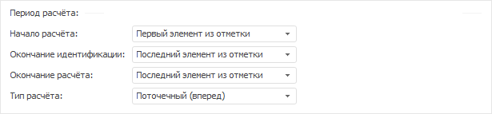
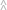

# Настройка периода расчёта выражения

Настройка периода расчёта выражения
-

# Настройка периода расчёта выражения

Для настройки периода расчёта выражения используйте панель периода расчёта.
 Например:

[Отображение
 и скрытие панели периода расчёта](javascript:TextPopup(this))

	Для скрытия панели:

		- Наведите курсор на границу панели. Указатель примет вид
		 двунаправленной стрелки.

		- Щёлкните по границе панели и, удерживая кнопку мыши, передвиньте
		 границу до нижней границы окна редактора выражения.

	Панель будет скрыта.

	Для отображения панели нажмите кнопку  «Параметры расчета».

[Случаи, в которых
 настройка периода расчёта не требуется](javascript:TextPopup(this))

		- Объект, для которого составляется выражение, не требует
		 настройки периода расчёта.

		- В источнике данных объекта отсутствует календарное измерение.

		- Если редактируется MDX-выражение для измерения куба ADOMD.

	В данных случаях панель периода расчёта не отображается.

Набор доступных параметров зависит от объекта, для которого настраивается
 выражение. Также обратите внимание на особенности, приведённые в разделе
 «[Особенности задания периода расчёта](#features)».

Задайте параметры периода расчёта:

	- Начало расчёта. Задайте
	 способ определения даты начала расчёта выражения:

		- Первый элемент из отметки.
		 Значение по умолчанию. Дата начала расчёта определяется по первому
		 отмеченному элементу в календарном измерении;

		- Начало данных +/-.
		 Дата начала расчёта равна первой фактической дате входного ряда
		 плюс число периодов, указанных в редакторе чисел, расположенном
		 справа;

		- Определенная дата.
		 Укажите дату начала расчёта в редакторе дат, расположенном справа;

		- Сегодня +/-. Дата
		 начала расчёта равна текущей дате плюс число периодов, указанных
		 в редакторе чисел, расположенном справа;

		- От конца периода идентификации.
		 Дата начала расчёта равна дате окончания периода идентификации
		 минус число периодов, указанных в редакторе чисел, расположенном
		 справа;

	- Окончание идентификации.
	 Задайте способ определения даты окончания идентификации выражения:

		- Последний элемент из отметки.
		 Значение по умолчанию. Дата окончания идентификации определяется
		 по последнему отмеченному элементу в календарном измерении;

		- Окончание данных +/-.
		 Дата окончания идентификации равна последней фактической дате
		 входного ряда плюс число периодов, указанных в редакторе
		 чисел, расположенном справа;

		- Определенная дата.
		 Укажите дату окончания идентификации в редакторе дат, расположенном
		 справа;

		- Сегодня +/-. Дата
		 окончания идентификации равна текущей дате плюс число периодов,
		 указанных в редакторе чисел, расположенном справа;

		- От начала расчёта.
		 Дата окончания идентификации равна дате начала расчёта плюс число
		 периодов, указанных в редакторе чисел, расположенном справа;

	- Окончание расчёта. Задайте
	 способ определения даты окончания расчёта выражения:

		- Конец периода отображения.
		 Дата окончания расчёта равна дате окончания периода отображения
		 данных в рабочей книге;

		- Последний элемент из отметки.
		 Значение по умолчанию. Дата окончания расчёта определяется по
		 последнему отмеченному элементу в календарном измерении;

		- Определенная дата.
		 Укажите дату окончания расчёта в редакторе дат, расположенном
		 справа;

		- Окончание данных +/-.
		 Дата окончания расчёта равна последней фактической дате входного
		 ряда плюс число периодов, указанных в редакторе чисел, расположенном
		 справа;

		- Сегодня +/-. Дата
		 окончания расчёта равна текущей дате плюс число периодов, указанных
		 в редакторе чисел, расположенном справа;

		- От конца периода идентификации.
		 Дата окончания расчёта равна дате окончания периода идентификации
		 плюс число периодов, указанных в редакторе чисел, расположенном
		 справа;

	- Тип расчёта. Задайте
	 тип расчёта выражения:

		- Векторный. Используется
		 по умолчанию. Выражение рассчитывается одновременно по всем точкам
		 данных;

		- Поточечный (вперед).
		 Расчёт ведется последовательно в каждой точке данных: сначала
		 выражение рассчитывается по первой данных, затем - по второй точке
		 и т.д.;

		- Поточечный (назад).
		 Расчёт ведется последовательно в каждой точке данных: сначала
		 выражение рассчитывается по последней точке, затем - по предпоследней
		 точке и т.д.;

	- Динамика. Выберите динамику
	 расчёта.

После задания параметров выражение будет рассчитано в соответствии с
 указанным периодом расчёта.

## Особенности задания периода расчёта

	- Если в источнике данных отсутствует календарное измерение, то
	 недоступен выбор динамики расчета. Если источник данных содержит несколько
	 календарных измерений, будет использоваться измерение, для которого
	 указан [тип](uiselection.chm::/Selection/Dimension_type.htm)
	 «Шкала времени».

	- Если выражение создаётся для табличного визуализатора и период
	 расчёта или одна из дат периода расчёта заданы с помощью параметра
	 через свойство [IMsFormulaTermInfo.DateParamID](KeMs.chm::/Interface/IMsFormulaTermInfo/IMsFormulaTermInfo.DateParamID.htm),
	 то данная дата не будет учитываться для способов «Начало
	 данных +/-» и «Окончание
	 данных +/-».

	- Если используется способ «Сегодня
	 +/-», то даты окончания идентификации и прогнозирования смещаются
	 на конец периода. Актуально для динамик от месячной и выше. Например,
	 дата окончания идентификации - апрель 2012, а дата окончания расчёта
	 равняется дате окончания идентификации. Таким образом, при вычислении
	 ряда дата окончания расчёта - 30.04.2012.

	- Если способ предполагает сдвиг даты вперёд или назад, то сдвиг
	 выполняется по динамике вычисляемого элемента. Например, для начала
	 расчёта выбран способ «Начало данных
	 +/-», в редакторе чисел указано значение -4, а вычисляемый
	 элемент имеет месячную динамику. Таким образом, начало расчёта будет
	 равно дате начала данных минус четыре месяца.

	- Способ определения начала расчёта «От
	 конца периода идентификации» не может одновременно использоваться
	 со способом определения окончания идентификации «От
	 начала расчёта».

	- Способ определения окончания расчёта «Конец
	 периода отображения» доступен, если редактор выражения вызван
	 из инструмента «Анализ временных
	 рядов».

См. также:

[Создание формул и выражений](../ExpressionEditor.htm)

		Справочная
		 система на версию 10.9
		 от 18/08/2025,
		 © ООО «ФОРСАЙТ»,
