# Автозаполнение ячеек данными

Автозаполнение ячеек данными
-

# Автозаполнение ячеек данными

В таблицах реализована возможность автозаполнения ячеек на основе [выделенного диапазона](Cells_Select.htm).

Автозаполнение ячеек данными доступно в режиме редактирования в инструментах:

	- «Аналитические панели»,
	 если разрешено [редактирование
	 данных](UiAdhoc.chm::/Document/Document.htm);

	- «Аналитические запросы (OLAP)»;

	- «Анализ временных рядов»;

	- «Моделирование и прогнозирование»;

	- «Отчёты».

А также автозаполнение доступно в расширении «Интерактивные
 формы ввода данных».

Существует несколько вариантов автозаполнения:

[Копирование](javascript:TextPopup(this))

	Данный вариант позволяет заполнить ячейки без изменения исходных
	 данных.

	Для заполнения ячеек без изменения исходных данных:

		- с помощью мыши:

			- Установите курсор над квадратным маркером, находящимся
			 в углу контура выделенного диапазона, и зажмите клавишу CTRL.
			 Курсор примет:

				- в веб-приложении вид указателя - 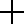;

				- в настольном приложении вид указателя - 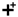.

			- Зажмите кнопку мыши и переместите курсор в необходимое
			 место таблицы;

		- с помощью меню кнопки  «Автозаполнение» в веб-приложении
		 или кнопки  «Автозаполнение»
		 в настольном приложении:

			- Установите курсор над квадратным маркером, находящимся
			 в углу контура выделенного диапазона. Курсор примет вид указателя - .

			- Зажмите кнопку мыши и переместите курсор в необходимое
			 место таблицы. В правом нижнем углу полученного диапазона
			 отобразится кнопка:

				-  «Автозаполнение»
				 в веб-приложении;

				-  «Автозаполнение»
				 в настольном приложении.

			- Выполните команду «Копировать»
			 в раскрывающемся меню указанной кнопки.

	Особенности при копировании:

		- если выделена одна ячейка, то копируется её значение:

			- в веб-приложении:

	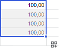

			- в настольном приложении:

	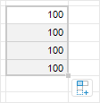

		- если выделено несколько ячеек, их значения копируются последовательно:

			- в веб-приложении:

	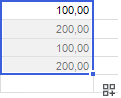

			- в настольном приложении:

	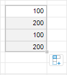

[Заполнение](javascript:TextPopup(this))

	Данный вариант позволяет заполнить ячейки с помощью линейного тренда.

	Под линейным трендом понимается тенденция изменения временного ряда,
	 описанная при помощи линейного уравнения.

	Для заполнения ячеек с помощью линейного тренда:

		- используйте мышь:

			- Установите курсор над квадратным маркером, находящимся
			 в углу контура выделенного диапазона. Курсор примет вид указателя - .

			- Зажмите кнопку мыши и переместите курсор в необходимое
			 место таблицы.

		- используйте меню кнопки  «Автозаполнение» в веб-приложении
		 или кнопки  «Автозаполнение»
		 в настольном приложении:

			- Установите курсор над квадратным маркером, находящимся
			 в углу контура выделенного диапазона. Курсор примет:

				- в веб-приложении вид указателя - ;

				- в настольном приложении вид указателя - .

			- Зажмите кнопку мыши и переместите курсор в необходимое
			 место таблицы. В правом нижнем углу полученного диапазона
			 появится кнопка:

				-  «Автозаполнение»
				 в веб-приложении;

				-  «Автозаполнение»
				 в настольном приложении.

			- Выполните команду «Заполнить»
			 в раскрывающемся меню указанной кнопки.

	Особенности при заполнении:

		- если выделена одна ячейка, при автозаполнении её значение
		 увеличивается на 1:

			- в веб-приложении:

	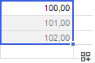

			- в настольном приложении:

	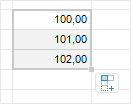

		- если выделено несколько ячеек, при автозаполнении рассчитывается
		 значение линейного тренда:

			- в веб-приложении:

	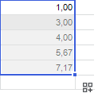

			- в настольном приложении:

	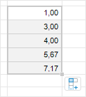

[Заполнение
 с шагом](javascript:TextPopup(this))

	Данный вариант позволяет заполнить ячейки с указанным шагом.

	Для установки значения шага:

		- Выполните один из вариантов автоматического заполнения:
		 [копирование](UiExpress_Tabl_Operation_AutoFillData.htm#copy)
		 или [заполнение](UiExpress_Tabl_Operation_AutoFillData.htm#fill).

		- Выполните команду «Заполнить
		 с шагом» в раскрывающемся меню кнопки  «Автозаполнение» в веб-приложении
		 или кнопки  «Автозаполнение»
		 в настольном приложении. Откроется окно «Заполнить
		 с шагом»:

			- в веб-приложении:

	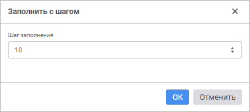

			- в настольном приложении:

	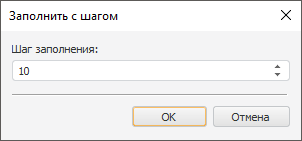

		- Укажите необходимый шаг заполнения.

	Примечание.
	 Значение шага заполнения может быть отрицательным.

	Особенности при заполнении с шагом:

		- если выделена одна ячейка, то её значение изменяется на
		 один шаг:

			- в веб-приложении:

	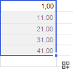

			- в настольном приложении:

	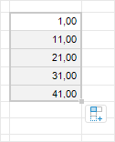

		- если выделено несколько ячеек, то значение каждой из них
		 изменяется на указанный шаг:

			- в веб-приложении:

	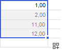

			- в настольном приложении:

	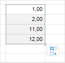

После выполнения автозаполнения расширяемый диапазон заполнится, основываясь
 на содержимом ячеек исходного диапазона и выбранном варианте автозаполнения.
 При дальнейшем редактировании ячеек, входящих в выделенный диапазон, кнопка  «Автозаполнение» в веб-приложении
 или кнопка  «Автозаполнение» в настольном приложении
 будет скрыта. Результат автозаполнения сохраняется.

## Особенности автозаполнения ячеек

При автозаполнении ячеек вместе с данными копируются [оформление
 ячеек](Cells_Select.htm#feature_sel_range) и [формулы](Cells_Select.htm#feature_sel_range),
 заданные для ячеек.

Примечание.
 Копирование данных с оформлением доступно только в инструменте «Отчёты». В отчёте для отмены копирования
 вышеперечисленных параметров снимите флажок  «Копировать оформление» в меню кнопки
  «Автозаполнение» в веб-приложении
 или флажок «Копировать оформление»
 в меню кнопки  «Автозаполнение»
 в настольном приложении.

В настольном приложении в [табличном визуализаторе](UiReport.chm::/Desktop/AreaData/DataTable.htm)
 для сохранения скопированного оформления необходимо установить флажок
 «Использовать оформление листа»
 вкладки «Параметры» группы вкладок
 «Таблица». Иначе при сохранении
 или отмене сохранения скопированное оформление сбросится.

При автозаполнении двойным щелчком заполнение ячеек происходит от текущего
 выделенного диапазона вниз до конца таблицы, если в столбце присутствуют
 ячейки с уже введенными данными, то заполнение будет до данных ячеек.

## Как определить, что будет выполнено: копирование или заполнение?

Если курсор установлен над квадратным маркером, находящимся в углу контура
 выделенного диапазона, зажата кнопка мыши и пользователь собирается растянуть
 диапазон до необходимых размеров, то как определить, что будет выполнено:
 копирование или заполнение?

Если пользователь выделил:

	- одну ячейку, то при
	 растягивании вправо, влево, вверх или вниз будет выполнено копирование;

	- более одной ячейки по горизонтали,
	 то:

		- при растягивании вправо или влево будет выполнено заполнение;

		- при растягивании вверх или вниз будет выполнено копирование;

	- более одной ячейки по вертикали,
	 то:

		- при растягивании вправо или влево будет выполнено копирование;

		- при растягивании вверх или вниз будет выполнено заполнение;

	- более одной ячейки по горизонтали
	 и вертикали, вправо, влево, вверх или вниз будет выполнено
	 заполнение;

	- любой диапазон из одной или
	 нескольких ячеек, то при растягивании в несколько сторон одновременно,
	 например, и вниз, и влево, будет выполнено заполнение.

Примечание.
 Если при растягивании была зажата клавиша CTRL, то будет выполнено копирование
 независимо от выбранного диапазона и направления растягивания.

См. также:

[Работа
 с интерактивными возможностями таблицы](Table_Work.htm) | [Выделение
 ячеек](Cells_Select.htm)

		Справочная
		 система на версию 10.9
		 от 18/08/2025,
		 © ООО «ФОРСАЙТ»,
