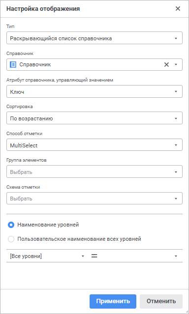
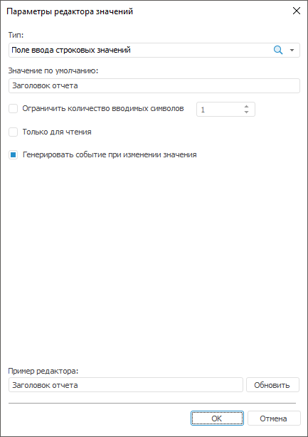
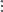
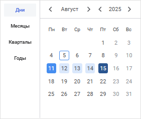

# Настройка редактора значений

Настройка редактора значений
-

# Настройка редактора значений

Редакторы значений используются для удобного ввода/выбора значений:

	- [параметров
	 объектов](../02_Navigator/General_Principles_of_Work.htm#open_param_object);

	- [параметров
	 визуализаторов](UiAdhoc.chm::/Blocks/Gadgets/Panels/DataSource_param.htm#params) в аналитической панели;

	- [параметров
	 источника данных](UiExpress.chm::/Express/Data_sources_parameters.htm) экспресс-отчёта;

	- [параметров](uireport.chm::/desktop/Reports/UiReport_Reports_Param1.htm)
	 регламентного отчёта;

	- [элементов
	 управления](uireport.chm::/desktop/source/controls.htm);

	- [формата
	 ячеек](Format/UiReport_Table_Attribute_Format.htm#cell_editor).

Окно «Параметры
 редактора значений»:

	 Веб-приложение Настольное приложение

		

		

Примечание.
 Набор отображаемых параметров зависит от выбранного типа редактора.

## Поддерживаемые типы редакторов

Списки и деревья:

[Иерархический
 список/Комбинированное дерево](javascript:TextPopup(this))

	Иерархический список в веб-приложении или комбинированное дерево
	 в настольном приложении отображает набор возможных значений в виде
	 иерархического списка (или дерева).

	Задайте параметры редактора:

		- Значение по умолчанию.
		 Задайте значение по умолчанию. Данное значение должно входить
		 в множество значений, указанных в списке возможных значений;

		- Список возможных значений.
		 В данном поле формируется дерево возможных значений:

			- для добавления вершины:

				- в веб-приложении выполните команду «Добавить
				 вершину» раскрывающегося меню кнопки «Добавить».
				 В добавленном поле введите имя вершины;

				- в настольном приложении нажмите кнопку «Вершина».
				 В открывшемся диалоге введите имя вершины.

	Вершина добавляется на первый уровень,
	 если это первый добавленный элемент, или на один уровень с выделенным
	 элементом;

			- для добавления дочернего элемента к выбранному элементу:

				- в веб-приложении выполните команду «Добавить
				 подэлемент» раскрывающегося меню кнопки «Добавить». В добавленном
				 поле введите имя элемента;

				- в настольном приложении нажмите кнопку «Подэлемент».
				 В открывшемся диалоге введите имя элемента и нажмите «ОК»;

			- для переименования элемента в веб-приложении выполните
			 команду «Переименовать»
			 раскрывающегося меню кнопки  «Настройка»;

			- для удаления выбранного элемента:

				- в веб-приложении нажмите кнопку  «Удалить» или выполните
				 команду «Удалить»
				 раскрывающегося меню кнопки  «Настройка»;

				- в настольном приложении нажмите кнопку «Удалить»;

			- для удаления всех элементов дерева в настольном приложении
			 нажмите кнопку «Очистить».

	Для предварительного просмотра заданных параметров в настольном
	 приложении нажмите кнопку «Обновить»,
	 указанные значения будут отображены в поле «Пример
	 редактора».

[Список/Комбинированный
 список](javascript:TextPopup(this))

	Список в веб-приложении или комбинированный список в настольном
	 приложении позволяет задавать значение из заранее определённого списка
	 значений.

	Задайте параметры редактора:

		- Значение по умолчанию.
		 Задайте значение по умолчанию. Данное значение должно входить
		 в множество значений, указанных в списке возможных значений;

		- Разрешить ввод.
		 При установленном флажке в поле редактора можно ввести значение,
		 которое отсутствует в раскрывающемся списке;

		- Список возможных значений.
		 В данном поле формируется список предустановленных значений:

			- для добавления значения:

				- в веб-приложении нажмите кнопку  «Добавить». В открывшемся
				 поле введите значение;

				- в настольнои приложении нажмите кнопку «Добавить».
				 В открывшемся окне введите значение;

			- для переименования элемента
			 в веб-приложении выполните команду «Переименовать»
			 раскрывающегося меню кнопки  «Настройка»;

			- для удаления выбранного
			 элемента:

				- в веб-приложении нажмите кнопку  «Удалить» или выполните
				 команду «Удалить»
				 раскрывающегося меню кнопки  «Настройка»;

				- в настольном приложении нажмите кнопку «Удалить»;

			- для удаления всех элементов
			 списка в настольном приложении нажмите кнопку «Очистить».

	Для предварительного просмотра заданных параметров в настольном
	 приложении нажмите кнопку «Обновить»,
	 указанные значения будут отображены в поле «Пример
	 редактора».

[Раскрывающийся
 список справочника](javascript:TextPopup(this))

	Раскрывающийся список справочника позволяет отображать и задавать
	 значения при помощи раскрывающегося списка с элементами справочника.

	Задайте параметры редактора:

		- Справочник. В раскрывающемся
		 списке выберите справочник, элементы которого будут отображаться
		 в редакторе;

		- Атрибут справочника, управляющий
		 значением. В раскрывающемся списке выберите атрибут справочника,
		 который будет использован для передачи значения параметру. Например,
		 в справочнике отображаются наименования элементов, а параметр
		 принимает целочисленные значения. В этом случае параметру необходимо
		 передавать значения атрибута «Идентификатор».
		 По умолчанию используется атрибут «Идентификатор(ID)».

	Выбранный атрибут должен иметь уникальный
	 индекс. Это необходимо для восстановления отметки:

			- в элементах управления регламентного отчёта, использующих
			 для управления значением параметра раскрывающийся список справочника;

			- в раскрывающемся списке параметра справочника, если
			 справочник обновляется в режиме просмотра.

	В противном случае отметка восстановлена
	 не будет;

		- Сортировка. В раскрывающемся списке выберите
		 вариант сортировки элементов справочника по наименованию:

			- <Нет>.
			 Сортировка элементов справочника не производится;

			- По возрастанию.
			 Сортировка элементов справочника производится в порядке возрастания
			 по алфавиту или текстовым значениям чисел;

			- По убыванию.
			 Сортировка элементов справочника производится в порядке убывания
			 по алфавиту или текстовым значениям чисел;

		- Состав и отметка справочника.
		 Задайте группу элементов, схему отметки и способ отметки справочника:

	Примечание.
	 Задание группы параметров «Состав
	 и отметка справочника» недоступно, если при настройке элемента
	 управления было задано [управляемое
	 измерение](uireport.chm::/desktop/Source/UiReport_Source_ControlProp.htm).

			- Группа элементов.
			 В раскрывающемся списке выберите группу элементов справочника.
			 В список включены [группы
			 элементов](UiNavObj.chm::/reference_book/look-and-feel_Reference_book/UiMd_reference_book_look-and-feel_Group.htm), созданные для текущего справочника;

			- Схема отметки.
			 В раскрывающемся списке выберите схему отметки справочника.
			 В список включены [схемы
			 отметки](UiNavObj.chm::/reference_book/look-and-feel_Reference_book/UiMd_reference_book_look-and-feel_Scheme.htm), созданные для текущего справочника;

			- Способ отметки.
			 В раскрывающемся списке выберите способ отметки элементов
			 справочника:

				- SingleSelect.
				 Единичная отметка: возможна отметка только одного элемента;

				- SingleSelectNullable.
				 Единичная отметка с возможностью установки пустого значения;

				- MultiSelect.
				 Множественная отметка.

	Для инвертирования отметки элемента
	 щёлкните по нему.

	Щелчок с удержанием клавиши SHIFT снимает
	 отметку со всех элементов и отмечает элементы (кроме свернутых), находящиеся
	 между сфокусированным элементом и элементом, на котором производится
	 щелчок.

	Щелчок с удержанием клавиши CTRL приводит
	 к установке/снятию отметки элемента и всех подчиненных ему элементов.
	 При вызове контекстного меню в области элемента, элемент фокусируется,
	 но не выделяется;

				- MultiSelectStandart.
				 Множественная отметка. При щелчке по элементу будет выделен
				 только выбранный элемент.

	Для отметки нескольких элементов при
	 щелчке удерживайте зажатой клавишу SHIFT или CTRL.

	Щелчок с удержанием клавиши SHIFT снимает
	 отметку со всех элементов и отмечает элементы (кроме свернутых), находящиеся
	 между сфокусированным элементом и элементом, на котором производится
	 щелчок.

	Щелчок с удержанием клавиши CTRL приводит
	 к установке/снятию отметки элемента;

				- None. Тип
				 отметки не задан, по умолчанию используется способ отметки
				 «MultiSelect»;

			- Множественная отметка.
			 Параметр доступен только в настольном приложении для календарных
			 справочников, для которых установлен способ отметки MultiSelect, MultiSelectStandart
			 или None. В раскрывающемся
			 списке выберите вариант множественной отметки:

				- Только элементы.
				 Значение по умолчанию. Множественная отметка будет устанавливаться
				 только для элементов справочника;

				- Только уровни. Множественная
				 отметка будет устанавливаться только для уровней справочника;

				- Элементы и уровни.
				 Множественная отметка будет устанавливаться для элементов
				 и уровней справочника;

		- Наименование уровней.
		 Задайте наименования для уровней в раскрывающемся списке. Установите
		 переключатель для отображения атрибутов справочника или пользовательского
		 наименования:

			- для отображения атрибутов справочника, которые будут
			 использоваться при формировании наименований уровней
			 укажите:

				- Уровень.
				 В раскрывающемся списке выберите уровень, для которого
				 настраивается наименование;

				- Наименование.
				 В раскрывающемся списке выберите атрибут, который определит
				 наименование.

	Заданное наименование для элемента «[все]» поля «Уровень»
	 применяется ко всем уровням, кроме тех, для которых наименование было
	 указано явно;

	Примечание.
	 По умолчанию для всех уровней используется атрибут «Наименование».

			- для
			 отображения пользовательского наименования уровней укажите:

				- Пользовательское
				 наименование всех уровней. В поле укажите наименование,
				 которое будет отображаться для всех уровней в раскрывающемся
				 списке;

				- Вставить атрибут.
				 В раскрывающемся списке выберите атрибут, который будет
				 добавлен в наименование;

		- Отображаемый
		 атрибут. Установите флажок «Отображаемый
		 атрибут» для определения наименования, которое будет отображаться
		 в табличной области. В поле укажите наименование, которое будет
		 отображаться для всех уровней. В раскрывающемся списке «Выбрать атрибут» выберите атрибут,
		 который будет добавлен в наименование. Параметр доступен только
		 в настольном приложении.

	Для предварительного просмотра заданных параметров в настольном
	 приложении нажмите кнопку «Обновить»,
	 указанные значения будут отображены в поле «Пример
	 редактора».

Поля ввода:

[Поле
 ввода строковых значений](javascript:TextPopup(this))

	Поле ввода строковых значений позволяет отображать и задавать текстовое
	 значение в однострочном поле ввода.

	Задайте параметры редактора:

		- Значение по умолчанию.
		 Определите значение, которое будет отображаться в редакторе по
		 умолчанию. Строка может содержать до 2 Гб данных. Текст строки
		 указывается без кавычек;

		- Ограничить количество вводимых
		 символов. Задайте максимальное количество символов, которое
		 можно ввести в поле редактора;

		- Только для чтения.
		 При установленном флажке будет запрещено редактировать значения;

		- Генерировать событие при
		 изменении значения. При установке флажка после каждого
		 изменения значения в элементе управления будет генерироваться
		 событие [OnChangeControlValue](KeReport.chm::/Class/UiReport/UiReport.OnChangeControlValue.htm)
		 без потери фокуса элементом управления.

	Примечание.
	 Флажок «Генерировать событие при
	 изменении значения» отображается только для [элементов управления](uireport.chm::/desktop/source/controls.htm)
	 в регламентном отчёте в настольном приложении.

	Для предварительного просмотра заданных параметров в настольном
	 приложении нажмите кнопку «Обновить»,
	 указанные значения будут отображены в поле «Пример
	 редактора».

[Поле
 ввода строковых значений с маской](javascript:TextPopup(this))

	Поле ввода строковых значений с маской позволяет ограничить набор
	 доступных для ввода символов и задать формат вводимого значения (или
	 шаблон). Данный тип редактора может использоваться для ввода номеров
	 телефонов, почтовых и других индексов, идентификаторов и др.

	Маска ввода обеспечивает возможность ввода только цифр и/или букв,
	 остальные символы (например, скобки вокруг кода города, дефис между
	 цифрами номера) будут добавляться автоматически.

	Задайте параметры редактора:

		- Значение по умолчанию.
		 Задайте значение по умолчанию. Строка может содержать до 2 Гб
		 данных, соответствующих маске. Текст строки указывается без кавычек;

		- Ограничить количество вводимых
		 символов. Задайте количество символов, которое можно ввести
		 в поле редактора;

		- Маска. Задайте маску
		 поля ввода. Маска должна содержать символы, определяющие ввод
		 символа в заданную позицию, а также может содержать текст, выводимый
		 автоматически. Для включения в маску текстовых констант, в том
		 числе знаков и пробелов, введите их в нужную позицию:

			 Символ маски
			 Описание

			 a/A
			 В данную позицию возможен ввод букв и цифр.

			 d/D
			 В данную позицию возможен ввод только цифр.

			 c/C
			 В данную позицию возможен ввод только букв.

	Например, маска «Серия
	 AACCDD» позволяет, но не требует от пользователя введения шести
	 символов. Первой парой символов могут быть любые буквы или цифры,
	 второй парой символов – только буквы, третьей парой символов
	 – только цифры. Также автоматически будет выводиться текст «Серия»;

		- Шаблон ввода. Задайте
		 шаблон, в соответствии с которым будут вводиться данные в редактор.
		 Шаблон должен содержать знаки подчеркивания («_») на позициях
		 ввода символов и текстовые константы, в случае их наличия в маске;

		- Допустимые символы.
		 Задайте набор символов, которые можно вводить в поле ввода. Например,
		 если задано «АК23», то:

			- в позиции, допускающие ввод цифр, можно вводить только
			 цифры 2 или 3;

			- в позиции, допускающие ввод букв, можно вводить только
			 буквы А или К;

			- в позиции, допускающие ввод цифр и букв, можно вводить
			 буквы А или К и цифры 2 или 3;

		- Генерировать событие при
		 изменении значения. При установке флажка после каждого
		 изменения значения в элементе управления будет генерироваться
		 событие [OnChangeControlValue](KeReport.chm::/Class/UiReport/UiReport.OnChangeControlValue.htm)
		 без потери фокуса элементом управления.

	Примечание.
	 Флажок «Генерировать событие при
	 изменении значения» отображается только для [элементов управления](uireport.chm::/desktop/source/controls.htm)
	 в регламентном отчёте в настольном приложении.

	Для предварительного просмотра заданных параметров в настольном
	 приложении нажмите кнопку «Обновить»,
	 указанные значения будут отображены в поле «Пример
	 редактора».

[Редактор
 вещественных значений](javascript:TextPopup(this))

	Редактор вещественных значений позволяет задавать значения вещественного
	 типа с помощью поля ввода с кнопками прокрутки.

	Примечание.
	 Данный тип редактора доступен только в настольном приложении.

	Задайте параметры редактора:

		- Значение по умолчанию.
		 Определите значение, которое будет отображаться в редакторе по
		 умолчанию. Данное значение должно быть в диапазоне допустимых
		 значений, заданных для редактора. Если диапазон допустимых значений
		 для редактора не задан, то значение должно быть в диапазоне [-5.0 x 10-324; 1.7 x 10308];

		- Минимальное значение.
		 Определите минимально допустимое значение;

		- Максимальное значение.
		 Определите максимально допустимое значение;

		- Точность значения.
		 Задайте количество разрядов, отображаемых после запятой;

		- Шаг изменения. Задайте
		 величину, на которую будет изменяться значение в поле редактирования
		 при использовании стрелок прокрутки;

		- Значение может быть пустым.
		 Задайте возможность ввода пустого значения в поле;

		- Генерировать событие при
		 изменении значения. При установке флажка после каждого
		 изменения значения в элементе управления будет генерироваться
		 событие [OnChangeControlValue](KeReport.chm::/Class/UiReport/UiReport.OnChangeControlValue.htm)
		 без потери фокуса элементом управления.

	Примечание.
	 Флажок «Генерировать событие при
	 изменении значения» отображается только для [элементов управления](uireport.chm::/desktop/source/controls.htm)
	 в регламентном отчете.

	Для предварительного просмотра заданных параметров в настольном
	 приложении нажмите кнопку «Обновить»,
	 указанные значения будут отображены в поле «Пример
	 редактора».

[Редактор
 десятичных значений](javascript:TextPopup(this))

	Редактор десятичных значений позволяет задавать значения десятичного
	 типа с помощью поля ввода с кнопками прокрутки.

	Задайте параметры редактора:

		- Значение по умолчанию.
		 Определите значение, которое будет отображаться в редакторе по
		 умолчанию. Данное значение должно быть в диапазоне допустимых
		 значений, заданных для редактора. Если диапазон допустимых значений
		 для ползунка не задан, то значение должно быть в диапазоне [-179228162514264337593543950335; 179228162514264337593543950335];

		- Минимальное значение.
		 Определите минимально допустимое значение;

		- Максимальное значение.
		 Определите максимально допустимое значение;

		- Значение может быть пустым.
		 При установке флажка появляется возможность ввода пустого значения
		 в поле;

		- Генерировать событие при
		 изменении значения. При установке флажка после каждого
		 изменения значения в элементе управления будет генерироваться
		 событие [OnChangeControlValue](KeReport.chm::/Class/UiReport/UiReport.OnChangeControlValue.htm)
		 без потери фокуса элементом управления.

	Примечание.
	 Флажок «Генерировать событие при
	 изменении значения» отображается только для [элементов управления](uireport.chm::/desktop/source/controls.htm)
	 в регламентном отчёте в настольном приложении.

	Для предварительного просмотра заданных параметров в настольном
	 приложении нажмите кнопку «Обновить»,
	 указанные значения будут отображены в поле «Пример
	 редактора».

[Редактор
 идентификаторов](javascript:TextPopup(this))

	Редактор позволяет отображать и задавать значения идентификаторов.

	Задайте параметры редактора:

		- Значение может быть пустым.
		 По умолчанию флажок снят. При установленном флажке значение идентификатора
		 может быть пустым;

		- Генерировать событие при
		 изменении значения. При установке флажка после каждого
		 изменения значения в элементе управления будет генерироваться
		 событие [OnChangeControlValue](KeReport.chm::/Class/UiReport/UiReport.OnChangeControlValue.htm)
		 без потери фокуса элементом управления.

	Примечание.
	 Флажок «Генерировать событие при
	 изменении значения» отображается только для [элементов управления](uireport.chm::/desktop/source/controls.htm)
	 в регламентном отчёте в настольном приложении.

	Для предварительного просмотра заданных параметров в настольном
	 приложении нажмите кнопку «Обновить»,
	 указанные значения будут отображены в поле «Пример
	 редактора».

	При построении идентификаторов необходимо учитывать правила:

		- идентификатор может состоять из букв латинского алфавита,
		 цифр и символа подчеркивания;

		- первым символом должна быть буква или символ подчеркивания;

		- строчные и прописные буквы считаются эквивалентными;

		- максимальная длина идентификатора - 255 символов.

[Редактор
 целых значений](javascript:TextPopup(this))

	Редактор целых значений позволяет задавать целочисленные значения
	 с помощью поля ввода с кнопками прокрутки.

	Задайте параметры редактора:

		- Значение по умолчанию.
		 Определите значение, которое будет отображаться в редакторе по
		 умолчанию. Данное значение должно быть в диапазоне допустимых
		 значений, заданных для редактора. Если диапазон допустимых значений
		 для редактора не задан, то значение должно быть в диапазоне [-2147483648;
		 2147483647];

		- Минимальное значение.
		 Определите минимально допустимое значение;

		- Максимальное значение.
		 Определите максимально допустимое значение;

		- Значение может быть пустым.
		 При установке флажка появляется возможность ввода пустого значения
		 в поле;

		- Генерировать событие при
		 изменении значения. При установке флажка после каждого
		 изменения значения в элементе управления будет генерироваться
		 событие [OnChangeControlValue](KeReport.chm::/Class/UiReport/UiReport.OnChangeControlValue.htm)
		 без потери фокуса элементом управления.

	Примечание.
	 Флажок «Генерировать событие при
	 изменении значения» отображается только для [элементов управления](uireport.chm::/desktop/source/controls.htm)
	 в регламентном отчёте в настольном приложении.

	Для предварительного просмотра заданных параметров в настольном
	 приложении нажмите кнопку «Обновить»,
	 указанные значения будут отображены в поле «Пример
	 редактора».

Ползунки:

[Ползунок
 для вещественных значений](javascript:TextPopup(this))

	Данный тип редактора позволяет задавать значения вещественного типа
	 с помощью ползунка.

	Примечание.
	 Данный тип редактора доступен только в настольном приложении.

	Задайте параметры редактора:

		- Значение по умолчанию.
		 Определите значение, на котором по умолчанию будет находиться
		 ползунок в редакторе. Данное значение должно быть в диапазоне
		 допустимых значений, заданных для ползунка. Если диапазон допустимых
		 значений для ползунка не задан, то значение должно быть в диапазоне
		 [-5.0 x 10-324; 1.7 x 10308];

		- Минимальное значение.
		 Определите минимально допустимое значение;

		- Максимальное значение.
		 Определите максимально допустимое значение;

		- Шаг изменения. Задайте
		 минимальный шаг при перемещении ползунка.

	Для предварительного просмотра заданных параметров в настольном
	 приложении нажмите кнопку «Обновить»,
	 указанные значения будут отображены в поле «Пример
	 редактора».

[Ползунок
 для десятичных значений](javascript:TextPopup(this))

	Данный тип редактора позволяет задавать значения десятичного типа
	 с помощью ползунка.

	Примечание.
	 Данный тип редактора доступен только в настольном приложении.

	Задайте параметры редактора:

		- Значение по умолчанию.
		 Определите значение, на котором по умолчанию будет находиться
		 ползунок в редакторе. Данное значение должно быть в диапазоне
		 допустимых значений, заданных для ползунка. Если диапазон допустимых
		 значений для ползунка не задан, то значение должно быть в диапазоне
		 [-179228162514264337593543950335; 179228162514264337593543950335];

		- Минимальное значение.
		 Определите минимально допустимое значение;

		- Максимальное значение.
		 Определите максимально допустимое значение;

		- Шаг изменения. Задайте
		 минимальный шаг при перемещении ползунка.

	Для предварительного просмотра заданных параметров в настольном
	 приложении нажмите кнопку «Обновить»,
	 указанные значения будут отображены в поле «Пример
	 редактора».

[Ползунок
 для целых значений](javascript:TextPopup(this))

	Данный тип редактора позволяет задавать целочисленные значения с
	 помощью ползунка.

	Примечание.
	 Данный тип редактора доступен только в настольном приложении.

	Задайте параметры редактора:

		- Значение по умолчанию.
		 Определите значение, на котором по умолчанию будет находиться
		 ползунок в редакторе. Данное значение должно быть в диапазоне
		 допустимых значений, заданных для ползунка. Если диапазон допустимых
		 значений для ползунка не задан, то значение должно быть в диапазоне
		 [-2147483648; 2147483647];

		- Минимальное значение.
		 Определите минимально допустимое значение;

		- Максимальное значение.
		 Определите максимально допустимое значение;

		- Шаг изменения. Задайте
		 минимальный шаг при перемещении ползунка.

	Для предварительного просмотра заданных параметров в настольном
	 приложении нажмите кнопку «Обновить»,
	 указанные значения будут отображены в поле «Пример
	 редактора».

Логические значения:

[Переключатель](javascript:TextPopup(this))

	Переключатель (или флажок) задаёт логическое значение: если флажок
	 установлен, то значение - «ИСТИНА» (True);
	 если снят, то значение - «ЛОЖЬ» (False).

	Задайте параметры редактора:

		- Текст надписи. Определите
		 подпись флажка;

		- Значение по умолчанию.
		 Определите состояние флажка по умолчанию: установлен (True),
		 снят (False).

	Для предварительного просмотра заданных параметров в настольном
	 приложении нажмите кнопку «Обновить»,
	 указанные значения будут отображены в поле «Пример
	 редактора».

[Редактор
 логических значений](javascript:TextPopup(this))

	По аналогии с переключателем редактор логических значений принимает
	 только 2 значения: «Истина»
	 и «Ложь», однако выбор значения
	 производится из раскрывающегося списка.

	Задайте параметры редактора:

		- Значение по умолчанию.
		 Выберите значение по умолчанию из раскрывающегося списка «Ложь» и «Истина».
		 Если значение не задано, то по умолчанию в поле будет отображаться
		 значение «Ложь».

	Для предварительного просмотра заданных параметров в настольном
	 приложении нажмите кнопку «Обновить»,
	 указанные значения будут отображены в поле «Пример
	 редактора».

Дата и время:

[Редактор
 времени](javascript:TextPopup(this))

	Редактор времени позволяет отображать и задавать значения времени.

	Задайте параметры редактора:

		- Значение по умолчанию.
		 Определите значение времени, которое будет отображаться в редакторе
		 по умолчанию. Значение должно быть в диапазоне допустимых значений,
		 заданных для редактора. Если диапазон допустимых значений для
		 редактора не задан, то значение должно быть в диапазоне от 0:00
		 до 23:59;

		- Минимальное значение.
		 Определите минимально допустимое значение времени;

		- Максимальное значение.
		 Определите максимально допустимое значение времени;

		- Отображать стрелки.
		 При установленном флажке в редакторе отображаются стрелки «Вверх» и «Вниз»,
		 увеличивающие и уменьшающие значение в редакторе. Параметр доступен
		 только в настольном приложении.

	Для предварительного просмотра заданных параметров в настольном
	 приложении нажмите кнопку «Обновить»,
	 указанные значения будут отображены в поле «Пример
	 редактора».

[Редактор
 даты](javascript:TextPopup(this))

	Редактор даты позволяет отображать и задавать значения даты.

	Задайте параметры редактора:

		- Значение по умолчанию.
		 Определите дату, которая будет отображаться в редакторе по умолчанию.
		 Значение должно быть в диапазоне допустимых значений, заданных
		 для редактора. Если диапазон допустимых значений для редактора
		 не задан, то значение должно быть в диапазоне от 01.01.1600 до
		 31.12.3000;

		- Минимальное значение.
		 Определите минимально допустимую дату;

		- Максимальное значение.
		 Определите максимально допустимую дату;

		- Отображать раскрывающийся
		 календарь. При установленном флажке в редакторе отображается
		 кнопка открытия календаря для визуального выбора даты;

		- Отображать стрелки.
		 При установленном флажке в редакторе отображаются стрелки «Вверх» и «Вниз»,
		 увеличивающие и уменьшающие значение в редакторе. Параметр доступен
		 только в настольном приложении.

	Для предварительного просмотра заданных параметров в настольном
	 приложении нажмите кнопку «Обновить»,
	 указанные значения будут отображены в поле «Пример
	 редактора».

[Редактор
 даты и времени](javascript:TextPopup(this))

	Редактор даты и времени в веб-приложении или редактор даты/времени
	 в настольном приложении объединяет в себе редактор даты и редактор
	 времени со всеми присущими им параметрами.

	Задайте параметры редактора:

		- Значение по умолчанию.
		 Определите значение даты и времени, которое будет отображаться
		 в редакторе по умолчанию. Значение должно быть в диапазоне допустимых
		 значений, заданных для редактора. Если диапазон допустимых значений
		 для редактора не задан, то значение должно быть в диапазоне от
		 01.01.1600 00:00 до 31.12.3000 23:59;

		- Минимальное значение.
		 Определите минимально допустимое значение даты и времени;

		- Максимальное значение.
		 Определите максимально допустимое значение даты и времени;

		- Отображать раскрывающийся
		 календарь. При установленном флажке в редакторе отображается
		 кнопка открытия календаря для визуального выбора даты;

		- Отображать стрелки.
		 При установленном флажке в редакторе отображаются стрелки «Вверх» и «Вниз»,
		 увеличивающие и уменьшающие значение в редакторе. Параметр доступен
		 только в настольном приложении.

	Для предварительного просмотра заданных параметров в настольном
	 приложении нажмите кнопку «Обновить»,
	 указанные значения будут отображены в поле «Пример
	 редактора».

## Особенности работы редактора значений

Если редактор значений используется для задания значений параметров
 объектов, то учитывайте особенности:

	- последние значения, введенные пользователем в редактор, автоматически
	 сохраняются в реестре. При последующем обращении к редактору будут
	 отображены сохраненные значения;

	- если для редактора задано значение по умолчанию и имеется значение,
	 сохраненное в реестре, то при обращении к редактору будет отображено
	 сохраненное значение.

Для предварительного просмотра заданных параметров можно воспользоваться
 строкой «Пример редактора». При
 работе с данным элементом учитывайте особенности:

	- при открытии диалога или нажатии кнопки «Обновить» редактор
	 обновляется до того вида, который был задан в диалоге;

	- редактор является примером для проверки и не служит для задания
	 какого-либо значения;

	- если были заданы минимальное и максимальное значения, то в строке
	 «Пример редактора» не будет
	 возможности установить значения ниже минимального и выше максимального.

Подстановка значений по умолчанию, заданных для типов редакторов «[Комбинированное
 дерево](#tree_combo_editor)», «[Комбинированный
 список](#combobox)», «[Переключатель](#check_box_editor)»,
 «[Поле ввода
 строковых значений с маской](#masked_string_editor)», «[Ползунок
 для вещественных значений](#float_slider)», «[Ползунок
 для десятичных значений](#decimal_slider)», «[Ползунок
 для целых значений](#integer_slider)», «[Редактор
 десятичных значений](#decimal_editor)», «[Редактор
 логических значений](#boolean_values_editor)», происходит только при активации ячейки.

## Применение заданных значений

В зависимости от типа элемента управления применение заданного значения
 происходит по-разному.

[Для элементов
 управления, позволяющих вводить значение с клавиатуры](javascript:TextPopup(this))

	Применение заданного значения происходит:

		- при потере фокуса;

		- при нажатии клавиши ENTER.

[Для элементов
 управления, содержащих кнопки для изменения значений](javascript:TextPopup(this))

	Изменение значения происходит:

		- при нажатии на эти кнопки;

		- при помощи клавиш PAGE UP и PAGE DOWN;

		- при прокрутке колёсика мыши.

	Применение значения в элементах управления, содержащих кнопки для
	 изменения значений, происходит:

		- с задержкой, равной 0.555 секунд, при изменении значения
		 одним из вышеперечисленных способов;

	Примечание.
	 При зажатой клавише SHIFT применение значения не произойдет. Для применения
	 значения ее необходимо отпустить, при этом значение применится без
	 задержки.

		- при потере фокуса, если событие произошло раньше, чем длится
		 задержка;

		- при нажатии клавиши ENTER, если событие произошло раньше,
		 чем длится задержка.

[Для элементов
 управления с раскрывающимися списками](javascript:TextPopup(this))

	Изменение значения происходит:

		- при перемещении по элементам клавишами PAGE UP, PAGE DOWN
		 и нажатии клавиши ПРОБЕЛ;

		- при отметке элементов мышью.

	Применение значения для элементов с раскрывающимися списками происходит
	 при закрытии раскрывающейся области. Закрытие происходит при помощи:

		- нажатия клавиши ENTER;

		- щелчка вне компонента;

		- выделения элементов мышью в режиме одиночной отметки. В
		 режиме множественной отметки закрытие происходит:

			- при нажатии клавиши ENTER;

			- при щелчке вне компонента.

[Для
 элементов управления/параметров с раскрывающимися списками при использовании
 календарного справочника в веб-приложении](javascript:TextPopup(this))

	Для удобства работы с календарным справочником в редакторе типа
	 «[Раскрывающийся
	 список справочника](ValueEditorParameters.htm#dimension)» в веб-приложении используйте календарь
	 с настраиваемым диапазоном дат.

	Примечание.
	 Календарь доступен для [календарных
	 справочников](uinavobj.chm::/reference_book/Master_Calendar_reference_book/Master_Calendar.htm), у которых установлен [прямой
	 порядок](uinavobj.chm::/reference_book/Master_Calendar_reference_book/UiMd_reference_book_Master_Calendar_page1.htm#order) элементов в справочнике и не используется
	 [сдвиг](uinavobj.chm::/reference_book/Master_Calendar_reference_book/UiMd_reference_book_Master_Calendar_page1.htm#move)
	 и/или[
	 преобразование наименований](uinavobj.chm::/reference_book/Master_Calendar_reference_book/UiMd_reference_book_Master_Calendar_page1.htm#change) элементов справочника.

	Для подключения календаря в строке связи «Настройка
	 отображения» для параметра [RANGECALENDARMODE](foresys.chm::/interface/ibindingmanager/control/ui_dimcombo.htm)
	 укажите значение true. После
	 выполнения действий будет доступна специально сформированная строка,
	 в которой отображаются даты начала и окончания периода:

	

	Для задания диапазона дат:

		- Нажмите кнопку  «Открыть
		 календарь»:

	

		- Выберите уровень календарного справочника, на котором будет
		 установлена отметка. Например: дни, месяцы, кварталы или годы.
		 Для выбора доступны только те уровни, которые были заданы в настройках
		 [календарного
		 справочника](uinavobj.chm::/reference_book/Master_Calendar_reference_book/UiMd_reference_book_Master_Calendar_page1.htm). При переключении уровней изменяются
		 значения календарной сетки в соответствии с выбранным уровнем
		 календарного справочника.

	Примечание.
	 Отображение диапазона дат в строке зависит от выбранного уровня, на
	 котором установлена отметка.

		- Укажите даты начала и окончания периода.

	Для сброса диапазона дат нажмите кнопку  «Очистить».

	Примечание.
	 Использование календаря с настраиваемым диапазоном дат доступно для
	 параметров только целочисленного типа.

См. также:

[Формат
 числа](Format/UiReport_Table_Attribute_Format.htm)

		Справочная
		 система на версию 10.9
		 от 18/08/2025,
		 © ООО «ФОРСАЙТ»,
