# Управление отображением объектов

Управление отображением объектов
-

# Управление отображением объектов

Для управления отображением объектов в [навигаторе](GetStarted.chm::/Interface/Interface_Navigator.htm):

	- в веб-приложении используйте список объектов и панель управления:

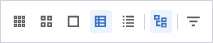

	- в настольном приложении используйте список объектов и вкладку
	 «Вид» ленты инструментов:

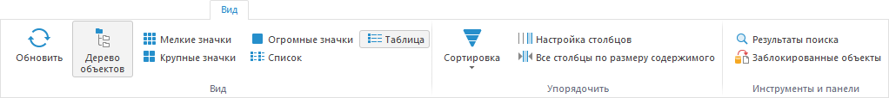

## Изменение отображения объектов

Для отображения/скрытия дерева объектов нажмите кнопку  «Дерево
 объектов»:

	- в веб-приложении на панели управления;

	- в настольном приложении на вкладке «Вид»
	 ленты инструментов.

По умолчанию дерево объектов отображается.

Для скрытия пустых папок в дереве объектов снимите флажок напротив пункта
 контекстного меню «Отображать пустые
 папки».

Примечание.
 Скрытие пустых папок в дереве объектов доступно только в настольном приложении.

Для изменения отображения объектов в списке выберите вид:

[Мелкие
 значки](javascript:TextPopup(this))

	Для отображения объектов в виде мелких значков:

		- в веб-приложении нажмите кнопку
		 
		 «Мелкие значки» на панели
		 управления;

		- в настольном приложении:

			- нажмите кнопку  «Мелкие
			 значки» на ленте инструментов;

			- выполните команду «Вид >
			 Мелкие значки» в контекстном меню списка объектов.

	После выполнения одного из действий будет изменён вид отображения
	 объектов в списке:

	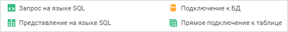

[Крупные
 значки](javascript:TextPopup(this))

	Для отображения объектов в виде крупных значков:

		- в веб-приложении нажмите кнопку
		 
		 «Крупные значки» на панели
		 управления;

		- в настольном приложении:

			- нажмите кнопку  «Крупные
			 значки» на ленте инструментов;

			- выполните команду «Вид >
			 Крупные значки» в контекстном меню списка объектов.

	После выполнения одного из действий будет изменён вид отображения
	 объектов в списке:

	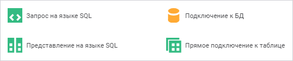

[Огромные
 значки](javascript:TextPopup(this))

	Для отображения объектов в виде огромных значков:

		- Убедитесь, что установлен флажок «[Разрешить отображение объектов в виде
		 значков без учета прав доступа на объекты](Admin.chm::/03_Admin/Access_control_settings.htm#extralargeicons)»
		 в менеджере безопасности.

		- Установите отображение огромных значков:

			- в веб-приложении нажмите кнопку
			  «Огромные
			 значки» на панели управления;

			- в настольном приложении:

				- нажмите кнопку  «Огромные значки» на
				 ленте инструментов;

				- выполните команду «Вид > Огромные значки» в
				 контекстном меню списка объектов.

	После выполнения одного из действий вид отображения в списке объектов
	 изменится только для тех объектов, которые были созданы с помощью
	 инструментов «[Аналитические панели](UIAdhoc.chm::/UiAdhoc_Purpose.htm)»,
	 «[Аналитические
	 запросы (OLAP)](UIExpress.chm::/purpose/UiExpress_Purpose.htm)», «[Отчёты](UIReport.chm::/UiReport_purpose.htm)»,
	 «[Анализ временных рядов](UiDw.chm::/UiDw_Title.htm)»:

	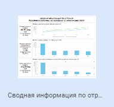

	Пиктограмма содержит предварительный просмотр, который отображает
	 область построения активного листа отчёта на момент сохранения. Обновление
	 пиктограммы происходит после каждого сохранения отчёта.

	Примечание.
	 Если вид отображения огромных значков был выбран перед установкой
	 флажка в менеджере безопасности, то пиктограмма не будет содержать
	 предварительный просмотр до последующего сохранения объекта.

	При необходимости отключите обновление пиктограммы при сохранении
	 отчёта.

	Важно.
	 Отключение обновления пиктограммы доступно только в среде разработки
	 с помощью перечисления [ScreenshotType](KeSom.chm::/Enums/ScreenshotType.htm).

[Таблица](javascript:TextPopup(this))

	Для отображения объектов в виде таблицы:

		- в веб-приложении нажмите кнопку
		 
		 «Таблица» на панели управления;

		- в настольном приложении:

			- нажмите кнопку  «Таблица»
			 на ленте инструментов;

			- выполните команду «Вид >
			 Таблица» в контекстном меню списка объектов.

	После выполнения одного из действий будет изменён вид отображения
	 объектов в списке:

	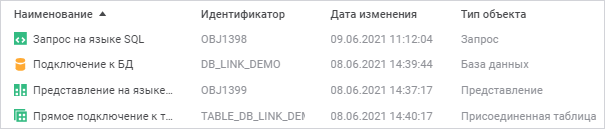

	Таблица содержит дополнительную информацию об объектах.

[Список](javascript:TextPopup(this))

	Для отображения объектов в виде списка:

		- в веб-приложении нажмите кнопку
		 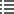
		 «Список» на панели управления;

		- в настольном приложении:

			- нажмите кнопку  «Список»
			 на ленте инструментов;

			- выполните команду «Вид >
			 Список» в контекстном меню списка объектов.

	После выполнения одного из действий будет изменён вид отображения
	 объектов в списке:

	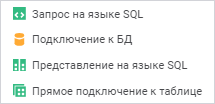

В настольном приложении доступны дополнительные операции при использовании
 вида «Таблица»:

[Выравнивание столбцов таблицы по размеру
 содержимого](javascript:TextPopup(this))

	Для выравнивания столбцов таблицы по размеру содержимого нажмите
	 кнопку 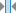 «Все столбцы по размеру содержимого».

[Настройка
 отображения столбцов таблицы](javascript:TextPopup(this))

	Для настройки отображения столбцов таблицы:

		- нажмите кнопку 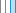 «Настройка
		 столбцов»;

		- выполните команду «Вид >
		 Настройка столбцов» в контекстном меню свободного
		 пространства.

	После выполнения одного из действий будет открыто окно «Выбрать
	 столбцы для отображения»:

	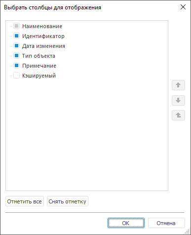

	Для отображения/скрытия столбцов в таблице установите/снимите флажки
	 напротив соответствующих заголовков столбцов.

	Примечание.
	 Снятие флажка напротив столбца «Наименование»
	 недоступно.

	Для перемещения по заголовкам столбцов используйте кнопки «Вверх»/«Вниз».

	Для отметки/снятия отметки со всех элементов используйте кнопки
	 «Отметить все»
	 и «Снять отметку».

	Для отображения комментариев к объектам репозитория используйте
	 столбец «Примечание». Комментарий
	 можно добавить для каждого объекта в окне «[Свойства
	 объекта](../03_Objects/UiNav_Obj_BasicProp.htm)» на вкладке «[Тип объекта](../03_Objects/UiNav_Obj_BasicPropGeneral.htm)».

	Для отображения информации, является ли объект репозитория [кешируемым](../02_Navigator/UiNav_Cache.htm),
	 установите флажок «Кешируемый».
	 Если объект является кешируемым, в столбце отобразится значение «Да».

## Сортировка объектов

Для сортировки объектов в списке:

	- выполните действия:

		- Нажмите кнопку 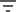 «Сортировка»:

			- в веб-приложении на панели управления;

			- в настольном приложении на вкладке «Вид»
			 ленты инструментов.

		- Выберите вариант сортировки в раскрывающемся меню:

			- По наименованию;

			- По идентификатору;

			- По дате изменения;

			- По типу объектов;

			- По примечанию.

Примечание.
 Доступно только в настольном приложении.

		- Выберите способ сортировки:

			- . По возрастанию;

			- 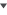. По убыванию.

	- нажмите на заголовок столбца;

	- выполните команду «Упорядочить >
	 <вариант
	 сортировки>» в контекстном
	 меню списка объектов.

Примечание.
 Доступно только в настольном приложении.

После выполнения действия список объектов будет отсортирован по выбранному
 столбцу. В заголовке столбца отображается пиктограмма сортировки, например:

## Отображение заблокированных объектов

Примечание.
 Доступно только в настольном приложении.

При [блокировке объектов](../02_Navigator/UiNav_BlockObjects.htm)
 отображается [плавающая
 панель](GetStarted.chm::/Interface/Interface_Description.htm#floatpane) «Заблокированные
 объекты»:

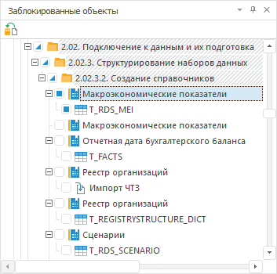

На панели отображается иерархический список заблокированных объектов
 репозитория.

Для отображения/скрытия плавающей панели нажмите кнопку  «Заблокированные
 объекты» на ленте инструментов.

Для снятия блокировки с объектов:

	- Установите флажок напротив заблокированных объектов.

	- Нажмите кнопку  «Снять
	 блокировку».

После выполнения действий выбранные объекты будут разблокированы и доступны
 для редактирования.

См. также:

[Интерфейс
 навигатора](GetStarted.chm::/Interface/Interface_Navigator.htm)

		Справочная
		 система на версию 10.9
		 от 18/08/2025,
		 © ООО «ФОРСАЙТ»,
