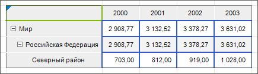
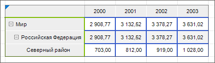
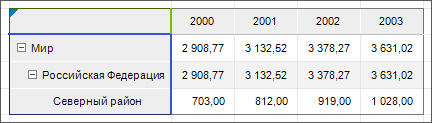
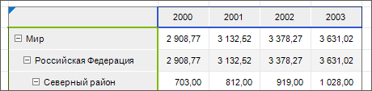
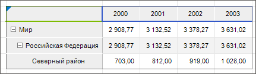
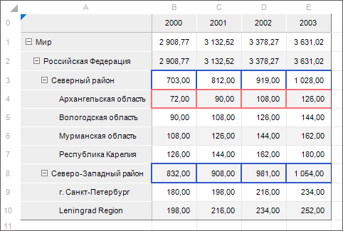
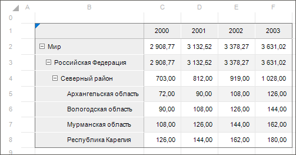
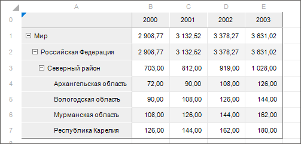

# Порядок применения оформления

Порядок применения оформления
-

# Порядок применения оформления

В «Форсайт. Аналитическая платформа»
 в настольном приложении можно настроить различное оформление таблиц: стили
 оформления, ручное форматирование областей, условное форматирование. При
 многочисленных настройках оформления оно применяется в определенном порядке.

## Порядок оформления в экспресс-отчете, регламентном отчете, аналитической
 панели

Оформление данных задается для:

	- [таблицы данных](UiAnalyticalArea.chm::/Table.htm)
	 экспресс-отчёта;

	- [таблицы данных](UiAdhoc.chm::/Blocks/Gadgets/Table.htm)
	 аналитической панели;

	- [табличного визуализатора](UiReport.chm::/Desktop/AreaData/DataTable.htm)
	 и [области
	 данных](UiReport.chm::/Desktop/AreaData/UiReport_AreaData.htm) регламентного отчёта.

В порядке оформления данных каждый следующий пункт перекрывает предыдущий:

	- [Чередующиеся
	 стили](UiAnalyticalArea.chm::/TableView/Formatting/Table_styles.htm).

	- [Ручное
	 форматирование](UiAnalyticalArea.chm::/TableView/Formatting/formattingColor.htm).

	- [Таблица стилей](../StylesTable/StylesTablePurpose.htm).

	- [Распределение
	 данных](UiAnalyticalArea.chm::/Analysis/distribution.htm). Перекрывает только заливку ячеек.

	- [Оформление
	 измененных данных](UiAnalyticalArea.chm::/TableView/Formatting/Format_changed_data.htm).

	- [Метрики](UiAnalyticalArea.chm::/Work_with_dimensions/Table_metrics.htm)
	 «Цвет», «Цвет шрифта», «Размер шрифта».

	- [Условное
	 форматирование](UiAnalyticalArea.chm::/Analysis/Conditional_formatting.htm). Перекрывает только заливку ячеек.

Для ручного форматирования и
 условного форматирования оформление
 может быть задано для разных [элементов таблицы](UiAnalyticalArea.chm::/Select_areas.htm),
 в этом случае порядок применения следующий:

	- Вся таблица. Наименьший приоритет.

	- Данные.

	- Измерение по строкам.

	- Уровень измерения по строкам.

	- Отдельная строка.

	- Измерение по столбцам.

	- Уровень измерения по столбцам.

	- Отдельный столбец.

	- [Итоги](UiAnalyticalArea.chm::/Totals/Calculate_totals.htm#formatting_totals)
	 по столбцам.

	- [Итоги](UiAnalyticalArea.chm::/Totals/Calculate_totals.htm#formatting_totals)
	 по строкам. Наибольший приоритет.

Примечание.
 При выборе нескольких измерений по строкам/столбцам будет использоваться
 оформление последнего выбранного измерения.

### Пример

Ручная настройка заливки измерения по строкам будет перекрываться заливкой
 отдельного столбца, но условное форматирование, настроенное для строки,
 будет перекрывать любую заливку, настроенную вручную.

## Порядок оформления в анализе временных рядов

В инструменте «Анализ
 временных рядов» доступны следующие настройки оформления, в порядке
 применения:

	- [Чередующиеся
	 стили](UiDw.chm::/Workbook/SidePanel/UiDw_sp_view.htm).

	- [Ручное
	 форматирование](UiDw.chm::/Workbook/SidePanel/Panel_DataArea.htm).

	- [Условное
	 форматирование](UiAnalyticalArea.chm::/Analysis/Conditional_formatting.htm).

## Порядок оформления области данных в регламентном отчёте

При работе в [области
 данных](UiReport.chm::/Desktop/AreaData/UiReport_AreaData.htm) регламентного отчёта основным оформлением является
 [оформление
 области данных](UiReport.chm::/Desktop/AreaData/Param/UiReport_AreaData_Param_appearance.htm) и [оформление
 итогов](UiReport.chm::/Desktop/AreaData/Param/UiReport_AreaData_Param_Totals.htm).

В процессе форматирования таблицы оформление области данных, оформление
 области формул, оформление итогов и оформление вычисляемых показателей
 могут перекрываться другими стилями, но при нажатии на кнопку «[Обновить](UiReport.chm::/Desktop/Reports/OperationReport/UiReport_Reports_Operation_Execute.htm)» оформление
 будет настроено в соответствии с параметрами области данных.

## Порядок применения специальных границ

Оформление специальных границ задаётся для:

	- [таблицы данных](UiAnalyticalArea.chm::/Table.htm)
	 экспресс-отчёта;

	- [таблицы данных](UiAdhoc.chm::/Blocks/Gadgets/Table.htm)
	 аналитической панели;

	- [табличного визуализатора](UiReport.chm::/Desktop/AreaData/DataTable.htm)
	 и [области
	 данных](UiReport.chm::/Desktop/AreaData/UiReport_AreaData.htm) регламентного отчёта;

	- [форм ввода](DataEntryForms.chm::/DataEntryForms_Purpose.htm).

В порядке применения специальных границ каждый следующий пункт перекрывает
 предыдущий:

	- Таблица. Наименьший
	 приоритет. Для настройки границ таблицы [выделите
	 всю таблицу](UiAnalyticalArea.chm::/select_areas.htm#select_all_table), перейдите на вкладку «Таблица» боковой панели, затем на
	 вкладку «Оформление». Установите
	 флажок «Специальная граница»
	 и задайте её [настройки](uianalyticalarea.chm::/tableview/formatting/formattingBorders.htm).

	- Уголок. Для настройки
	 границ уголка выделите [уголок](UiAnalyticalArea.chm::/tableview/corner_show_dims.htm),
	 перейдите на вкладку «Уголок»
	 боковой панели, затем на вкладку «Оформление».
	 Установите флажок «Специальная граница»
	 и задайте её [настройки](uianalyticalarea.chm::/tableview/formatting/formattingBorders.htm).

	- Данные. Для настройки
	 границ данных выделите [данные](UiAnalyticalArea.chm::/select_areas.htm#select_data),
	 перейдите на вкладку «Данные»
	 боковой панели, затем на вкладку «Оформление».
	 Установите флажок «Специальная граница»
	 и задайте её [настройки](uianalyticalarea.chm::/tableview/formatting/formattingBorders.htm).

Пример перекрытия границ уголка границами
 данных:

В приведённом примере для уголка настроены
 зелёные границы, для данных - синие. На пересечении нижнего левого
 угла уголка и верхнего правого угла данных синяя граница перекрывает зелёную.

	- Боковик. Для настройки
	 границ боковика выделите [боковик](UiAnalyticalArea.chm::/select_areas.htm#select_sidehead),
	 перейдите на вкладку «Заголовок»
	 боковой панели, затем на вкладку «Оформление».
	 Установите флажок «Специальная граница»
	 и задайте её [настройки](uianalyticalarea.chm::/tableview/formatting/formattingBorders.htm).

Пример перекрытия границ данных границами
 боковика:

В приведённом примере для боковика настроены
 зелёные границы, для данных - синие. На пересечении правой границы
 боковика и левой границы данных зеленая граница боковика перекрывает синюю.

Пример перекрытия границ уголка границами
 боковика:

В приведённом примере для боковика настроены
 синие границы, для уголка - зелёные. На пересечении верхней границы
 боковика и нижней границы уголка синяя граница боковика перекрывает зелёную.

	- Шапка. Для настройки
	 границ шапки выделите [шапку](UiAnalyticalArea.chm::/select_areas.htm#select_heading), перейдите
	 на вкладку «Заголовок» боковой
	 панели, затем на вкладку «Оформление».
	 Установите флажок «Специальная граница»
	 и задайте её [настройки](uianalyticalarea.chm::/tableview/formatting/formattingBorders.htm).

Пример перекрытия границ боковика границами
 шапки:

В приведённом примере для боковика настроены
 зелёные границы, для шапки - синие. На пересечении правого верхнего
 угла боковика и нижнего левого угла шапки синяя граница перекрывает зелёную.

Пример перекрытия границ уголка границами
 шапки:

В приведённом примере для уголка настроены
 зелёные границы, для шапки - синие. На пересечении правой границы
 уголка и левой границы шапки синяя граница перекрывает зелёную.

	- Границы измерения. Для
	 настройки стиля измерения [выделите
	 измерение](UiAnalyticalArea.chm::/Work_with_dimensions/Select_dimensions_elements_in_table.htm#select_dim), перейдите на вкладку «Измерение»
	 боковой панели, затем на вкладку «Оформление
	 заголовка», если необходимо настроить границы заголовка измерения,
	 или на вкладку «Оформление данных»,
	 если необходимо настроить границы для данных измерения. Установите
	 флажок «Специальная граница»
	 и задайте её [настройки](uianalyticalarea.chm::/tableview/formatting/formattingBorders.htm).

	- Границы уровня измерения.
	 Для настройки стиля уровня измерения [выделите
	 уровень](UiAnalyticalArea.chm::/Work_with_dimensions/Select_dimensions_elements_in_table.htm#select_level), перейдите на вкладку «Уровень»
	 боковой панели, затем на вкладку «Оформление
	 заголовка», если необходимо настроить границы заголовка уровня,
	 или на вкладку «Оформление данных»,
	 если необходимо настроить границы для данных уровня. Установите флажок
	 «Специальная граница» и задайте
	 её [настройки](uianalyticalarea.chm::/tableview/formatting/formattingBorders.htm).

	- Границы элемента измерения.
	 Для настройки стиля элемента измерения выделите необходимый элемент
	 измерения в боковике или шапке, перейдите на вкладку «Формат»
	 боковой панели, затем на вкладку «Оформление
	 заголовка», если необходимо настроить границы заголовка элемента,
	 или на вкладку «Оформление данных»,
	 если необходимо настроить границы для данных элемента. Установите
	 флажок «Специальная граница»
	 и задайте её [настройки](uianalyticalarea.chm::/tableview/formatting/formattingBorders.htm).

Пример перекрытия границ уровня измерения
 границами элемента измерения:

В приведённом примере для элемента измерения
 «Архангельская область» и для
 уровня измерения «ФО Территориальные
 образования» настроены специальные границы данных. Для элемента -
 розовая линия, для уровня - синяя линяя. Верхняя граница элемента
 перекрыла нижнюю границу уровня измерения.

Примечание.
 При пересечении вертикальных и горизонтальных границ наибольшим приоритетом
 обладают элементы измерения шапки (вертикальные границы). В ячейке, расположенной
 на пересечении границ, могут не отображаться пересекающиеся границы. Для
 отображения пересекающихся границ используйте свойство [IEaxGridViewSettings.ShowRealBorderDataStyle](KeExpress.chm::/Interface/IEaxGridViewSettings/IEaxGridViewSettings.ShowRealBorderDataStyle.htm).

	- Границы условного форматирования
	 данных. [Условное
	 форматирование](uianalyticalarea.chm::/tableview/formatting/formatting_table.htm) данных применяется к данным динамически,
	 стиль не хранится в ячейке.

	- Границы изменённых данных.
	 [Оформление
	 изменённых данных](UiAnalyticalArea.chm::/TableView/Formatting/Format_changed_data.htm) применяется динамически, стиль
	 не хранится в ячейке.

	- Границы, установленные блоком
	 контроля. С помощью [блоков
	 контроля](CalculationAlgorithm.chm::/Desktop/Control_Block/Control_Block.htm) можно настроить проверку вводимых в формы
	 ввода данных и [оформление
	 не прошедших контроль значений](CalculationAlgorithm.chm::/Desktop/Control_Block/Style_ControlBlock.htm). Оформление, настроенное
	 в блоке контроля, применяется к данным динамически, стиль не хранится
	 в ячейке.

	- Внешние границы таблицы.
	 По умолчанию внешние границы таблицы отображаются на листе отчета,
	 тип и цвет линии внешней границы установлены по умолчанию:

Если левая верхняя ячейка таблицы расположена
 в ячейке А0, верхняя и левая внешние границы таблицы не отображаются:

Изменить тип и цвет линии внешней границы
 таблицы можно через настройку регионов с помощью интерфейса [ITabRegion](TabSheet.chm::/Interface/ITabRegion/ITabRegion.htm).

Пример перекрытия внешней границей границ
 боковика и шапки таблицы:

В приведённом примере для боковика и шапки
 настроены специальные границы - верхняя, левая, правая и нижняя.
 Для боковика - зелёного цвета, для шапки - синего. Внешняя граница
 перекрыла левую и нижнюю границы боковика, верхнюю и правую границы шапки.

	- Границы регионов. Наивысший
	 приоритет. Для работы с регионами таблицы используйте интерфейс [ITabRegion](TabSheet.chm::/Interface/ITabRegion/ITabRegion.htm).

См. также:

[Применение
 стилей оформления](UiETL_Objects_Styles.htm)

		Справочная
		 система на версию 10.9
		 от 18/08/2025,
		 © ООО «ФОРСАЙТ»,
