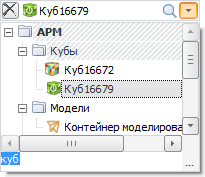
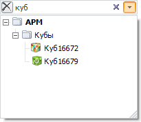

# Работа с комбинированными списками

Работа с комбинированными списками
-

# Работа с комбинированными списками

Различные инструменты, входящие в состав «Форсайт. Аналитическая платформа»,
 используют комбинированные списки для выбора каких-либо элементов или
 объектов.

Пример комбинированного списка в настольном приложении:

Элементы в списке представляются в иерархическом виде. Для выбора элемента
 щёлкните по нему в раскрытом списке элементов.

В комбинированном списке реализованы различные виды поиска.

## Поиск элементов

В развёрнутом раскрывающемся списке предусмотрены следующие виды поиска:

	- при наборе первых символов в наименовании элементов курсор будет
	 переходить к первому найденному элементу. Данный поиск осуществляется
	 циклически и только по элементам, присутствующим в развернутой части
	 иерархии дерева элементов;

	- при помощи строки поиска, которая вызывается при нажатии
	 клавиши F3 либо CTRL+F. После ввода искомой части слова и нажатии клавиши
	 ENTER либо кнопки  «Поиск»
	 в настольном приложении будет осуществляться поиск. Поиск осуществляется
	 циклически по всей иерархии элементов.

При удачном поиске фокус будет переходить к найденному элементу.

Также существует возможность поиска при свернутом раскрывающемся списке
 компонента. Когда компонент находится в фокусе нажмите кнопку  «Поиск» или просто начните набирать
 искомый текст. При наборе сочетания символов будет формироваться список,
 отфильтрованный по элементам, содержащим в своем наименовании данное сочетание.

В строке поиска существует возможность поиска по частям не только одного,
 но и нескольких слов. Для этого искомые сочетания символов разделяются
 пробелом. Порядок слов в наименовании элементов при поиске не учитывается.

См. также:

[Дополнительные справочные материалы](General_principles.htm)

		Справочная
		 система на версию 10.9
		 от 18/08/2025,
		 © ООО «ФОРСАЙТ»,
