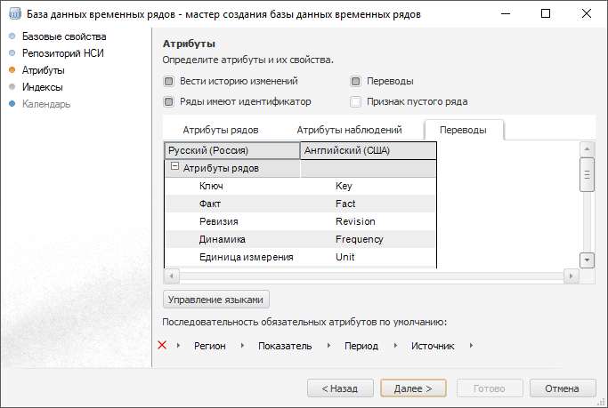
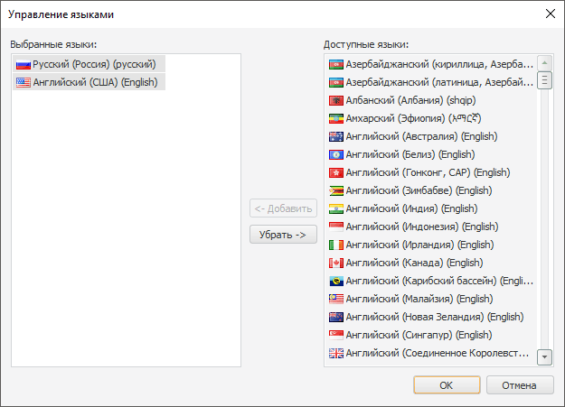

# Перевод наименований атрибутов на другие языки

Перевод наименований атрибутов на другие языки
-

# Перевод наименований атрибутов на другие языки

Перевод наименований атрибутов баз данных временных рядов на другие
 языки является одним из шагов в [создании мультиязычной](UiDw.chm::/FAQ/Translation.htm)
 базы данных временных рядов.

Примечание.
 Настройка перевода наименований атрибутов баз данных временных рядов на
 другие языки доступна только в настольном приложении. Заданный перевод
 в настольном приложении отображается в [рабочей книге](UiDw.chm::/UiDw_Title.htm)
 в веб-приложении, если используется соответствующий [язык
 репозитория для текущего пользователя](Setup.chm::/06_AK_Client_Config/UiNav_RepoConfig_repo1.htm#more).

Для перевода наименований атрибутов на другие языки:

	- Откройте диалог «Параметры»
	 с помощью команды «Сервис >
	 Параметры» в главном меню [навигатора
	 объектов](GetStarted.chm::/Interface/Interface_Navigator.htm).

	- Перейдите на вкладку «[Настройки по умолчанию](../02_Navigator/Repo_Default.htm)» и убедитесь,
	 что для репозитория задан язык по умолчанию. Если язык не задан, то
	 задайте его.

Примечание.
 Язык репозитория по умолчанию выбирается один раз и в дальнейшем не может
 быть изменен.

	- Сохраните изменения и закройте диалог «Параметры».

	- Откройте [мастер
	 создания базы данных временных рядов](UiNavObj.chm::/TimeSeriesDatabase/CreateTimeSeriesDatabase.htm) и перейдите
	 на страницу «[Атрибуты](UiNavObj.chm::/TimeSeriesDatabase/TS_Attributes.htm)».

	- Установите флажок «Переводы».
	 Будет отображена дополнительная вкладка «Переводы».
	 Вкладка содержит список атрибутов на языке репозитория, и на других
	 языках, на которые были добавлены переводы:

	- Добавьте новый язык перевода с помощью кнопки «Управление
	 языками». Будет открыт диалог «Управление
	 языками»:

В списке «Выбранные
 языки» содержатся языки, на которые в данный момент переводятся
 наименования атрибутов. Список «Доступные
 языки» содержит языки, на которые могут быть переведены наименования
 атрибутов. Для добавления языка перевода переместите его из списка «Доступные языки» в список «Выбранные языки», а для удаления
 - из списка «Выбранные языки»
 в список «Доступные языки».

Для перемещения элементов между списками
 используйте:

		- кнопку «Добавить»/«Убрать»;

		- двойной щелчок по наименованию языка;

		- механизм перетаскивания.

	- На вкладке «Переводы»
	 дважды щёлкните по наименованию атрибута в столбце переводов и задайте
	 перевод наименования атрибута.

После выполнения действий будет отображаться перевод наименований атрибутов
 баз данных временных рядов на выбранном [языке
 репозитория для текущего пользователя](Setup.chm::/06_AK_Client_Config/UiNav_RepoConfig_repo1.htm#more) в [рабочей книге](UiDw.chm::/UiDw_Title.htm).

См. также:

[Настройка
 мультиязычности](Multilanguage_setting.htm) | [Настройка
 атрибутов](UiNavObj.chm::/TimeSeriesDatabase/TS_Attributes.htm)

		Справочная
		 система на версию 10.9
		 от 18/08/2025,
		 © ООО «ФОРСАЙТ»,
