# Настройка мультиязычности

Настройка мультиязычности
-

# Настройка мультиязычности

Продукт «Форсайт. Аналитическая платформа»
 поддерживает несколько языков интерфейса и справочной системы, а также
 позволяет реализовывать локализацию содержания репозитория: наименования
 объектов репозитория, наименования атрибутов и элементов справочников
 НСИ, наименования атрибутов баз данных временных рядов и другое.

Для изменения языка интерфейса и справочной системы:

	- в веб-приложении:

		- Задайте набор доступных языков в файле [config.json](Setup.chm::/UiWebSetup/03_setup_web/PP_config_Java.htm#config_json)
		 в поле [locales](Setup.chm::/UiWebSetup/03_setup_web/PP_config_Java.htm#locales).

		- Выберите язык в [окне регистрации](GetStarted.chm::/GetStarted/Get_Started.htm);

	- в настольном приложении:

		- Откройте окно «[Параметры](GetStarted.chm::/Interface/Intro_Language.htm#options)»
		 или приложение «[Языковые
		 параметры](GetStarted.chm::/Interface/Intro_Language.htm#lang_settings)».

		- Выберите из раскрывающегося списка один из поддерживаемых
		 языков продукта «Форсайт. Аналитическая платформа».

После выполнения действий язык интерфейса и справочной системы будет
 изменён на заданный.

Для перевода содержания репозитория на другие языки настройте мультиязычность
 объектов репозитория.

Схема настройки мультиязычности в приоритетном порядке:

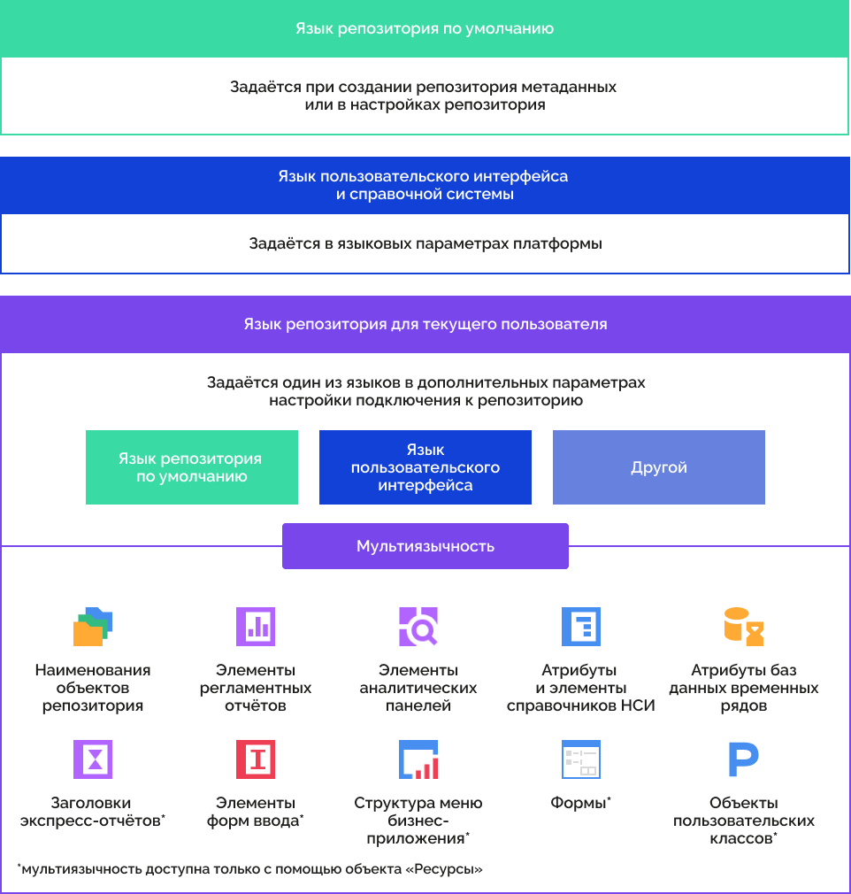

Мультиязычность объектов репозитория зависит только от языка репозитория
 для текущего пользователя. Язык интерфейса задается независимо от языка
 репозитория для текущего пользователя и может отличаться.

Примечание.
 Если поле для перевода на другой язык пустое, то используется язык по
 умолчанию.

Для настройки мультиязычности объектов репозитория:

	- Выберите язык репозитория по умолчанию в [настройках репозитория](uinav.chm::/02_Navigator/Repo_Default.htm),
	 если он не был выбран при [создании
	 репозитория](setup.chm::/05_RepoMngr/Setup_RepoMngr_CreateRepo.htm).

Примечание.
 Язык репозитория по умолчанию задаётся один раз и недоступен для изменения
 после выбора.

	- Выберите [язык
	 интерфейса и справочной системы](GetStarted.chm::/Interface/Intro_Language.htm), на котором будут отображаться
	 элементы интерфейса и справка продукта «Форсайт. Аналитическая платформа».

	- Выберите один из [языков
	 репозитория для текущего пользователя](Setup.chm::/06_AK_Client_Config/UiNav_RepoConfig_repo1.htm#more), на котором
	 будут отображаться мультиязычные объекты репозитория:

		- язык репозитория по умолчанию;

		- язык пользовательского интерфейса;

		- другой.

Примечание.
 Выбор другого языка не зависит от того, какие языки были заданы для интерфейса
 и по умолчанию.

	- Задайте переводы на другие языки для элементов мультиязычных
	 объектов репозитория:

		- [наименования
		 объектов репозитория](../03_Objects/Translate_names.htm);

		- элементы регламентных отчётов;

		- [элементы
		 аналитических панелей](Multilanguage_tuning.htm);

		- [атрибуты
		 и элементы справочников НСИ](UiRds_Locale.htm);

		- [наименования
		 атрибутов баз данных временных рядов](AttrTranslate.htm);

		- с помощью [ресурсов](Resources.htm):

			- [заголовки экспресс-отчётов](Title_Express.htm);

			- элементы форм ввода;

			- [структура
			 меню бизнес-приложения](constructor.chm::/Desktop/Setting_web_application_structure.htm);

			- [разрабатываемые
			 приложения](UiDevEnv.chm::/01_Development_Environment/07_MultiLng_Applications/UiDevEnv_MLng_Applications.htm);

			- [объекты
			 пользовательских классов](UiDevEnv.chm::/04_NavigatorSetting/Classes_Object/UiNav_Classes_Object.htm).

После выполнения действий интерфейс и мультиязычные объекты репозитория
 будут отображаться на заданных языках.

## Мультиязычность объектов репозитория

Допустимые варианты перевода элементов мультиязычных объектов репозитория
 и схемы с областями применения заданного языка:

	- [Перевод
	 наименований объектов репозитория](../03_Objects/Translate_names.htm). Используется для перевода
	 наименований объектов репозитория в [навигаторе](GetStarted.chm::/Interface/Interface_Navigator.htm):

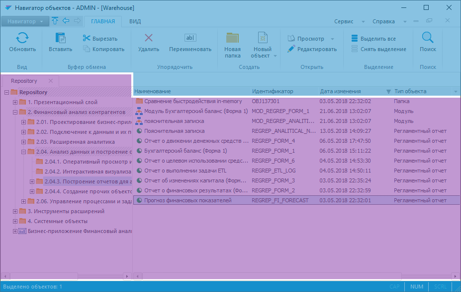

	- Перевод элементов регламентных
	 отчётов. Используется для перевода [наименований
	 листов](uireport.chm::/Web/Sheets/UiReport_Sheets_rename.htm) в регламентных отчётах. Также отображается
	 перевод элементов мультиязычных справочников НСИ, на которых основаны
	 срезы данных, и мультиязычное наименование регламентного отчёта:

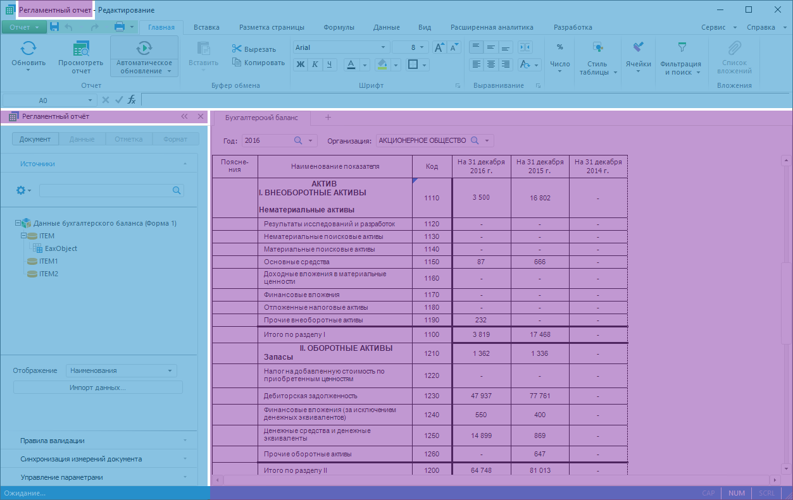

Наименования листов отображаются, изменяются
 и сохраняются на текущем языке, выбранном в [окне регистрации](getstarted.chm::/GetStarted/Get_Started.htm);

	- [Перевод
	 элементов аналитических панелей](Multilanguage_tuning.htm). Используется для перевода
	 наименований блоков, заголовков визуализаторов, текста кнопок, надписей
	 и других элементов в [аналитической
	 панели](UIAdhoc.chm::/UiAdhoc_Purpose.htm).
	 Также отображается перевод элементов мультиязычных справочников НСИ,
	 на которых основаны блоки аналитической панели, и мультиязычное наименование
	 аналитической панели:

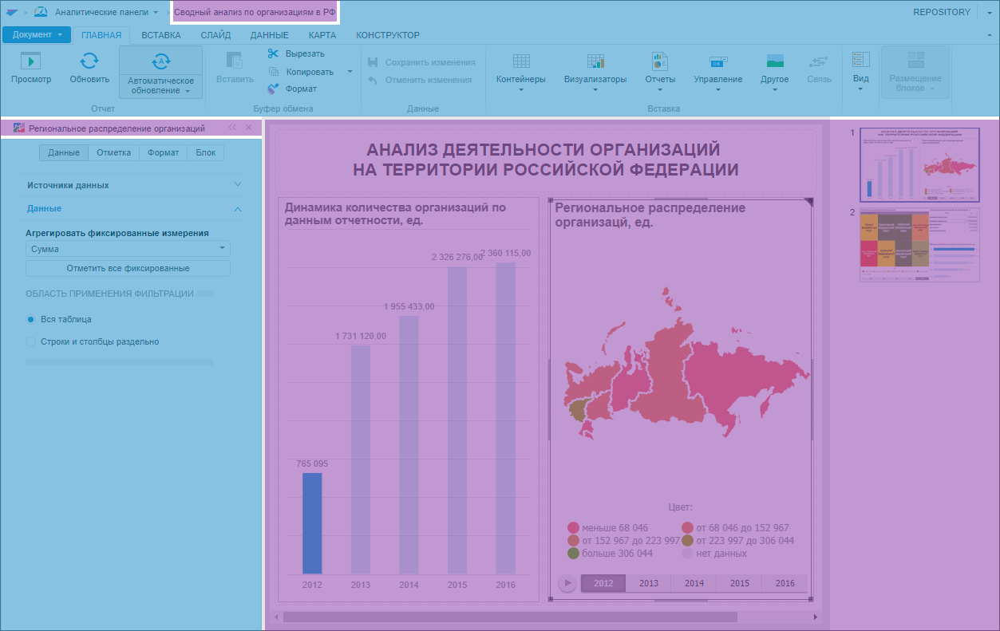

	- [Перевод
	 атрибутов и элементов справочников НСИ](UiRds_Locale.htm). Используется для
	 перевода атрибутов и элементов [справочников
	 НСИ](UiNavObj.chm::/reference_book/Work/Work_Dictionary.htm#rds), которые содержатся в [базе данных
	 временных рядов](UiNavObj.chm::/TimeSeriesDatabase/ChooseNSI.htm) и [кубах](UiNavObj.chm::/Cube/CreateCube/UiMd_Cube_CreateCube.htm)
	 для анализа данных и построения отчётов с помощью различных инструментов.
	 Также в справочнике НСИ отображается мультиязычное наименование справочника:

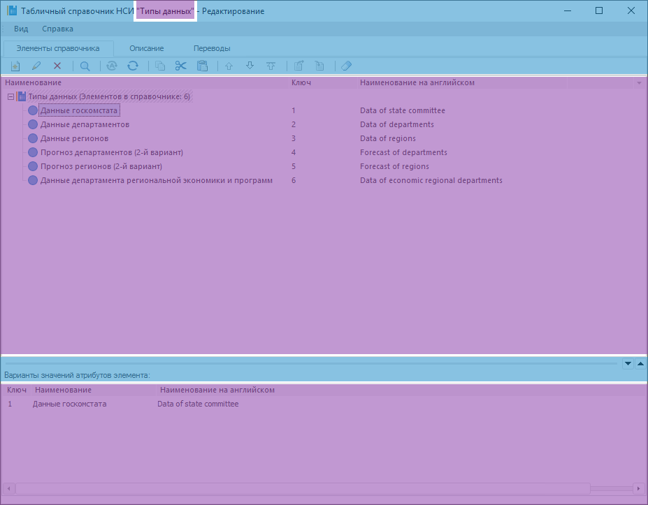

	- [Перевод
	 наименований атрибутов баз данных временных рядов](AttrTranslate.htm). Используется
	 для перевода наименований [атрибутов](UiNavObj.chm::/TimeSeriesDatabase/TS_Attributes.htm#translate)
	 баз данных временных рядов в [рабочей книге](UiDw.chm::/UiDw_Title.htm).
	 Также отображается перевод элементов мультиязычных справочников НСИ,
	 на которых основана база данных, и мультиязычное наименование рабочей
	 книги:

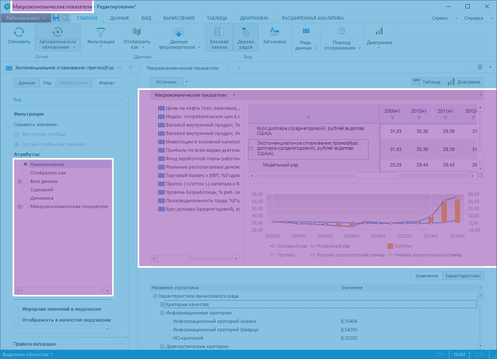

	- [Перевод
	 в ресурсах](Resources.htm). Используется для перевода текста и локализации
	 изображений:

		- в [заголовках
		 экспресс-отчётов](UIExpress.chm::/Setup_express_report/UiExpress_Purpose_Toolbar_Title.htm#translate):

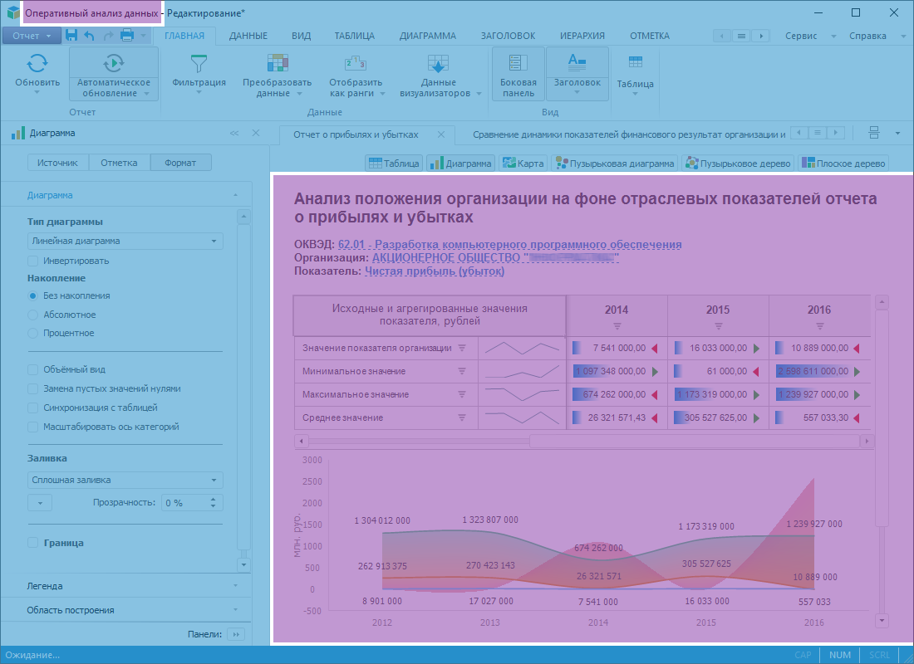

		- в формах ввода - [наименования
		 листов](dataentryforms.chm::/Web/Starting/Sheets_work.htm#rename), пользовательские [кнопки](dataentryforms.chm::/Web/Custom_module/Advanced.htm),
		 [вкладки](dataentryforms.chm::/Desktop/Starting/Ribbon.htm#add_tab)
		 и [группы](dataentryforms.chm::/Desktop/Starting/Ribbon.htm#add_group):

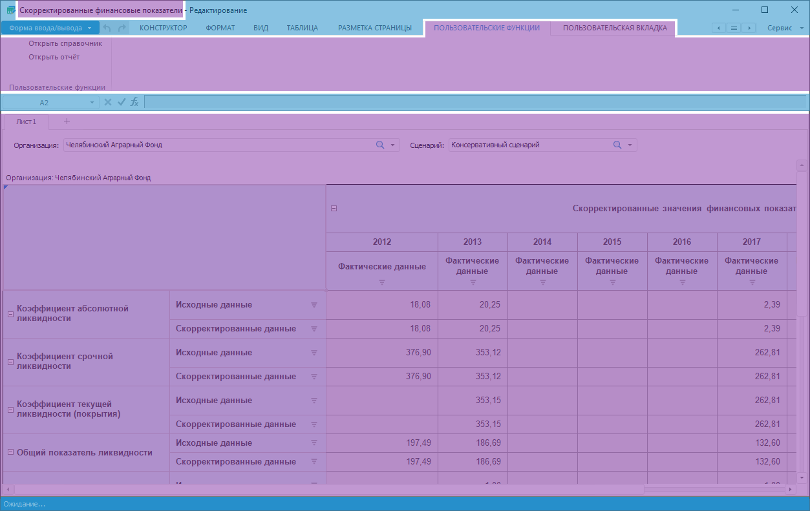

Элементы формы ввода отображаются, изменяются
 и сохраняются на текущем языке, выбранном в [окне регистрации](getstarted.chm::/GetStarted/Get_Started.htm).
 При необходимости для перевода элементов на другие языки можно использовать
 готовый [ресурс](Resources.htm), который входит в [состав
 объекта](UiNav.chm::/03_Objects/UiNav_Obj_BasicPropConsist.htm);

		- в [структуре
		 меню бизнес-приложения](constructor.chm::/Desktop/Setting_web_application_structure.htm):

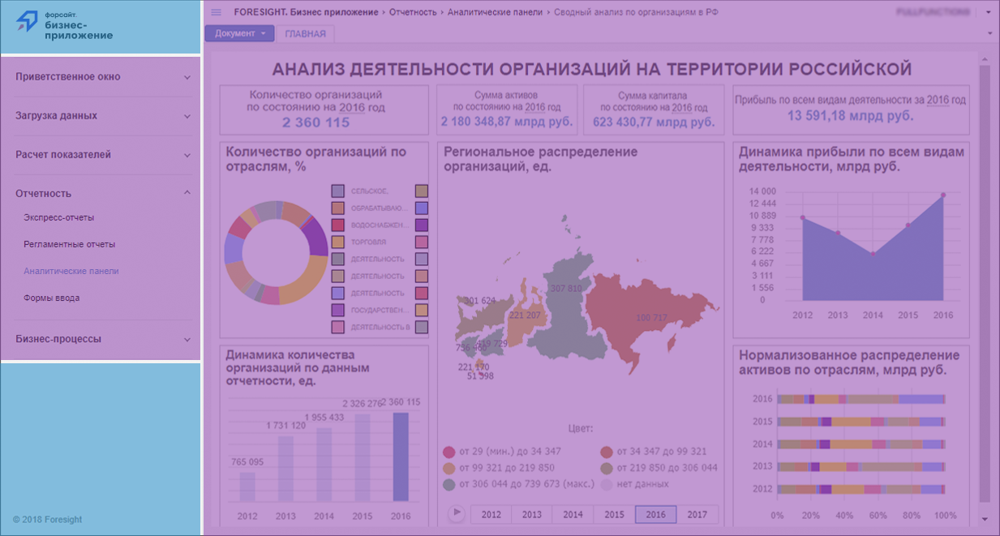

Для перевода структуры меню бизнес-приложения
 на другие языки используйте готовый ресурс «Ресурсы
 приложения "Бизнес-приложение"» с идентификатором APPLICATION_RESOURCES,
 расположенный в папке «Внутренняя структура
 БП» бизнес-приложения;

		- в [мультиязычных
		 приложениях](UiDevEnv.chm::/01_Development_Environment/07_MultiLng_Applications/UiDevEnv_MLng_Applications.htm):

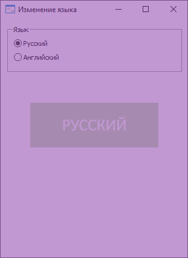

		- в [объектах
		 пользовательских классов](UiDevEnv.chm::/04_NavigatorSetting/Classes_Object/UiNav_Classes_Object.htm):

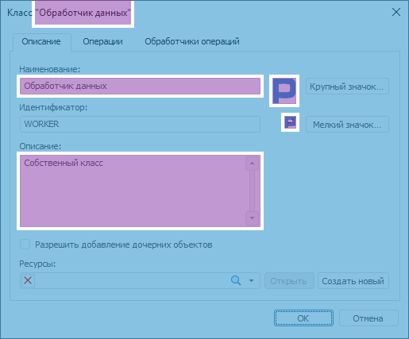

Условные обозначения:

 -
 язык пользовательского интерфейса;

 -
 язык репозитория для текущего пользователя.

Различия функциональности мультиязычности в веб- и настольном приложениях:

		 Мультиязычность
		 Веб-приложение
		 Настольное приложение

		 [Перевод
		 наименований объектов репозитория](../03_Objects/Translate_names.htm)

		 

		 

		 Перевод элементов регламентных отчётов

		 

		 

		 [Перевод
		 элементов аналитических панелей](Multilanguage_tuning.htm)

		 

		 

		 [Перевод атрибутов
		 и элементов справочников НСИ](UiRds_Locale.htm)

		 

		 

		 [Перевод наименований
		 атрибутов баз данных временных рядов](AttrTranslate.htm)

		 

		 

		 [Перевод в ресурсах](Resources.htm)

		 

		 

Условные обозначения:

 - функциональность доступна в полном объеме;

 - функциональность доступна с особенностями использования.

См. также:

[Дополнительные
 справочные материалы](../GUI/General_principles.htm)

		Справочная
		 система на версию 10.9
		 от 18/08/2025,
		 © ООО «ФОРСАЙТ»,
