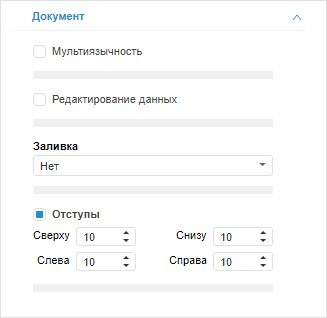
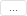
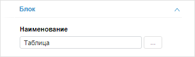
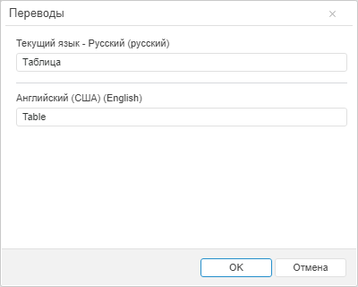

# Перевод элементов аналитических панелей на другие языки

Перевод элементов аналитических панелей на другие языки
-

# Перевод элементов аналитических панелей на другие языки

Аналитические панели в веб-приложении могут поддерживать несколько языков
 пользовательского интерфейса, например, русский и английский. Подобные
 панели называются мультиязычными.

Элементы аналитической панели, поддерживающие мультиязычность:

	- наименования [блоков](UiAdhoc.chm::/Document/Block_BaseProps.htm),
	 [вкладок](UiAdhoc.chm::/Blocks/Container_Tabs.htm)
	 и аналитической панели;

	- заголовки [блоков](UiAdhoc.chm::/Document/Block_Caption.htm)
	 и [визуализаторов](UiAdhoc.chm::/Blocks/Gadgets/Gadgets.htm);

	- заголовки [осей диаграмм](UiDiagrams.chm::/Params_diagram/UiDiagrams_Axis.htm);

	- текст [кнопки](UiAdhoc.chm::/Blocks/Controls/Button.htm),
	 [надписи](UiAdhoc.chm::/Blocks/Other/Label.htm)
	 и блока «[Текст](UiAdhoc.chm::/Blocks/Other/Text.htm)».

Совет. Для изменения
 набора языков, доступных в интерфейсе аналитической панели, используйте
 раздел <cultures> в файле [PP.xml](Setup.chm::/UiWebSetup/03_Setup_Web/PP_config_Java.htm).

Для создания мультиязычной аналитической панели:

	- Откройте инструмент «[Аналитические
	 панели](UIAdhoc.chm::/Launching.htm#open)».

	- Убедитесь, что боковая панель отображается.

	- Щёлкните по пустому пространству в рабочей области.

	- Перейдите на вкладку «Документ»
	 боковой панели.

	- Установите флажок «Мультиязычность».

После выполнения действий задайте переводы на другие языки для элементов
 аналитической панели, поддерживающих мультиязычность.

Для полей, переводимых на различные языки, отображается дополнительная
 кнопка  «Переводы». Например, для [наименования блока](UiAdhoc.chm::/Document/Block_BaseProps.htm):

Введите в поле значение на текущем языке веб-приложения.

Примечание.
 Для перевода заголовков [осей диаграммы](UiDiagrams.chm::/Params_diagram/UiDiagrams_Axis.htm)
 на другой язык откройте репозиторий в соответствующем языке, выделите
 диаграмму в аналитической панели и укажите новые заголовки на вкладках
 «Ось категорий (X)», «Ось
 значений (Y)» и «Ось значений
 (дополнительная)» в группе вкладок «Формат»
 на боковой панели. После сохранения аналитической панели заданные заголовки
 осей будут запомнены и будут загружаться автоматически при последующем
 переключении репозитория на данный язык.

Для ввода значения, используемого для другого языка, нажмите кнопку
  «Переводы». Откроется диалог «Переводы»:

В окне доступно задание значений полей:

	- на текущем языке веб-приложения, выбранном при [регистрации](GetStarted.chm::/GetStarted/Get_Started.htm);

	- на языке по умолчанию, если он был [задан](setup.chm::/06_ak_client_config/uinav_repoconfig_repo1.htm#lang);

	- на дополнительном языке. Для добавления нового языка перевода
	 нажмите кнопку «Еще язык».
	 В отобразившемся списке выберите требуемый язык.

Примечание.
 По умолчанию набор доступных языков совпадает с набором языков, указанных
 в файле [PP.xml](Setup.chm::/UiWebSetup/03_Setup_Web/PP_config_Java.htm).

При задании перевода полей учитывайте следующие особенности:

	- если для какого-либо поля не задан перевод на дополнительном
	 языке, то будет отображён перевод на языке по умолчанию;

	- если отредактировано значение перевода на языке по умолчанию,
	 то соответствующие изменения будут выполнены для всех полей на дополнительных
	 языках, для которых не были заданы переводы.

См. также:

[Настройка
 мультиязычности](Multilanguage_setting.htm) | [Использование дополнительных
 сервисов в аналитической панели](UiAdhoc.chm::/Document/Document_tuning.htm)

		Справочная
		 система на версию 10.9
		 от 18/08/2025,
		 © ООО «ФОРСАЙТ»,
