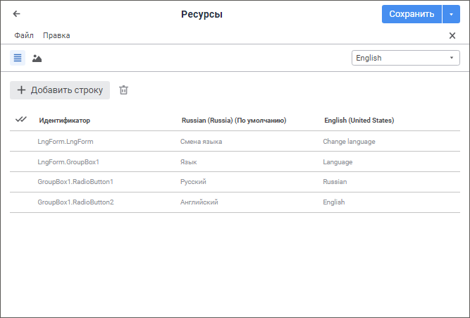
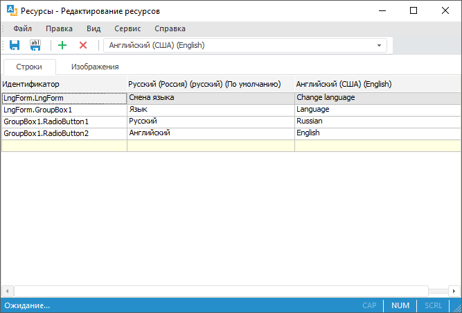

# Перевод в ресурсах

Перевод в ресурсах
-

# Перевод в ресурсах

Ресурсы используются для перевода текста на другие языки и локализации
 изображений:

	- в [заголовках
	 экспресс-отчётов](UIExpress.chm::/Setup_express_report/UiExpress_Purpose_Toolbar_Title.htm#translate);

	- в формах ввода - [наименования
	 листов](dataentryforms.chm::/Web/Starting/Sheets_work.htm#rename), пользовательские [кнопки](dataentryforms.chm::/Web/Custom_module/Advanced.htm),
	 [вкладки](dataentryforms.chm::/Desktop/Starting/Ribbon.htm#add_tab)
	 и [группы](dataentryforms.chm::/Desktop/Starting/Ribbon.htm#add_group);

	- в [структуре
	 меню бизнес-приложения](constructor.chm::/Desktop/Setting_web_application_structure.htm);

	- в [мультиязычных
	 приложениях](UiDevEnv.chm::/01_Development_Environment/07_MultiLng_Applications/UiDevEnv_MLng_Applications.htm);

	- в [объектах
	 пользовательских классов](UiDevEnv.chm::/04_NavigatorSetting/Classes_Object/UiNav_Classes_Object.htm).

Для начала работы создайте новые или откройте готовые ресурсы.

[Создание
 новых ресурсов](javascript:TextPopup(this))

	Для создания новых ресурсов в [навигаторе
	 объектов](GetStarted.chm::/Interface/Interface_Navigator.htm):

		- в веб-приложении нажмите кнопку  «Создать» в главном меню и выберите
		 тип объекта на боковой панели «[Новый объект](UiNav.chm::/02_Navigator/General_Principles_of_Work.htm#add_object)»;

		- в настольном приложении выполните одно из действий:

			- нажмите кнопку «Новый
			 объект > Среда разработки > Ресурсы»
			 в группе «Создать»
			 на вкладке «Главная»
			 ленты инструментов;

			- выполните команду «Создать
			 > Среда разработки > Ресурсы»
			 в контекстном меню навигатора объектов.

[Редактирование
 готовых ресурсов](javascript:TextPopup(this))

	Для редактирования готовых ресурсов в [навигаторе
	 объектов](GetStarted.chm::/Interface/Interface_Navigator.htm) выделите ресурс и выполните одно из действий:

		- в веб-приложении:

			- выполните команду «Редактировать»
			 в контекстном меню ресурса;

			- выполните команду «Редактировать
			 в новой вкладке» в контекстном меню ресурса;

			- выполните команду «Редактировать
			 в новом окне» в контекстном меню ресурса;

			- дважды щёлкните по ресурсу;

			- нажмите клавишу F4;

		- в настольном приложении:

			- нажмите кнопку 
			 «Редактировать» в
			 группе «Открыть» на
			 вкладке «Главная»
			 ленты инструментов;

			- выполните команду «Редактировать»
			 в контекстном меню ресурса;

			- нажмите клавишу F4.

Примечание.
 Для перевода структуры меню бизнес-приложения на другие языки используйте
 готовый ресурс «Ресурсы приложения "Бизнес-приложение"»
 с идентификатором APPLICATION_RESOURCES, расположенный в папке «Внутренняя структура БП» бизнес-приложения.
 Для перевода элементов формы ввода используйте готовый ресурс, который
 входит в [состав
 объекта](UiNav.chm::/03_Objects/UiNav_Obj_BasicPropConsist.htm).

Для разработки мультиязычных приложений
 смотрите статью «[Разработка
 мультиязычных приложений](UiDevEnv.chm::/01_Development_Environment/07_MultiLng_Applications/UiDevEnv_MLng_Applications.htm)».

Для использования ресурсов в объектах
 пользовательских классах смотрите статью «[Описание
 пользовательского класса](UiDevEnv.chm::/04_NavigatorSetting/Classes_Object/ObjectsClasses.htm)».

Для перевода заголовков экспресс-отчётов
 на другие языки смотрите статью «[Перевод заголовков
 экспресс-отчётов](Title_Express.htm)».

Основное окно объекта репозитория
 «Ресурсы»:

	Веб-приложение Настольное
	 приложение

		

		

Ресурсы делятся на строковые и графические и отображаются в виде списка.
 Для каждого ресурса определяется идентификатор, перевод для [языка
 репозитория по умолчанию](../02_Navigator/Repo_Default.htm) и перевод для [текущего
 языка репозитория](Setup.chm::/06_AK_Client_Config/UiNav_RepoConfig_repo1.htm#more).

Ключевые возможности:

	- [добавление нового языка
	 перевода](Resources/Add_language.htm);

	- [добавление ресурса](Resources/Work_Resources.htm);

	- [работа с готовыми
	 ресурсами](Resources/Work_with_resources.htm);

	- [поиск и замена
	 ресурса](Resources/Find_Replace_Resource.htm). Доступно только в настольном приложении;

	- [экспорт ресурсов](Resources/Export_Resource.htm).
	 Доступно только в настольном приложении;

	- [импорт ресурсов](Resources/Import_Resource.htm).
	 Доступно только в настольном приложении;

	- [сохранение ресурсов](Resources/Save_Resources.htm).

Для использования дополнительных
 возможностей при работе с ресурсами в настольном приложении смотрите статью
 «[Дополнительные
 возможности](Resources/Advanced_Features.htm)».

См. также:

[Настройка
 мультиязычности](Multilanguage_setting.htm)

		Справочная
		 система на версию 10.9
		 от 18/08/2025,
		 © ООО «ФОРСАЙТ»,
