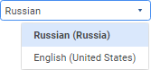
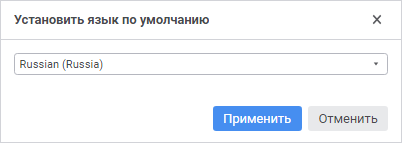
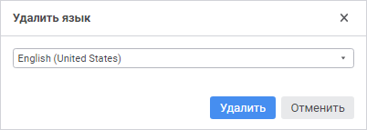

# Добавление нового языка перевода

Добавление нового языка перевода
-

# Добавление нового языка перевода

Для настройки мультиязычности в [ресурсах](../Resources.htm)
 используются следующие языки:

	- язык репозитория по умолчанию.
	 Язык перевода для отображения содержимого репозитория на [языке
	 по умолчанию](../../02_Navigator/Repo_Default.htm). Для корректной работы языки по умолчанию в ресурсах
	 и в репозитории должны совпадать;

	- язык репозитория для текущего
	 пользователя. Язык перевода для отображения содержимого репозитория
	 на [языке
	 репозитория для текущего пользователя](setup.chm::/06_ak_client_config/uinav_repoconfig_repo1.htm#more), если он
	 отличается от языка по умолчанию. Если в ресурсах отсутствует язык
	 перевода, совпадающий с языком репозитория для текущего пользователя,
	 то используются значения для языка ресурсов по умолчанию;

	- текущий язык перевода.
	 Язык перевода, выбранный в ресурсах.

После [создания ресурсов](../Resources.htm#create) для перевода
 содержится только язык репозитория по умолчанию. Если при создании репозитория
 не задан [язык
 по умолчанию](Setup.chm::/05_RepoMngr/Setup_RepoMngr_CreateRepo.htm), то в ресурсах содержится язык, соответствующий
 языку интерфейса продукта «Форсайт. Аналитическая платформа»,
 который будет использоваться в качестве языка по умолчанию для ресурсов.

Для добавления нового языка перевода:

	- Выполните команду «Файл > Добавить
	 язык» в главном меню. После чего будет открыто окно «Добавить новый язык»:

	- Выберите язык в раскрывающемся списке.

	- Нажмите кнопку «Добавить».

После выполнения действий будет доступен выбор отображения перевода
 на выбранном языке в раскрывающемся списке [основного
 окна ресурсов](../Resources.htm):

При выборе языка перевода рядом со столбцом переводов на языке по умолчанию
 будет отображаться столбец с переводами на выбранном языке.

## Изменение языка ресурсов по умолчанию

Для изменения языка ресурсов по умолчанию:

	- Выполните команду «Файл > Установить
	 язык по умолчанию» в главном меню. После чего будет открыто
	 окно «Установить язык по умолчанию»:

	- Выберите язык по умолчанию в раскрывающемся списке. Список доступных
	 языков формируется из добавленных ранее.

	- Нажмите кнопку «Применить».

После выполнения действий язык для ресурсов по умолчанию будет изменён.

## Изменение языка репозитория для текущего пользователя

Примечание.
 Доступно только в настольном приложении.

Для изменения языка репозитория для текущего
 пользователя:

	- Выполните команду «Сервис >
	 Параметры». После чего будут открыты [настройки
	 репозитория](Setup.chm::/06_AK_Client_Config/UiNav_RepoConfig.htm).

	- Откройте на [редактирование](Setup.chm::/06_AK_Client_Config/UiNav_RepoConfig.htm)
	 параметры репозитория. После чего будет открыто окно «[Настройка подключения к репозиторию](Setup.chm::/06_AK_Client_Config/UiNav_RepoConfig_repo1.htm)».

	- Нажмите кнопку «Дополнительно».
	 После чего будет открыто окно «[Дополнительные параметры](setup.chm::/06_ak_client_config/uinav_repoconfig_repo1.htm#more)».

	- Измените язык репозитория с помощью [переключателей](Setup.chm::/06_AK_Client_Config/UiNav_RepoConfig_repo1.htm#more).

После выполнения действий язык репозитория
 для текущего пользователя будет изменён.

## Удаление языка перевода

Для удаления языка перевода:

	- Выполните команду «Файл > Удалить
	 язык» в главном меню. После чего будет открыто окно «Удалить язык»:

	- Выберите язык в раскрывающемся списке.

	- Нажмите кнопку «Удалить».

После выполнения действий выбранный язык будет удалён.

Примечание.
 При удалении языка перевода должен быть задан [язык
 репозитория по умолчанию](../../02_Navigator/Repo_Default.htm).

См. также:

[Перевод
 в ресурсах](../Resources.htm)

		Справочная
		 система на версию 10.9
		 от 18/08/2025,
		 © ООО «ФОРСАЙТ»,
