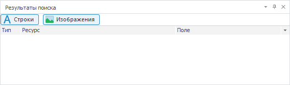

# Дополнительные возможности

Дополнительные возможности
-

# Дополнительные возможности

При работе с ресурсами доступны дополнительные возможности.

Примечание.
 Доступно только в настольном приложении.

## Изменение вида панелей инструментов

Для изменения вида панелей инструментов используйте флажки в главном
 меню «Вид > Панели инструментов»:

	- Стандартная. По умолчанию.
	 При установленном флажке отображается стандартная панель инструментов:

	- Результаты поиска. При
	 установленном флажке отображается панель с результатами [поиска
	 ресурсов](Find_Replace_Resource.htm):

После выполнения действий будет изменен вид панелей инструментов.

Для настройки содержимого [панелей
 инструментов](GetStarted.chm::/Interface/Interface_Description.htm#toolbars):

	- выполните команду «Вид >
	 Панели инструментов > Настройка» в главном меню;

	- выполните команду «Сервис >
	 Настройка» в главном меню.

После выполнения одного из действий будет открыто окно «[Настройка](GetStarted.chm::/Interface/Interface_Description.htm#toolbars)» для
 настройки команд, панелей инструментов, клавиатуры.

## Получение информации о программе

Для получения [информации о программе](../../GUI/Info.htm)
 выполните команду «Справка >
 О программе» в главном меню [основного
 окна ресурсов](../Resources.htm).

После выполнения действия будет открыто окно «[О
 программе](../../GUI/Info.htm)», в котором представлена различная информация.

## Открытие справочной системы

Для открытия справочной системы продукта «Форсайт. Аналитическая платформа»
 выполните команду «Справка >
 Содержание» в главном меню [основного
 окна ресурсов](../Resources.htm).

После выполнения действия будет открыта справочная система, указанная
 в [настройках репозитория](../../02_Navigator/UiNav_RepoConfig_Help.htm).

См. также:

[Перевод
 в ресурсах](../Resources.htm)

		Справочная
		 система на версию 10.9
		 от 18/08/2025,
		 © ООО «ФОРСАЙТ»,
