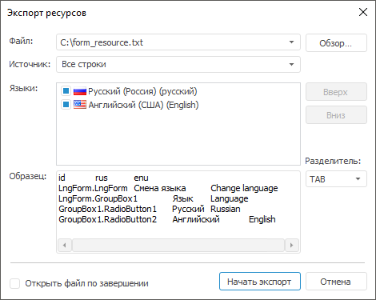

# Экспорт ресурсов

Экспорт ресурсов
-

# Экспорт ресурсов

Для предоставления строковых ресурсов переводчикам, а также последующей
 загрузки полученных переводов в репозиторий выполните экспорт ресурсов
 в текстовый файл.

Примечание.
 Доступно только в настольном приложении.

Для экспорта ресурсов выполните команду «Файл >
 Экспортировать» в главном меню. Будет открыт диалог экспорта:

Задайте параметры экспорта:

	- Файл. Укажите текстовый
	 файл, в который будут экспортироваться ресурсы;

	- Источник. Укажите режим
	 экспорта:

	-

		- Все строки. Используется
		 по умолчанию. Экспортируются все строковые элементы ресурсов;

		- Только выбранные строки.
		 Экспортируются только строки, выделенные в редакторе ресурсов;

	- Языки.
	 В списке содержатся все языки, добавленные в ресурсы. Отметьте флажками
	 те языки, которые требуется экспортировать. По умолчанию отмечены:
	 язык по умолчанию и текущий язык перевода. Порядок следования элементов
	 в списке «Языки» определяет
	 порядок следования языков в экспортируемом файле. Для изменения порядка
	 используйте:

	-

		- кнопки «Вверх» и
		 «Вниз»;

		- команды «Вверх»
		 и «Вниз» в контекстном
		 меню элемента;

		- механизм перетаскивания;

	- Разделитель. Укажите
	 символ-разделитель значений элементов, который будет использоваться
	 при экспорте;

	- Образец. Отображаются
	 первые строки ресурсов, сформированные по параметрам экспорта. В первой
	 строке содержатся заголовки столбцов в экспортируемом файле файла:
	 идентификатор элемента и идентификаторы импортируемых языков;

	- Открыть файл по завершении.
	 Если флажок установлен, то после окончания экспорта будет открыт сформированный
	 файл. По умолчанию флажок снят.

Для экспорта ресурсов нажмите кнопку «Начать
 экспорт».

Каждая строка полученного файла будет являться набором полей, отделяемых
 друг от друга символом-разделителем. Начало и окончание текста каждого
 поля обозначается символом-кавычек: «"».

См. также:

[Перевод
 в ресурсах](../Resources.htm)

		Справочная
		 система на версию 10.9
		 от 18/08/2025,
		 © ООО «ФОРСАЙТ»,
