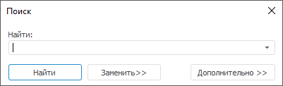
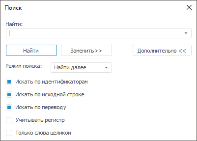
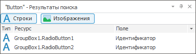
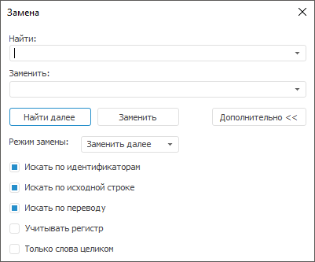

# Поиск и замена ресурса

Поиск и замена ресурса
-

# Поиск и замена ресурса

Поиск и замена выполняется среди строковых и графических ресурсов.

Примечание.
 Доступно только в настольном приложении.

## Поиск ресурса

Для быстрого поиска ресурса:

	- Откройте диалог «Поиск».
	 Для этого:

		- выполните команду «Правка > Найти»
		 в главном меню;

		- нажмите сочетание клавиш CTRL+F.

	- В поле «Найти» введите
	 искомый текст или идентификатор ресурса.

	- Нажмите кнопку «Найти».

Фокус будет перемещён к первому найденному ресурсу, удовлетворяющему
 условию поиска. Название кнопки изменится на «Найти
 далее», нажатие которой приведет к поэтапному получению результатов
 поиска.

Для выполнения расширенного поиска задайте дополнительные параметры.
 В диалоге «Поиск» нажмите
 кнопку «Дополнительно»:

Задайте параметры:

	- Режим поиска. Выберите
	 необходимый режим поиска:

	-

		- Найти далее. Поиск
		 осуществляется последовательно с первой выделенной строки таблицы,
		 при достижении конца таблицы поиск возобновляется с ее начала.
		 При нахождении ресурса, удовлетворяющего параметрам поиска, соответствующая
		 ему строка будет выделена. Фокус будет установлен на найденной
		 ячейке;

		- Найти все.
		 Поиск осуществляется единовременно по всем ресурсам. Найденные
		 ресурсы отображаются на дополнительной панели «[Результаты поиска](Advanced_Features.htm)»:

Для фильтрации результатов поиска используйте
 кнопки «Строки» и «Изображения».
 Если кнопка нажата, то соответствующие ресурсы отображаются в результатах
 поиска, если кнопка в ненажатом состоянии, то соответствующие ресурсы
 скрыты из результатов поиска.

Для перехода к требуемому ресурсу:

			- выполните команду «Перейти
			 к ресурсу» в контекстном меню ресурса в результатах
			 поиска;

			- дважды щёлкните по ресурсу в результатах поиска.

Фокус будет перемещен к соответствующей строке
 списка ресурсов.

Панель с результатами поиска не скрывается
 после закрытия диалога поиска;

Совет.
 Для вызова диалога поиска ресурсов в режиме «Найти
 все» нажмите сочетание клавиш CTRL+SHIFT+F.

	- Искать по идентификаторам.
	 Флажок включает/выключает поиск в столбце «Идентификатор».
	 По умолчанию флажок установлен;

	- Искать по исходной строке.
	 Флажок включает/выключает поиск в столбце с языком по умолчанию. Не
	 учитывается при поиске в изображениях, но учитывается в режиме «Найти все». По умолчанию флажок
	 установлен;

	- Искать по переводу.
	 Флажок выключает/выключает поиск в столбце с языком перевода. Не учитывается
	 при поиске в изображениях, но учитывается в режиме «Найти
	 все». По умолчанию флажок установлен;

	- Учитывать регистр. Флажок
	 выключает/выключает чувствительность к регистру при поиске. По умолчанию
	 флажок снят;

	- Только слова целиком.
	 Флажок определяет, является ли искомая строка самостоятельным словом.
	 По умолчанию флажок снят.

## Замена ресурса

Для быстрой замены ресурса:

	- Откройте диалог «Замена».
	 Для этого:

		- выполните команду «Правка > Заменить»
		 в главном меню ресурсов;

		- нажмите сочетание клавиш CTRL+H;

		- нажмите кнопку «Заменить»
		 в [диалоге поиска](Find_Replace_Resource.htm#find).

	- В поле «Найти» введите
	 текст ресурса, который требуется заменить.

	- В поле «Заменить» введите
	 текст, на который требуется заменить текст в поле «Найти».

	- Нажмите кнопку «Заменить».

Фокус будет перемещён к первому найденному ресурсу, значение которого
 может быть заменено. Для замены текущего ресурса и поиска следующего нажмите
 кнопку «Заменить».

Для выполнения расширенного поиска задайте дополнительные параметры.
 В диалоге «Замена» нажмите
 кнопку «Дополнительно»:

Дополнительные параметры замены ресурса аналогичны дополнительным параметрам
 [поиска ресурса](Find_Replace_Resource.htm#find).

См. также:

[Перевод
 в ресурсах](../Resources.htm)

		Справочная
		 система на версию 10.9
		 от 18/08/2025,
		 © ООО «ФОРСАЙТ»,
