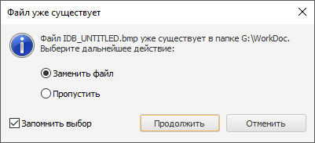

# Сохранение ресурсов

Сохранение ресурсов
-

# Сохранение ресурсов

Для сохранения ресурсов:

	- в веб-приложении нажмите кнопку «Сохранить»
	 в главном меню;

	- в настольном приложении:

		- выполните команду «Файл >
		  Сохранить»
		 в главном меню;

		- нажмите кнопку  «Сохранить» на панели инструментов.

После выполнения одного из действий список ресурсов будет сохранён.

## Сохранение копии ресурсов

Для сохранения копии ресурсов:

	- в веб-приложении нажмите кнопку «Сохранить
	 как» в раскрывающемся меню кнопки «Сохранить»;

	- в настольном приложении:

		- выполните команду «Файл >  Сохранить
		 как» в главном меню;

		- нажмите кнопку  «Сохранить
		 как» на панели инструментов.

После выполнения одного из действий будет открыто окно «Сохранить
 копию объекта» для выбора директории сохраняемого объекта с возможностью
 изменения его наименования и идентификатора.

## Сохранение графических ресурсов в файл или папку

Для сохранения одного графического ресурса в файл:

	- в веб-приложении:

		- Дважды щёлкните по ячейке с графическим ресурсом. После
		 чего будет открыта [боковая
		 панель](Work_Resources.htm#localized).

		- Нажмите кнопку  «Сохранить
		 в файл»;

	- в настольном приложении:

		- Выделите ячейку с графическим ресурсом.

		- Сохраните ресурс в файл:

			- выполните команду «Сохранить
			 в файл» в контекстном меню ресурса;

			- откройте окно «[Редактирование
			 изображения](Work_Resources.htm#localized)» с помощью команды «Редактировать»
			 в контекстном меню ресурса и нажмите кнопку «Сохранить
			 в файл».

После выполнения действий будет открыт стандартный диалог сохранения
 объекта.

Для сохранения нескольких графических ресурсов в
 папку:

	- Выделите ячейки с графическими ресурсами.

	- Выполните команду «Сохранить
	 в папку» в контекстном меню ресурсов.

После выполнения действий будет открыт стандартный диалог сохранения
 объекта. Если в указанной директории содержатся изображения с аналогичными
 наименованиями, то будет выдан диалог:

Выберите дальнейшее действие:

	- Заменить файл.
	 Существующий файл будет заменён;

	- Пропустить.
	 Сохранение ресурса в файл будет пропущено;

	- Запомнить выбор.
	 Установите флажок для применения выбранного действия (замена файла
	 или пропуск сохранения) для всех конфликтных случаев;

	- Отмена. Прерывание
	 процесса сохранения выбранных ресурсов;

	- Продолжить.
	 Продолжение процесса сохранения с учётом выбранного действия.

Примечание.
 Сохранение нескольких графических ресурсов в папку доступно только в настольном
 приложении.

См. также:

[Перевод
 в ресурсах](../Resources.htm)

		Справочная
		 система на версию 10.9
		 от 18/08/2025,
		 © ООО «ФОРСАЙТ»,
