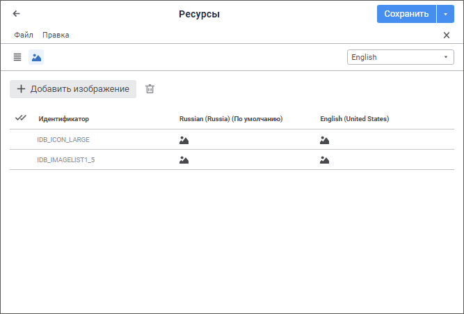

# Добавление ресурса

Добавление ресурса
-

# Добавление ресурса

Ресурсы делятся на следующие типы:

	- [строковые](#string);

	- [графические](#image).

Список ресурсов формируется на соответствующих вкладках: «Строки»,
 «Изображения».

## Добавление строкового ресурса

Для добавления строкового ресурса используйте вкладку «Строки».

	Веб-приложение Настольное
	 приложение

		

		

Добавьте новую строку:

	- Выполните одно из действий:

		- в веб-приложении:

			- нажмите кнопку  «Добавить строку» на панели
			 инструментов;

			- выполните команду «Правка > Добавить
			 ресурс > Добавить строку» в главном меню;

			- выполните команду «Создать
			 ресурс» в контекстном меню списка ресурсов;

		- в настольном приложении:

			- нажмите кнопку  «Добавить ресурс» на панели
			 инструментов;

			- выполните команду «Правка > Создать
			 ресурс > Создать строку» в главном меню;

			- выполните команду «Создать
			 ресурс» в контекстном меню списка ресурсов;

			- нажмите клавишу INSERT;

			- выделите последнюю строку в таблице, подсвеченную жёлтым
			 цветом, затем нажмите клавишу ENTER.

После выполнения одного из действий будет
 добавлена новая строка в конце списка ресурсов.

	- Введите перевод для языка по умолчанию и текущего языка перевода
	 в соответствующие ячейки.

	- Измените идентификатор ресурса при необходимости.

После выполнения действий строковый ресурс будет добавлен в новой строке
 списка ресурсов.

## Добавление графического ресурса

Для добавления графического ресурса используйте вкладку «Изображения»:

	Веб-приложение Настольное
	 приложение

		

		

Добавьте новое изображение:

	- Выполните одно из действий:

		- в веб-приложении:

			- нажмите кнопку  «Добавить изображение» на
			 панели инструментов;

			- выполните команду «Правка > Добавить
			 ресурс > Добавить изображение» в главном
			 меню;

			- выполните команду «Создать
			 ресурс» в контекстном меню списка ресурсов;

		- в настольном приложении:

			- нажмите кнопку  «Добавить ресурс» на панели
			 инструментов;

			- выполните команду «Правка > Создать
			 ресурс > Создать изображение» в главном
			 меню;

			- выполните команду «Создать
			 ресурс» в контекстном меню списка ресурсов;

			- нажмите клавишу INSERT.

После выполнения одного из действий будет
 открыт стандартный диалог выбора файла. Выберите изображение, добавляемое
 для языка по умолчанию. В результате будет добавлена новая строка в конце
 списка ресурсов с выбранным изображением.

	- Выберите [локализованное изображение](#localized)
	 для текущего языка перевода.

	- Измените идентификатор ресурса при необходимости.

После выполнения действий графический ресурс будет добавлен в новой
 строке списка ресурсов.

### Выбор локализованного изображения

Для выбора локализованного изображения:

	- в веб-приложении нажмите кнопку  «Изменить» на боковой панели. После
	 чего будет открыт стандартный диалог выбора файла. Выберите изображение,
	 добавляемое для текущего языка перевода:

Примечание.
 Боковая панель открывается автоматически после выбора изображения для
 языка по умолчанию.

	- в настольном приложении нажмите кнопку «Изменить»
	 в окне «Редактирование изображения».
	 После чего будет открыт стандартный диалог выбора файла. Выберите
	 изображение, добавляемое для текущего языка перевода.

[Для
 открытия окна](javascript:TextPopup(this))

	Дважды щёлкните по ячейке, соответствующей
	 языку перевода.

После выполнения действий изображение, выбранное
 для языка по умолчанию, будет локализовано для текущего языка перевода.

Для удаления изображения:

	- в веб-приложении нажмите кнопку  «Удалить»;

	- в настольном приложении нажмите кнопку
	 «Очистить».

Для сохранения изображения в файл нажмите
 кнопку  «Сохранить в файл».

См. также:

[Перевод
 в ресурсах](../Resources.htm)

		Справочная
		 система на версию 10.9
		 от 18/08/2025,
		 © ООО «ФОРСАЙТ»,
