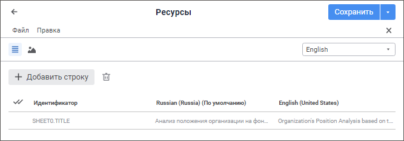

# Перевод заголовков экспресс-отчётов

Перевод заголовков экспресс-отчётов
-

# Перевод заголовков экспресс-отчётов

Заголовок экспресс-отчёта может поддерживать несколько языков пользовательского
 интерфейса, например, русский и английский. Подобные заголовки называются
 мультиязычными.

Для получения подробной информации
 о настройке заголовка экспресс-отчёта обратитесь к разделу «[Настройка
 заголовка как интерактивного элемента управления](UIExpress.chm::/Setup_express_report/UiExpress_Purpose_Toolbar_Title.htm)».

Примечание.
 Использование мультиязычных заголовков доступно с помощью языка [Fore](KeExpress.chm::/Interface/IEaxAnalyzer/IEaxAnalyzer.SupportMultiLanguage.htm).
 Если заголовок является мультиязычным, то настройка заголовка выполняется
 для текущего [языка
 репозитория](setup.chm::/06_ak_client_config/uinav_repoconfig_repo1.htm#more).

Для перевода заголовка экспресс-отчёта на другие языки:

	- Откройте инструмент «[Аналитические запросы (OLAP)](UIExpress.chm::/purpose/UiExpress_Organizational_Starting.htm#open_report)».

	- Выберите режим отображения заголовка в раскрывающемся меню кнопки
	  «Заголовок»
	 на вкладке «Главная» или «Вид» ленты инструментов экспресс-отчёта.

	- Создайте в [навигаторе](UiNav.chm::/02_Navigator/General_Principles_of_Work.htm#add_object)
	 объект «Ресурсы» с идентификатором
	 RESOURCE, в котором будет содержаться перевод заголовка, например:

	- Выполните [модуль](UiDevEnv.chm::/01_Development_Environment/02_Work_in_Development_Environment/DevEnv_Object/DevEnv_Module.htm)
	 для использования мультиязычного заголовка в экспресс-отчёте.

Для выполнения модуля предполагается наличие
 в репозитории экспресс-отчёта с идентификатором EXPRESS и ресурса с идентификатором
 RESOURCE.

Добавьте ссылки на системные сборки: Metabase,
 Express, IO.

			Sub UserProc;

Var

    MB: IMetabase;

    Resource: IResourceObject;

    Object: IMetabaseObject;

    Express: IEaxAnalyzer;

Begin

    MB := MetabaseClass.Active;

    // Получим ресурс с переводом заголовка

    Resource := MB.ItemById("EXPRESS").Bind As IResourceObject;

    // Получим экспресс-отчёт

    Object := MB.ItemById("RESOURCE").Edit;

    Express := Object As IEaxAnalyzer;

    // Зададим ресурс для экспресс-отчёта

    Express.Resources := Resource;

    // Разрешим использование мультиязычного заголовка

    Express.SupportMultiLanguage := True;

    // Сохраним изменения

    Object.Save;

End Sub UserProc;

После выполнения действий при изменении [языка
 репозитория для текущего пользователя](setup.chm::/06_ak_client_config/uinav_repoconfig_repo1.htm#more) на заданный язык
 перевода в экспресс-отчёте будет отображаться мультиязычный заголовок
 в соответствии с переводом в ресурсах.

См. также:

[Настройка
 мультиязычности](Multilanguage_setting.htm) | [Перевод в ресурсах](Resources.htm)

		Справочная
		 система на версию 10.9
		 от 18/08/2025,
		 © ООО «ФОРСАЙТ»,
