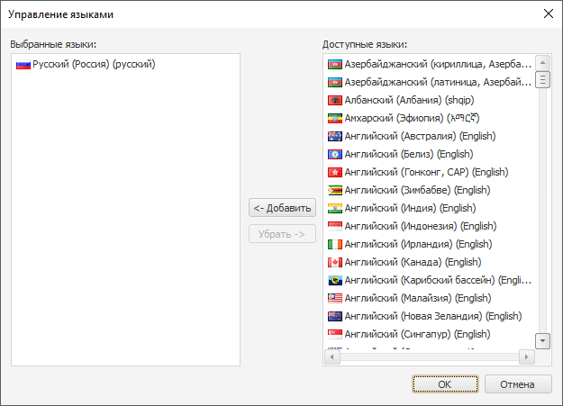
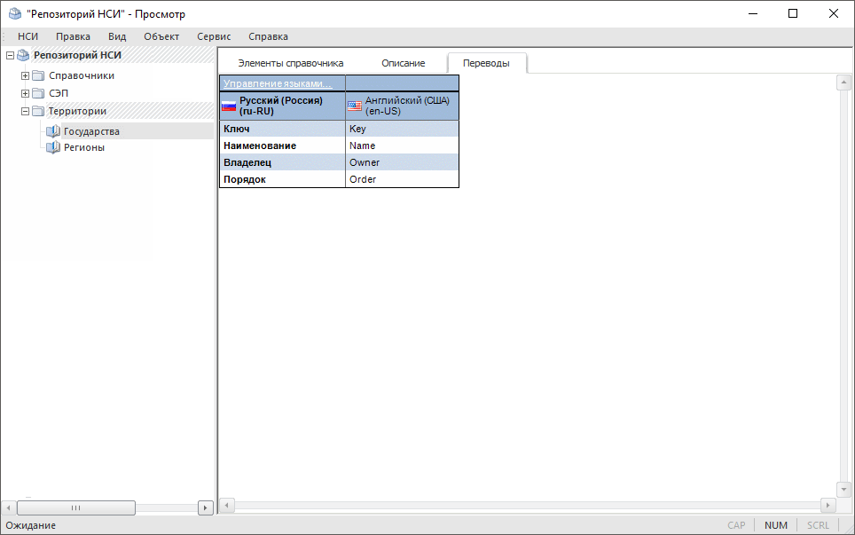
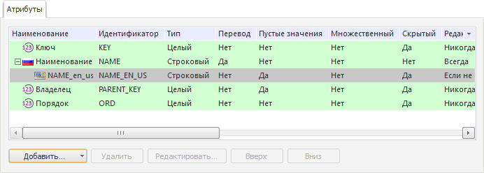
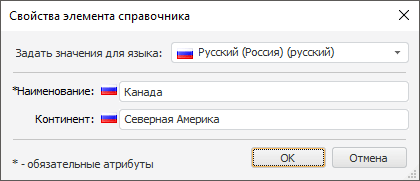

# Перевод справочников НСИ на другие языки

Перевод справочников НСИ на другие языки
-

# Перевод справочников НСИ на другие языки

В настольном приложении доступно создание мультиязычных справочников
 НСИ/составных справочников НСИ, то есть справочников, содержащих перевод
 атрибутов и элементов на различные языки. Данные справочники поддерживают
 отображение на различных языках в настольном и веб-приложении. Если мультиязычный
 справочник используется в качестве измерения в кубе или базе данных
 временных рядов, то при смене [языка
 репозитория для текущего пользователя](setup.chm::/06_ak_client_config/uinav_repoconfig_repo1.htm#more) элементы соответствующего
 измерения будут отображаться на выбранном языке.

Для перевода справочника:

	- Откройте диалог «Параметры»
	 с помощью команды «Сервис >
	 Параметры» в главном меню [навигатора
	 объектов](GetStarted.chm::/Interface/Interface_Navigator.htm).

	- Перейдите на вкладку «[Настройки
	 по умолчанию](UiNav.chm::/02_Navigator/Repo_Default.htm)» и убедитесь, что для репозитория
	 задан язык по умолчанию. Если язык не задан, то задайте его.

Примечание.
 Язык репозитория по умолчанию выбирается один раз и в дальнейшем не может
 быть изменен.

	- Сохраните изменения и закройте диалог «Параметры».

	- Откройте на [редактирование](UiNavObj.chm::/reference_book/Work/Work_Dictionary.htm#edit)
	 справочник, для которого требуется настроить
	 перевод.

	- Перейдите на вкладку «Описание»
	 и установите флажок «Переводить справочник
	 на другие языки» для [справочника
	 НСИ](UiNavObj.chm::/reference_book/Master_RDS_reference_book/base_settings.htm#translate_dictionary)/[составного
	 справочника НСИ](uinavobj.chm::/reference_book/Master_Composite_Table_reference_book/base_settings.htm#ranslate_dictionary). Будет отображена вкладка «Переводы».

	- Перейдите на вкладку «Переводы»:

Изначально в таблице содержится только столбец
 с наименованием атрибутов для текущего [языка
 репозитория по умолчанию](../02_Navigator/Repo_Default.htm). Он выделен жирным шрифтом.

	- Щёлкните по гиперссылке «Управление
	 языками» в углу таблицы. Будет открыт диалог «Управление
	 языками»:

В списке «Выбранные
 языки» содержатся языки, на которые в данный момент переводятся
 наименования атрибутов и значения строковых атрибутов справочника. Список
 «Доступные языки» содержит языки,
 на которые справочник может быть переведён.

	- Сформируйте список языков, на которые будет переведен справочник.
	 Для перемещения выделенного языка между списками «Доступные
	 языки» и «Выбранные языки»:

		- перетащите выделенный язык в требуемый список;

		- дважды щёлкните по выбранному языку;

		- нажмите кнопку «Добавить»
		 для перемещения языка в список «Выбранные
		 языки»;

		- нажмите кнопку «Убрать»
		 для перемещения языка в список «Доступные
		 языки». Данная возможность доступна для всех языков, кроме
		 [языка репозитория по
		 умолчанию](../02_Navigator/Repo_Default.htm).

Закройте диалог «Управление
 языками» с сохранением сделанных изменений.

	- На вкладке «Переводы»
	 будут отображены столбцы для перевода атрибутов справочника НСИ на
	 выбранные языки. Для перевода атрибутов:

		- Переведите ячейку с переводом атрибута в режим редактирования.
		 Для этого дважды щёлкните по ней. Для редактирования ячейки, расположенной
		 выше выделенной ячейки, используйте клавишу UP, расположенной
		 ниже - клавишу DOWN.

		- Введите перевод атрибута.

		- Нажмите клавишу ENTER или щёлкните за пределами редактируемой
		 ячейки.

	- Перейдите на вкладку «Описание»
	 и нажмите кнопку «Сохранить».
	 На данной вкладке для строковых атрибутов будут созданы дочерние атрибуты
	 для перевода. Количество дочерних атрибутов соответствует количеству
	 языков, на которые переводится справочник. Идентификаторы данных атрибутов
	 состоят из идентификатора родительского атрибута с добавлением суффикса
	 - международной аббревиатуры языка:

	- Задайте перевод элементов справочника. Для этого:

		- Перейдите на вкладку «Элементы
		 справочника».

		- Если требуется перевести вновь создаваемые элементы, то
		 нажмите кнопку  «Добавить» на панели инструментов
		 или выполните команду «Добавить»
		 в контекстном меню. Если требуется перевести существующие элементы,
		 то нажмите кнопку  «Редактировать»
		 на панели инструментов или выполните команду «Редактировать»
		 в контекстном меню элемента. Будет отображён диалог «[Свойства элемента справочника](UiNavObj.chm::/reference_book/Work/Work_Elements.htm#addelement)».

		- В поле «Задать значение
		 для языка» выберите язык и задайте значения атрибутов элемента
		 на выбранном языке. Атрибуты, значения которых должны быть переведены,
		 отмечены пиктограммой с флагом, соответствующем языку перевода.
		 Повторите данную операцию для всех языков в списке «Задать
		 значение для языка»:

Таким образом, будет создан мультиязычный справочник. [Работа
 с элементами](UiNavObj.chm::/reference_book/Work/Work_Dictionary.htm) подобного справочника ведется так же,
 как и с элементами обыкновенных справочников. Отличие заключается в том,
 что при вводе значений строковых атрибутов для элементов необходимо выбрать
 язык, для которого предназначено значение.

Пример мультиязычного справочника:

См. также:

[Настройка
 мультиязычности](Multilanguage_setting.htm) | [Работа
 со справочником](UiNavObj.chm::/reference_book/Work/Work_Dictionary.htm)

		Справочная
		 система на версию 10.9
		 от 18/08/2025,
		 © ООО «ФОРСАЙТ»,
