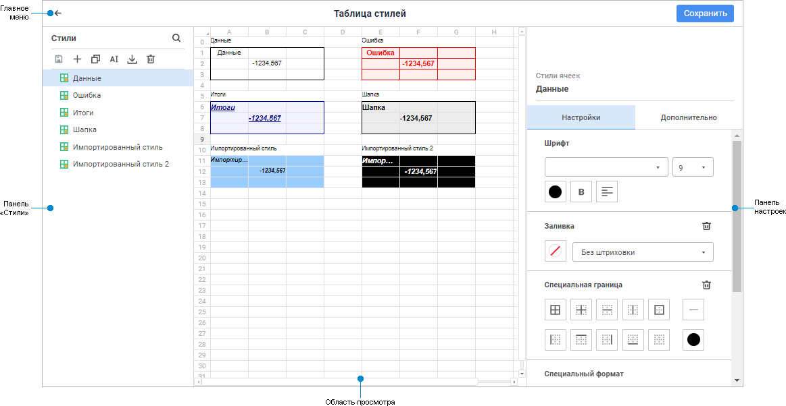
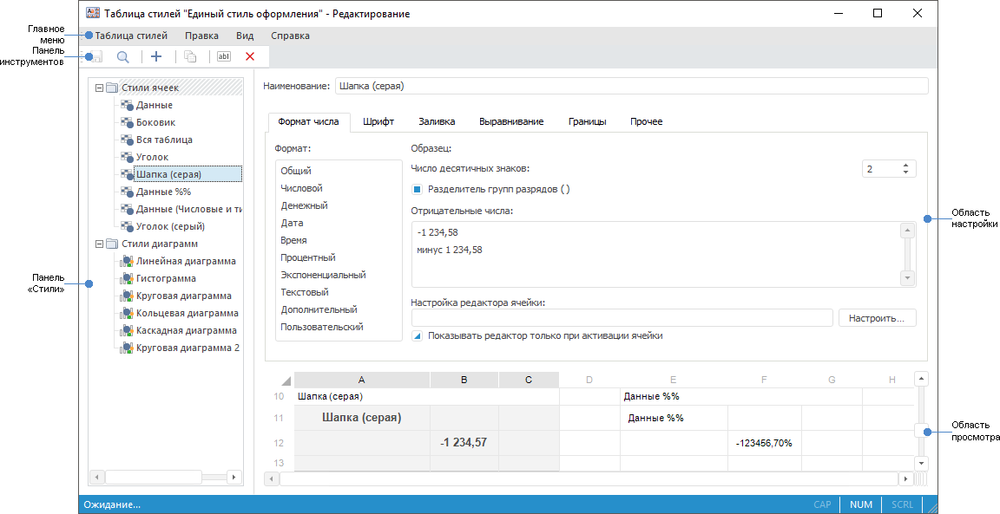

# Начало работы с таблицей стилей

Начало работы с таблицей стилей
-

# Начало работы с таблицей стилей

Для начала работы создайте новую или откройте готовую таблицу стилей.

[Создание
 новой таблицы стилей](javascript:TextPopup(this))

	Для создания новой таблицы стилей в [навигаторе
	 объектов](GetStarted.chm::/Interface/Interface_Navigator.htm):

		- в веб-приложении нажмите кнопку  «Создать» в главном меню и выберите
		 тип объекта на боковой панели «[Новый объект](../02_Navigator/General_Principles_of_Work.htm#add_object)»;

		- в настольном приложении выполните одно из действий:

			- нажмите кнопку «Новый
			 объект > Другие > Таблица стилей» в
			 группе «Создать» на
			 вкладке «Главная»
			 ленты инструментов;

			- выполните команду «Создать >
			 Другие > Таблица стилей» в контекстном меню
			 навигатора объектов;

	Также в настольном приложении доступно создание новой таблицы стилей
	 в основном окне. Для этого выполните команду «Новая
	 таблица стилей» в главном меню открытой таблицы стилей.

[Редактирование
 готовой таблицы стилей](javascript:TextPopup(this))

	Для открытия готовой таблицы стилей на редактирование в [навигаторе
	 объектов](GetStarted.chm::/Interface/Interface_Navigator.htm) выделите таблицу стилей и выполните одно
	 из действий:

		- в веб-приложении:

			- выполните команду «Редактировать»
			 в контекстном меню таблицы стилей;

			- выполните команду «Редактировать
			 в новой вкладке» в контекстном меню таблицы стилей;

			- выполните команду «Редактировать
			 в новом окне» в контекстном меню таблицы стилей;

			- дважды щёлкните по таблице стилей;

			- нажмите клавишу F4;

		- в настольном приложении:

			- нажмите кнопку 
			 «Редактировать» в
			 группе «Открыть» на
			 вкладке «Главная»
			 ленты инструментов;

			- выполните команду «Редактировать»
			 в контекстном меню таблицы стилей;

			- дважды щёлкните по таблице стилей;

			- нажмите клавишу F4.

	Также в настольном приложении доступно открытие таблицы стилей в
	 основном окне. Для этого выполните команду «Открыть»
	 в главном меню открытой таблицы стилей.

Для формирования таблиц стилей смотрите
 статью «[Формирование
 таблицы стилей](StylesTable_building.htm)».

Для работы с готовыми таблицами
 стилей смотрите статью «[Работа
 с готовой таблицей стилей](StylesTable_working.htm)».

Основное окно таблицы стилей:

	Веб-приложение Настольное приложение

		

		

[Элементы
 окна таблицы стилей](javascript:TextPopup(this))

		- [Главное меню](GetStarted.chm::/interface/interface_description.htm#main_menu):

			- в веб-приложении предназначено для переименования таблицы
			 стилей, а также содержит кнопку для сохранения таблицы стилей;

			- в настольном приложении содержит список команд, предназначенных
			 для выполнения различных операций над таблицей стилей;

		- [Панель
		 инструментов](GetStarted.chm::/interface/interface_description.htm#toolbars). Содержит кнопки для формирования
		 и настройки таблицы стилей. Присутствует только в настольном приложении;

		- Панель «Стили»:

			- в веб-приложении содержит стили, а также кнопки для
			 формирования и настройки стилей;

			- в настольном приложении содержит стили, сгруппированные
			 по визуализаторам, для которых они предназначены;

		- Панель настроек/Область
		 настройки. Предназначена для настройки оформления выбранного
		 стиля;

		- Область просмотра.
		 Предназначена для [просмотра стилей](stylestable_view.htm).

См. также:

[Таблица
 стилей](StylesTablePurpose.htm)

		Справочная
		 система на версию 10.9
		 от 18/08/2025,
		 © ООО «ФОРСАЙТ»,
