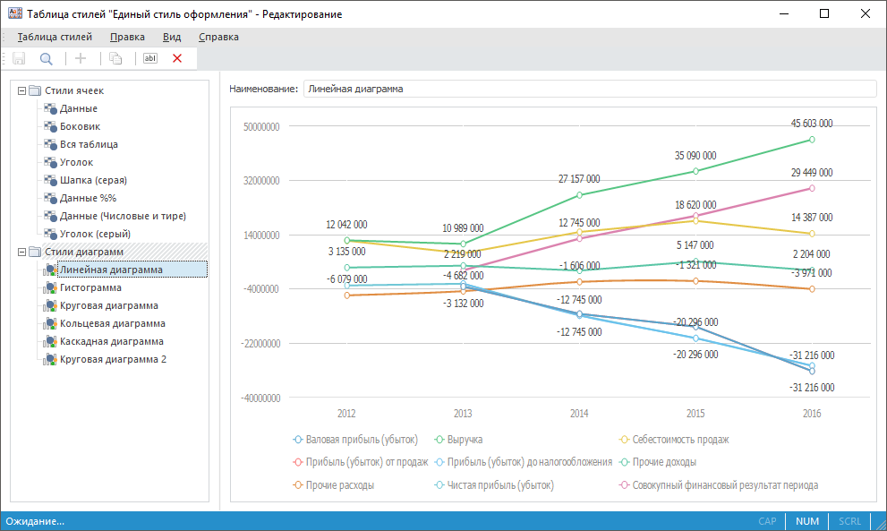

# Таблица стилей

Таблица стилей
-

# Таблица стилей

Для единообразного стилевого оформления визуализаторов в различных инструментах
 продукта «Форсайт. Аналитическая платформа»
 предназначена таблица стилей:

Ключевые возможности:

	- ведение единых стилей для визуализаторов:

		- таблица;

		- диаграмма;

		- общая легенда диаграмм. Доступна только в инструменте «Отчёты»;

		- пузырьковая диаграмма;

		- пузырьковое дерево;

		- плоское дерево;

		- карта;

Примечание.
 В веб-приложении настройка стилей в таблице стилей доступна только для
 табличных визуализаторов.

	- применение единых стилей в инструментах: «[Аналитические
	 панели](UiAdhoc.chm::/UiAdhoc_Purpose.htm)», «[Аналитические
	 запросы (OLAP)](UIExpress.chm::/purpose/UiExpress_Purpose.htm)», «[Отчёты](UIReport.chm::/UiReport_purpose.htm)»,
	 «[Анализ
	 временных рядов](UiDw.chm::/uidw_title.htm)»;

Примечание.
 В веб-приложении применение стилей из таблиц стилей доступно в инструменте
 «Отчёты» и расширении «Интерактивные формы ввода данных».

	- формирование нескольких таблиц стилей для их использования для
	 оформления различных групп отчётов.

Для начала работы смотрите статью
 «[Начало
 работы с таблицей стилей](StylesTable.htm)».

Для формирования таблицы стилей
 смотрите статью «[Формирование
 таблицы стилей](StylesTable_building.htm)».

Для работы с готовой таблицей стилей
 смотрите статью «[Работа
 с готовой таблицей стилей](StylesTable_working.htm)».

См. также:

[Начало
 работы с таблицей стилей](StylesTable.htm)

		Справочная
		 система на версию 10.9
		 от 18/08/2025,
		 © ООО «ФОРСАЙТ»,
