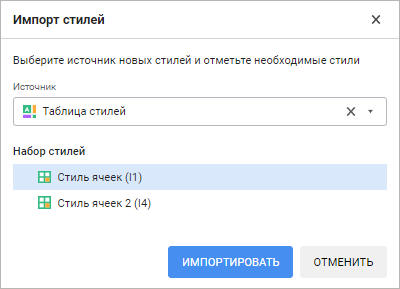
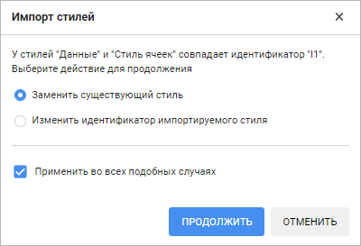
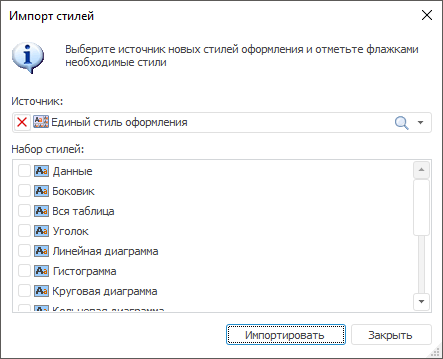
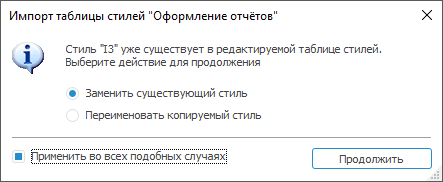
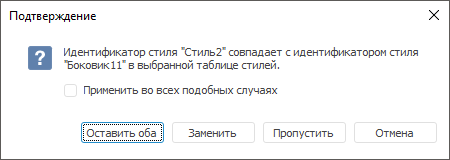

# Загрузка стилей

Загрузка стилей
-

# Загрузка стилей

В таблицу стилей доступна загрузка уже готовых стилей с помощью:

	- [импорта из других таблиц
	 стилей и регламентных отчётов](StylesTable_Import.htm#import);

	- [экспорта стилей из отчётов](StylesTable_Import.htm#export).

## Импорт стилей

В таблицу стилей готовые стили импортируются из других таблиц стилей
 и из внутренних таблиц стилей регламентных отчётов.

Примечание.
 В веб-приложении импорт стилей доступен только из других таблиц стилей.

Импорт стилей отличается в настольном и веб-приложении.

	Веб-приложение Настольное приложение

		Для импорта стилей:

			- Выполните одно из действий:

				- нажмите кнопку  «Импортировать» на панели
				 «Стили»;

				- выполните команду  «Импортировать» контекстного
				 меню на панели «Стили».

		Будет открыт диалог «Импорт
		 стилей»:

		

			- В раскрывающемся списке «Источник»
			 выберите таблицу стилей. В списке «Набор
			 стилей» будет отображён список доступных стилей.

		Для быстрого выбора объекта в поле
		 для поиска введите его название/идентификатор/ключ, в зависимости
		 от настроек отображения. Поиск будет выполняться автоматически
		 по мере ввода текста. Список будет содержать объекты, наименования/идентификаторы/ключи
		 которых содержат вводимый текст.

		Для настройки отображения объектов
		 в списке нажмите кнопку  «Отображение
		 объекта» и выберите в раскрывающемся меню вариант отображения:

				- Наименование.
				 Объекты отображаются под своими наименованиями. Вариант
				 по умолчанию;

				- Идентификатор.
				 Объекты отображаются под своими идентификаторами;

				- Ключ. Объекты
				 отображаются под своими ключами.

		Выбрать можно несколько вариантов.
		 Идентификатор и ключ будут указаны в скобках.

		Для сброса отметки выбранного объекта
		 нажмите кнопку  «Очистить».

			- Выделите в области «Набор
			 стилей» стили, которые требуется импортировать, и нажмите
			 кнопку «Импортировать».
			 Для выделения всех стилей выполните команду контекстного меню
			 «Отметить все», для
			 снятия выделения со всех стилей - команду контекстного меню
			 «Снять отметку со всех».

		В результате в текущую таблицу стилей будут импортированы отмеченные
		 стили.

		Если идентификатор импортируемого стиля совпадает с каким-либо
		 из уже существующих в таблице стилей, то будет выдан запрос на
		 подтверждение производимого действия:

		

		Выберите действие со стилем:

			- Заменить существующий
			 стиль. Стиль в текущей таблице будет заменён на импортируемый;

			- Переименовать копируемый
			 стиль. К идентификатору импортируемого стиля будет
			 добавлен суффикс «КопияN», где N - индекс копии.

		Для применения выбранного действия для всех импортируемых стилей,
		 имеющих неуникальный идентификатор, установите флажок «Применить
		 во всех подобных случаях». Если флажок снят, то окно будет
		 отображаться каждый раз при возникновении конфликтной ситуации.

		Для импорта стилей:

			- Выполните команду «Импортировать»
			 в главном меню «Таблица стилей».
			 Будет открыт диалог «Импорт
			 стилей»:

		

			- Выберите таблицу стилей или регламентный отчёт в раскрывающемся
			 списке «Источник».

			- Установите флажки напротив стилей, которые необходимо
			 импортировать, в списке «Набор
			 стилей».

		Совет.
		 Для быстрой установки флажков для нескольких стилей выделите их
		 с зажатой клавишей CTRL и выполните команду «Отметить»
		 в контекстном меню. Для установки флажков для всех стилей используйте
		 команду «Отметить все»,
		 для снятия флажков с выделенных стилей - команду «Снять
		 отметку».

		В результате в текущую таблицу стилей будут импортированы отмеченные
		 стили.

		Если идентификатор импортируемого стиля
		 совпадает с каким-либо из уже существующих в таблице стилей, будет
		 выдан запрос на подтверждение производимого действия:

		

		Выберите действие со стилем:

			- Заменить существующий
			 стиль. Стиль в текущей таблице будет заменён на импортируемый;

			- Переименовать копируемый
			 стиль. К идентификатору импортируемого стиля будет
			 добавлен суффикс «КопияN», где N - индекс копии.

		Для применения выбранного действия для всех импортируемых стилей,
		 имеющих неуникальный идентификатор, установите флажок «Применить
		 во всех подобных случаях». Если флажок снят, то окно будет
		 отображаться каждый раз при возникновении конфликтной ситуации.

## Экспорт стилей

Из экспресс-отчётов, аналитических панелей, регламентных отчётов и рабочих
 книг стили могут быть экспортированы в таблицу стилей.

Примечание.
 Экспорт стилей доступен только в настольном приложении.

Для экспорта:

	- Откройте отчёт, содержащий стили, созданные пользователем.

	- Перейдите на вкладку ленты инструментов, предназначенной для
	 настройки визуализатора, и нажмите кнопку  «Действия», расположенную в группе
	 для настройки стиля.

Наименование вкладки и группы зависит от
 визуализатора. Например, для таблицы вкладка называется «Формат»,
 а группа - «Стиль ячейки»;
 для диаграммы вкладка называется «Диаграмма»,
 а группа - «Стиль диаграммы».
 Для получения подробной справки по каждому визуализатору обратитесь к
 разделу «[Визуализаторы данных](DataAnalysis.chm::/Visualizators.htm)».

	- Стили, которые могут быть экспортированы, отображаются в группе
	 «Стили документа». Для экспорта
	 всех стилей из этой группы выполните команду «Экспорт
	 во внешние стили» в меню кнопки  «Действия», для экспорта только определённого
	 стиля выполните команду «Экспорт
	 во внешние стили» в контекстном меню стиля.

	- В отобразившемся окне выбора файла укажите текущую таблицу стилей.

	- Будет запрошено подтверждение дополнения таблицы стилей выбранными
	 стилями. Дайте положительный ответ. Затем будет предложено подключить
	 выбранную таблицу стилей к отчёту. Дайте положительный ответ, если
	 требуется использовать стили из выбранной таблицы стилей в текущем
	 отчёте.

В выбранную таблицу стилей будут экспортированы стили из отчёта. Если
 идентификатор экспортируемого стиля совпадает с каким-либо из уже существующих
 в таблице стилей, будет выдан запрос на подтверждение производимого действия:

Выберите действие со стилем:

	- Оставить оба. Экспортируемый
	 стиль будет добавлен в таблицу стилей с новым уникальным идентификатором;

	- Заменить. Стиль в текущей
	 таблице будет заменён на экспортируемый;

	- Пропустить. Стиль не
	 будет экспортирован в таблицу.

Для применения выбранного действия для всех экспортируемых стилей, имеющих
 неуникальный идентификатор, установите флажок «Применить
 во всех подобных случаях». Если флажок снят, то окно будет отображаться
 каждый раз при возникновении конфликтной ситуации.

См. также:

[Формирование
 таблицы стилей](StylesTable_building.htm)

		Справочная
		 система на версию 10.9
		 от 18/08/2025,
		 © ООО «ФОРСАЙТ»,
